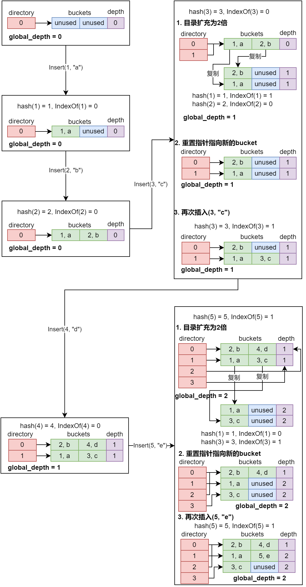

本文将介绍第一个`project: buffer poll`的实现思路
由于课程老师不允许放出自己的代码实现, 因此我只会涉及大概的实现思路, 而不涉及代码细节

官方`project`文档: https://15445.courses.cs.cmu.edu/fall2022/project1/

# 1 项目目标
本项目要实现的缓存池结构如下:
1. 实现一个可扩展哈希表, 将数据库中的一个`page`从磁盘缓存到内存中, 并且维持从`page_id`到`page`得到映射关系
2. 当`page`的大小超出容量时, 使用`lru-k`进行替换

# 2 可扩展哈希
## 2.1 整体介绍 
可扩展哈希（Extendible Hashing）是一种动态哈希技术，适用于数据库和文件系统中的索引结构，特别是在处理大量增减变化的数据集时。可扩展哈希表的主要特点是能根据数据量的变化动态地调整其大小，这样可以维持较均匀的访问性能，无论数据量的多少。

## 2.2 工作原理

1. **哈希函数**：
   可扩展哈希表使用哈希函数对键值进行哈希，生成固定长度的位模式。通常，这个哈希函数产生的位数要比实际使用的位数多，以便表可以在未来扩展。
2. **目录结构**：
   该算法使用一个称为“目录”(`directory`)的结构，它包含指向数据桶（`buckets`）的指针。目录的大小取决于当前使用的哈希键的位数，初始时通常很小。

3. **桶**：
    存储实际数据项（例如键值对）的基本单元。每个桶可以存储一个或多个数据项，其容量通常是预先定义的。

1. **桶分裂**：
   当一个桶满时（即达到预设的装载因子），系统会进行桶分裂（`bucket splitting`）。分裂时，桶中的数据会根据新的哈希键位重新分配到两个新桶中。

2. **目录扩展**：
   如果所有数据项都使用了当前哈希键的全部位数，且某个桶满了需要分裂，则目录也需要扩展。目录扩展是通过增加哈希键的位数并复制当前目录项来实现的。

3. **局部性原理**：
   可扩展哈希表的一个关键特性是局部性原理，即桶分裂只影响某个特定桶中的记录，而不会影响到整个哈希表。

## 2.3 插入流程
### 2.3.1 流程概述
整体流程如下:
可扩展哈希的插入流程涉及将新的数据项（键值对）添加到哈希表中。以下是插入过程的步骤：

1. **哈希函数计算**：
   对插入项的键使用哈希函数，得到一个哈希值。这个哈希值包含足够多的位，以支持未来的目录扩展。

2. **确定目标桶**：
   使用哈希值的前几位（称为“全局深度”）来确定目标桶。全局深度是指目录中用于索引的位数。如果哈希表的目录大小是 $2^d$，那么全局深度就是 `d`。

3. **将数据插入桶**：
   1. 如果目标桶没有满，即其包含的数据项少于桶的最大容量，则直接将数据项插入到该桶中。
   2. **处理桶溢出**：
   如果目标桶已经满了，需要进行桶分裂。桶分裂的基本流程如下：
      1. **分裂桶**：
      创建一个新的空桶。将原来的桶中的所有数据项和新插入的数据项根据哈希值的下一位重新分配到这两个桶中。这通常意味着原桶和新桶会根据哈希值的那一位（原本相同的位）分别收集0和1的记录。
      2. **更新目录**：
      更新目录以反映新的桶分配。这可能需要增加目录的“全局深度”（即索引的位数）。如果分裂的桶的“局部深度”（该桶对应的哈希值的位数）已经等于全局深度，那么在分裂之前，目录需要加倍，即复制一遍，以增加一个位的索引深度。
      3. **重新指向桶指针**：
      将目录中与原桶相关的指针（那些仅在分裂位上有差异的指针）更新，使一部分指向原桶，另一部分指向新桶。
      4. **重复分裂（如有必要）**：
   如果在分裂后新插入的项还是无法被放入桶中（因为原桶中其他项与它有相同的新哈希值），则需要重复分裂过程。
      5. **完成插入**：
   当桶分裂和目录更新完成后，确保所有的数据项都被正确地放入桶中，包括新插入的数据项。

这个过程确保了可扩展哈希表可以根据数据量的变化动态调整，同时保持常数时间的平均插入性能。由于目录的深度和桶指针的更新是有限的，所以插入过程通常很高效。

### 2.3.2 图解插入
接下来结合插入的图例解释其工作原理:

通过上图我们可以明显看到可扩展哈希的下面几个特点:
1. 不同目录项可以指向相同的`bucket`
2. 每次超出`bucket`容量时, 只有超出`bucket`容量的那一个`bucket`需要`rehash`, 其余`bucket`保持不变
3. 每一个`bucket`有自己的深度, 全局的深度等于所有`bucket`的深度的最大值
4. `global_depth << 1== len(directory)`

**此处详细说明图中`IndexOf`的含义:**
`IndexOf`就是寻找`bucket`的序号, 将`key`进行`hash`后取`某几个低位`得到`bucket`的序号, `某几个低位`正是通过全局的`global_depth`确定的, `global_depth`就是指定了低位的数量, 以最后一次插入的`(5, "e")`为例:
1. `hash(5) = 5`;
2. 5的二进制表示是`0b101`, 此时的`global_depth`为2, 所以取低2为`0b01`, 目标`bucket`的序号为1
3. 向1号`bucket`插入`(5, "e")`, 容量足够, 插入成功

# 2.4 删除流程
由于本项目不需要实现哈希的收缩, 因此删除流程只需要将指定`bucket`中的元素删除即可

