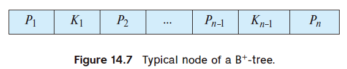
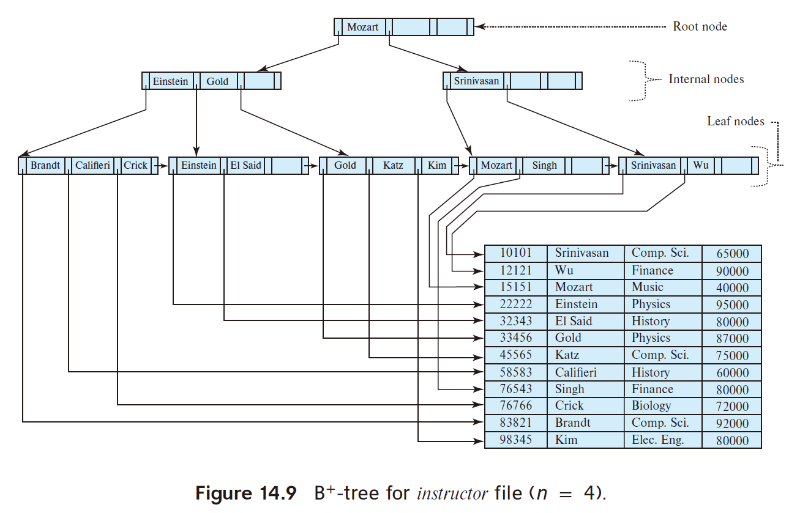

本`project`应该是4个`project`中难度最大的一个了, 本地测试非常粗糙, 很多`bug`测不出来, 且有非常多的边界情况需要考虑

官方`project`文档: https://15445.courses.cs.cmu.edu/fall2022/project2/

# 1. B+树介绍
B+树是一种自平衡的树数据结构，它维护排序的数据，并允许搜索、顺序访问、插入和删除操作，都在对数时间内完成。B+树特别适合用于数据库和文件系统的索引，因为其每个节点设置成文件系统的`page`大小可以大量地减少磁盘IO。

本章将结合数据库系统概念第六版和自己的理解, 进行原理讲解和说明。

# 1.1 结构特征

1. **节点的结构**：
   1. 叶子结点
   B+树的每个节点（除了叶子和根）都有多个孩子。上图所示为摘自书中的B+树节点，其中`K``i`表示比较的`key`, 其左边的`P``i`表示指针指向的**数据页面**中所有的`key`都比`K``i`小, 右边的`P``i+1`表示指针指向的**数据页面**中所有的`key`都比`K``i`大。但有一个例外: `P``n`指向的页面就是叶子层的`K`更大的下一个**叶子页面**。因此实际存储的指针的数量上限为`n-1`。
   2. 非叶子节
   非叶子节点的`K`的排序指针的含义和和叶子结点是类似的, 但是区别是最后一个指针`P``n`指向的旧不是同高度的下一个节点了, 而仍然是下一级的页面(可能是叶子也可能是非叶子), 因此实际存储的指针的数量上限为`n`

下面给出一个书中B+树的示意图：

1. **所有叶子节点在同一层**：
B+树的所有叶子节点都位于同一层，并且包含了所有的键值及指向记录的指针。叶子节点通过指针连接成一个链表，便于顺序访问。

1. **非叶子节点作为索引部分**：非叶子节点包含了孩子节点中的最大（或最小）键，但不会包含数据记录本身的指针，这些节点的主要作用是作为指向叶子节点的索引。

2. **分裂和融合**：当节点中的键值个数超过最大值时，节点会分裂成两个节点；当键值个数过少时，可能会与相邻节点融合或重新分配键值。

# 1.2 
更新中...