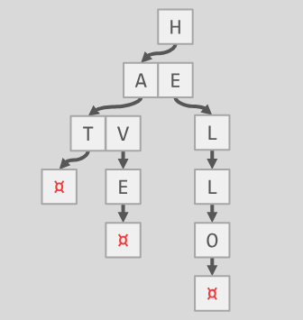
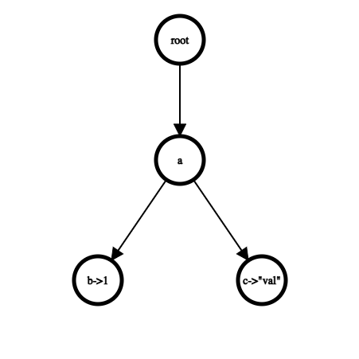

这是对个人在2022年秋的`CMU15445`的`project`总结, 算是补档, 所有很多代码也忘了, 这里也就值只介绍其中的思路, 不涉及具体代码细节, 不过`CMU15445`的老师`Andy`本来也禁止个人公开代码实现的。

本次实验是实现一个字典树`Trie`, 但难度主要不在这个数据结构, 更多是通过这个项目熟悉`C++`常见的新特性。

`官方project指导书`: https://15445.courses.cs.cmu.edu/fall2022/project0/

# 1 `Trie`数据结构介绍
下面是摘自官方文档的数据结构示意图:



在上面的图中可以看到, 字典树每个节点实际上存储的就是字符串的一个字符, 这个树结构从根路径到叶子结点路径上的字符一起组成了字符串, 如`hello`, `have`, `hat`

另一方面, 还可以在特定的节点存储`value`形成`KV`存储的数据结构, 下面是摘自官方文档的数据结构示意图:

> 另外, 如果不存在某个字符是所有字符串的祖先(第一个字符), 就设一个空的`root`节点替代



这个数据结构存储了`("ab", 1)` 和 `("ac", "val")`2个数据结构

可以看出, 这种数据结构的核心思想就是: **将公共的前缀压缩在树的公共祖先路径上**, 路径形成`key`, 再在节点上存储`value`

# 2 代码实现思路
## 2.1 数据结构解析
给出的代码框架中, `TrieNode`就对应不包含值的节点, `TrieNodeWithValue`就是包含了值的节点, 二者是继承关系, 而`TrieNode`使用`unordered_map`存储指向每个节点的`unique_ptr`

## 2.3 `Insert`函数实现思路
`Insert` 函数是一个模板函数，用于插入键值对。它接受一个字符串 `key` 作为要插入的键，以及一个 `value` 作为与键关联的值。流程如下：

1. 检查键 (`key`) 是否为空。如果为空，直接返回 `false`

2. 使用迭代器`c` 循环遍历 `key` 中的每个字符，直至迭代器 `c` 到达 `key` 的末尾。

3. 在循环中，`cur` 存储当前迭代器 `c` 的值，并立即将 `c` 增加。如果 `c` 到达 `key` 的末尾，则跳出循环。

4. 检查前一个子节点 `pre_child` 是否有当前字符 `*cur` 对应的子节点。
   1. 如果没有，使用 `InsertChildNode` 创建一个新的 `TrieNode` 子节点，并更新 `pre_child` 指向新节点。
   2. 如果 `pre_child` 已经有当前字符 `*cur` 对应的子节点，那么就获取这个子节点，并更新 `pre_child` 指向它。

5. 循环结束后，`c` 递减，指向 `key` 的最后一个字符。

6. 尝试获取最后一个字符对应的子节点 `end_node`。
   1. 如果 `end_node` 已经存在并且是一个结束节点（即已经存储了一个值），则释放写锁并返回 `false`，表示键已存在。
   2.  如果 `end_node` 存在但不是结束节点，创建一个带有值 `value` 的新 `TrieNodeWithValue` 节点，并使用 `std::move` 把 `end_node` 的数据移动到新节点。然后用 `reset` 方法替换 `end_node` 中的指针。
   3.  如果 `end_node` 不存在，使用 `InsertChildNode` 在 `pre_child` 下插入一个新的 `TrieNode`，然后创建一个新的 `TrieNodeWithValue` 实例，将 `pre_child` 的数据移动到新节点，并设置值 `value`。

7.  最后，函数释放写锁，并返回 `true`，表示键值对已成功插入字典树。

上面的代码其实说的太详细了, `Tie`的插入其实也很简单, 之所以说这么复杂, 主要是要提到使用的`C++11\14\17`的新特性

## 2.2 `Remove`函数实现思路
1. 检查键是否为空：
   如果提供的键 `key` 为空字符串，函数返回 `false`，因为无法从Trie中移除一个不存在的键。

2. 使用栈跟踪路径：
  代码初始化了一个栈 `s` 来存储遍历过程中的路径。栈中的元素是一个包含字符和指向`TrieNode`指针的`pair`。

1. 遍历键中的每个字符：
   1. 使用一个迭代器 `c` 遍历键 `key` 的每个字符。
   2. 检查是否存在当前字符对应的子节点。如果存在：
      1. 将当前字符和指向父节点的指针存入栈中。
      2. 更新 `pre_child` 指向当前字符的子节点。
   3. 如果不存在当前字符对应的子节点，说明键不在Trie中，返回 `false`。

2. 检查并移除没有子节点的节点：
   1. 从栈中弹出元素，这样就可以从键的末尾向根节点遍历。
   2. 对于每一个弹出的元素，检查当前节点（通过 `(*node)->GetChildNode(key)` 获取）是否存在子节点。
   2. 如果当前节点没有子节点，使用 `(*node)->RemoveChildNode(key)` 方法移除它。
   3. 如果当前节点有子节点，说明该节点是其他键的前缀，或者其子节点中有其他键的后续部分，因此不能移除该节点。

3. 返回成功：
  如果整个键已经被遍历，并且相关节点已被移除，函数返回 `true` 表示键已成功从Trie中移除。

在这个过程中，推荐使用后进先出（LIFO）的栈结构来保存遍历过程中的路径。这是因为在移除过程中，可能需要从叶子节点回溯到根节点，去除沿途的任何不再有用的节点。这种回溯机制确保只有当**一个节点不再表示任何其他键时，它才会被移除**。如果在回溯过程中**遇到一个有子节点的节点，这意味着该节点仍然是其他键的一部分**，因此该节点和它的祖先节点都不应该被移除。

这个代码实际写起来应该很简单, 本项目的目的也就是对C++17进行练手而已

# 3 补充知识: 用到的C++新特性
## 3.1 右值
### 3.1.1 右值的定义
在C++中，右值（rvalue）是指一个临时的、非持久的对象，它通常出现在赋值表达式的右侧。右值表示对象的值，而不是对象的身份（位置），这意味着它们不具有可识别的内存地址。

C++中的值可以分为两大类：左值（lvalue）和右值（rvalue）。左值是指那些具有持久状态的对象，这些对象通常可以**通过它们的地址来标识**。它们可以出现在赋值表达式的左侧。例如，一个变量或者一个数组的元素都是左值。

而右值分为两类：

1. 纯右值：表示表达式完全不对应任何对象存储位置。例如，数字字面量（如`42`）、算术表达式的结果（如`3+4`）、返回非引用类型的函数调用等。

2. 将亡值：C++11中引入的概念，是一种特殊的右值，它对应于即将被销毁、或者可以“移动”的对象。这类右值允许将资源（比如动态分配的内存）从一个对象转移到另一个对象，这样可以提升效率，避免不必要的复制。例如，使用`std::move`函数可以将一个左值转换为将亡值。

右值的一个关键特性是它们可以被移动而非复制，这是C++11中引入的右值引用（`&&`）的主要用途。右值引用允许开发者重用即将销毁的对象的资源，例如在移动构造函数（`T(T&&)`）和移动赋值操作符（`T& operator=(T&&)`）中。

```cpp
int a = 42; // 42是一个纯右值
int b = a;  // a是一个左值

int&& rvalue_ref = a * 2; // a * 2是一个纯右值，rvalue_ref是对它的右值引用
int&& moved_ref = std::move(b); // 使用std::move将b转换为一个将亡值，moved_ref是对它的右值引用
```

在上面的例子中，`42`是一个纯右值，`a * 2`是一个临时结果，也是一个纯右值，而`std::move(b)`将`b`转换为一个将亡值，这允许将`b`的资源移动到另一个对象中。

### 3.1.2 赋值后的右值
这里有个非常容易误解的地方, 涉及到C++中的一个微妙之处。当创建一个右值引用，比如 `int&& rvalue_ref`，并将一个右值表达式 `a * 2` 绑定到它上面时，`rvalue_ref` 本身成为一个具名的引用，它的身份可以被识别，因此在某种意义上它表现得像一个左值。

然而，`rvalue_ref` 仍然保持着与它所绑定的右值的联系，这意味着可以使用它来“移动”所绑定的临时对象的资源，正如右值引用的初衷那样。C++标准规定，即使是具名的右值引用，也应该被视为一个右值，以允许移动语义和其他对右值的操作。

在函数重载解析中，`rvalue_ref` 会被当作一个右值来处理。举个例子：

```cpp
void foo(int& x) { /* ... */ } // 针对左值的重载
void foo(int&& x) { /* ... */ } // 针对右值的重载

int a = 42;
int&& rvalue_ref = a * 2;

foo(rvalue_ref); // 这里会调用 foo(int&& x)
```

在上面的代码中，即使 `rvalue_ref` 是一个具名的变量，`foo(rvalue_ref)` 依然会调用接受右值引用的重载版本 `foo(int&& x)`，因为 `rvalue_ref` 在表达式中被视为右值。

然而，如果尝试对 `rvalue_ref` 取地址或者再次对其赋值，它就会表现得像一个左值：

```cpp
int* p = &rvalue_ref; // 现在取得了它的地址，它表现得像一个左值

rvalue_ref = 100; // 可以对它赋值，它表现得像一个左值
```

在这些情况下，`rvalue_ref` 的行为与左值没有区别，因为它是一个具名的对象，可以对它进行操作，例如取地址和赋值，这是标准左值操作。

下面的陈述不一定复合编译器的事实, 但阐述了右值的思想: **右值引用的出现可以延长一个右值的生命周期，并提供了对这个右值的直接访问。**:
比较`int&& rvalue_ref = a * 2;`和`int& rvalue_ref = a * 2;`这2句代码的执行, 
- `int rvalue_ref = a * 2;`的执行
1. `a * 2`这个临时的右值存放在栈上
2. `rvalue_ref`是个左值,  `a * 2`会被复制到`rvalue_ref`的地址中
3. `rvalue_ref`的地址被释放

- `int&& rvalue_ref = a * 2;`的执行
1. `a * 2`这个临时的右值存放在栈上
2. `rvalue_ref`是个右值引用, 其内存地址直接和存放`a * 2`这个临时的右值的地址相同
3. 由于原来临时右值将要被继续使用, 所以不需要释放

## 3.1.3 右值的使用——完美转发
完美转发（`Perfect forwarding`）是C++11引入的一个概念，简单说就是: **允许函数模板将其接收到的参数以原始的值类别（即保持其是左值还是右值的特性）转发到另一个函数**。其目的也是减少复制的数量。

完美转发的关键在于`std::forward`函数模板和右值引用的结合使用。右值引用独自并不能实现完美转发，因为当一个右值引用被传递时，它变成了一个左值。为了解决这个问题，`std::forward`用于保持参数的原始值类别。

以下是使用右值引用和`std::forward`实现完美转发的一个例子：

```cpp
#include <utility> // For std::forward

template <typename F, typename... Args>
void forwarder(F&& f, Args&&... args) {
    f(std::forward<Args>(args)...);
}

void g(int&& n) {
    // 只有当n是一个右值时，这里的代码才会被执行
}

int main() {
    forwarder(g, 42); // 42是一个右值，forwarder能够完美转发它到g
}
```

在这个例子中，`forwarder`是一个函数模板，它接受任意类型的函数`f`和参数`args`。它用`std::forward`来转发参数`args`到函数`f`，同时保持每个参数的左值或右值属性。

`std::forward`的作用是这样的：
- 当参数是一个左值时，`std::forward`将其转换为左值引用类型。
- 当参数是一个右值时，`std::forward`将其转换为右值引用类型，允许移动语义的发生。

## 3.2 智能指针
所有的智能指针都是自动回收资源, 这一点是最重要的。
## 3.2.1 `unique_ptr`
在任何给定时间，只有一个 `unique_ptr` 实例可以指向一个特定的对象。这个特性使得 `unique_ptr` 成为管理动态分配内存的理想选择，因为它可以确保对象被正确删除，并且防止了资源泄露。

`unique_ptr` 是一个模板类，提供了一系列用于管理动态分配的资源的接口函数。以下是一些常用的接口函数及其用法：

1. **初始化**

- **构造函数**：可以用来创建 `unique_ptr`，有多种构造方式，包括默认构造、从原始指针构造等。
  
  ```cpp
  std::unique_ptr<int> ptr1; // 默认构造，初始化为空
  std::unique_ptr<int> ptr2(new int(5)); // 从原始指针构造
  ```

- **移动构造函数**：允许从另一个 `unique_ptr` 转移所有权。
  
  ```cpp
  std::unique_ptr<int> ptr3(std::move(ptr2)); // ptr2 为空，ptr3 拥有原始资源
  ```

- **make_unique**：C++14 引入了 `std::make_unique` 函数模板，用于在堆上创建一个对象，并返回这个对象的 `unique_ptr`。这是创建 `unique_ptr` 的推荐方式，因为它可以防止原始指针的泄露，并且可以提供异常安全。
  
  ```cpp
  auto ptr7 = std::make_unique<int>(30); // 使用 make_unique 创建
  ```

- **构造函数 with deleter**：创建一个带有自定义删除器的 `unique_ptr`。
  
    ```cpp
    auto deleter = [](int* ptr){
        std::cout << "Custom deleter is called." << std::endl;
        delete ptr;
    };
    std::unique_ptr<int, decltype(deleter)> ptr6(new int, deleter);
    ```


2.  **赋值**
    - **移动赋值操作符**：允许转移所有权。
    
    ```cpp
    std::unique_ptr<int> ptr4 = std::move(ptr3); // ptr3 为空，ptr4 拥有原始资源
    ```
3.  **资源管理**
    - **reset**：替换管理的对象，或设置为空。

    ```cpp
    ptr4.reset(new int(10)); // ptr4 现在拥有一个新的 int 对象
    ptr4.reset(); // 自动删除管理的对象，并将 ptr4 设置为空
    ```

    - **release**：释放对对象的所有权，并返回原始指针，之后 `unique_ptr` 将为空。

    ```cpp
    int* rawPtr = ptr4.release(); // 现在 rawPtr 是裸指针，需要手动管理
    ```

    - **swap**：交换两个 `unique_ptr` 的管理的对象。

    ```cpp
    std::unique_ptr<int> ptr5(new int(20));
    ptr4.swap(ptr5); // 现在 ptr4 管理一个 int(20)，ptr5 为空
    ```

4. **裸指针获取**

    - **get**：返回管理的对象的裸指针。
    
    ```cpp
    int* rawPtr = ptr5.get(); // 不释放所有权，仅返回指针
    ```

    - **`operator*` 和 `operator->`**：提供对管理对象的访问。
    
    ```cpp
    int value = *ptr5; // 访问 int 值
    ```

## 3.2.2 `shared_ptr`
与 `unique_ptr` 不同，多个 `shared_ptr` 实例可以共享同一个对象，引用计数会跟踪有多少个 `shared_ptr` 拥有同一个资源，当最后一个 `shared_ptr` 被销毁时，资源会被自动释放。


1. **构造函数**

- **默认构造函数**：构造一个空的 `shared_ptr`。
  
  ```cpp
  std::shared_ptr<int> ptr;
  ```

- **从原始指针构造**：创建一个 `shared_ptr` 管理一个新的对象。
  
  ```cpp
  std::shared_ptr<int> ptr(new int(10));
  ```

- **拷贝构造函数**：构造一个新的 `shared_ptr`，它与另一个 `shared_ptr` 共享对象，并增加引用计数。
  
  ```cpp
  std::shared_ptr<int> ptr2(ptr);
  ```

- **移动构造函数**：从另一个 `shared_ptr` 移动构造，转移所有权并将原 `shared_ptr` 设置为空。
  
  ```cpp
  std::shared_ptr<int> ptr3(std::move(ptr2));
  ```

- **构造函数 with deleter**：创建一个带有自定义删除器的 `shared_ptr`。
  
  ```cpp
  auto deleter = [](int* p){ delete p; };
  std::shared_ptr<int> ptr6(new int, deleter);
  ```

- **make_shared**：C++11 引入了 `std::make_shared` 函数模板，用于在堆上创建一个对象，并返回这个对象的 `shared_ptr`。这是创建 `shared_ptr` 的推荐方式，因为它通常更高效，并可以减少内存分配次数。
  
  ```cpp
  auto ptr7 = std::make_shared<int>(30);
  ```

2. **赋值运算符**

- **拷贝赋值运算符**：允许将一个 `shared_ptr` 的所有权赋值给另一个 `shared_ptr`，原 `shared_ptr` 的引用计数减一，新 `shared_ptr` 的引用计数加一。
  
  ```cpp
  std::shared_ptr<int> ptr4;
  ptr4 = ptr;
  ```

- **移动赋值运算符**：将一个 `shared_ptr` 的所有权移动给另一个 `shared_ptr`。
  
  ```cpp
  std::shared_ptr<int> ptr5;
  ptr5 = std::move(ptr4);
  ```

3. **资源管理**

- **reset**：更换 `shared_ptr` 所管理的对象，或者放弃对当前对象的所有权。
  
  ```cpp
  ptr.reset(new int(20)); // ptr 现在指向新的 int 对象
  ptr.reset(); // 放弃所有权，如果 ptr 是最后一个引用，将释放对象
  ```

- **use_count**：返回当前共享同一个对象的 `shared_ptr` 数量。
  
  ```cpp
  long count = ptr.use_count(); // 获取引用计数
  ```

- **unique**：检查 `shared_ptr` 是否是管理对象的唯一拥有者。
  
  ```cpp
  bool isUnique = ptr.unique(); // 如果引用计数为1，则返回 true
  ```

4. **裸指针获取**

- **get**：返回管理的对象的原始指针。
  
  ```cpp
  int* rawPtr = ptr.get(); // 获取裸指针
  ```

- **`operator*` 和 `operator->`**：提供对管理对象的访问。
  
  ```cpp
  int value = *ptr; // 解引用
  int value = ptr->someMethod(); // 访问对象成员
  ```

5. **检查**

- **operator bool**：检查 `shared_ptr` 是否拥有一个对象。
  
  ```cpp
  if (ptr) {
      std::cout << "ptr is not empty." << std::endl;
  }
  ```

## 3.2.3 `weak_ptr`
`weak_ptr` 用来解决智能指针间的循环引用问题。`weak_ptr` 持有对 `shared_ptr` 管理对象的非拥有（弱）引用，即它不会增加对象的引用计数。这意味着 `weak_ptr` 的存在不会阻止其所指向的对象被销毁。

`weak_ptr` 主要用于监视 `shared_ptr`，而不是拥有资源。它通常用于缓存、观察者模式、和防止 `shared_ptr` 之间的循环引用导致的内存泄漏。

**一个循环引用的例子**
如果有两个类 `A` 和 `B`，它们互相持有对方的 `shared_ptr`，那么它们将永远不会被释放，因为它们的引用计数永远不会降到零。使用 `weak_ptr` 可以打破这种循环：

```cpp
class B; // 前向声明

class A {
public:
    std::shared_ptr<B> b_ptr;
    // ...
};

class B {
public:
    std::weak_ptr<A> a_ptr; // 使用 weak_ptr 而不是 shared_ptr
    // ...
};

```

在这个例子中，即使 `A` 和 `B` 相互引用，一旦外部对 `A` 和 `B` 的 `shared_ptr` 被销毁，它们最终也能被正确清理。


1. **构造函数**

- **默认构造函数**：创建一个不指向任何对象的 `weak_ptr`。
  ```cpp
  std::weak_ptr<int> wp;
  ```
  
- **从 shared_ptr 构造**：创建一个 `weak_ptr` 实例，它指向由 `shared_ptr` 管理的对象，但不增加引用计数。
  ```cpp
  std::shared_ptr<int> sp(new int(42));
  std::weak_ptr<int> wp(sp);
  ```

2. **资源管理**

- **reset**：重置 `weak_ptr` 实例，放弃对对象的引用。
  ```cpp
  wp.reset();
  ```

- **use_count**：返回与此 `weak_ptr` 共享对象的 `shared_ptr` 实例的数量。
  ```cpp
  long count = wp.use_count(); // 如果对象已经被删除，则返回 0
  ```
  
- **expired**：检查所管理的对象是否已经被删除。
  ```cpp
  bool isExpired = wp.expired(); // 如果对象已经被删除，则返回 true
  ```

3. **获得 `shared_ptr`**
- **lock**：尝试从 `weak_ptr` 创建一个 `shared_ptr` 实例。如果对象还存在，这将返回一个有效的 `shared_ptr`，否则返回一个空的 `shared_ptr`。
  ```cpp
  std::shared_ptr<int> sp = wp.lock();
  if (sp) {
      // 对象仍然存在，可以安全使用 sp
  } else {
      // 对象已被删除
  }
  ```

## 3.3 类型转换
C++ 提供了四种类型转换运算符来覆盖不同的类型转换场景：`static_cast`、`dynamic_cast`、`const_cast` 和 `reinterpret_cast`。

### 3.3.1 `static_cast`

`static_cast` 在编译时执行类型转换，不进行运行时类型检查。`static_cast` 可以用于各种明确的类型转换，包括基本数据类型之间的转换、指向基类和派生类之间的转换（只要没有虚继承），以及用户定义的类型转换（通过转换构造函数或转换运算符）。

```cpp
int i = 10;
float f = static_cast<float>(i); // 基础数据类型转换
```

### 3.3.2 `dynamic_cast`

`dynamic_cast` 专门用于处理多态类型。它在运行时检查对象类型，确保转换的安全性。`dynamic_cast` 主要用于将基类指针或引用安全地转换为派生类指针或引用，它依赖于运行时类型信息（`RTTI`）。

如果转换失败，当转换的目标类型是指针时，`dynamic_cast` 返回 `nullptr`；当目标类型是引用时，则抛出一个 `std::bad_cast` 异常。

```cpp
class Base { virtual void dummy() {} };
class Derived : public Base { /* ... */ };

Base* base_ptr = new Derived;
Derived* derived_ptr = dynamic_cast<Derived*>(base_ptr); // 安全地转换为派生类指针
```

### 3.3.3 `const_cast`

`const_cast` 用于改变对象的 `const` 或 `volatile` 属性。它是唯一能够去除对象的 `const` 属性的 C++ 类型转换运算符。但是，它不应该用来去除对象本身就是常量的 `const` 属性，那样会导致未定义行为。

```cpp
const int i = 10;
int* modifiable = const_cast<int*>(&i); // 去除 const 属性
```

### 3.3.4 `reinterpret_cast`

`reinterpret_cast` 提供了低级别的重新解释类型的能力，它可以将任何指针转换为任何其他类型的指针。也可以用于指针与足够大的整数类型之间的转换。`reinterpret_cast` 不检查语义安全性，其实也就类似C语言的强制转换

```cpp
long p = 0x12345678;
void* vp = reinterpret_cast<void*>(p); // 将整数转换为 void 指针
```