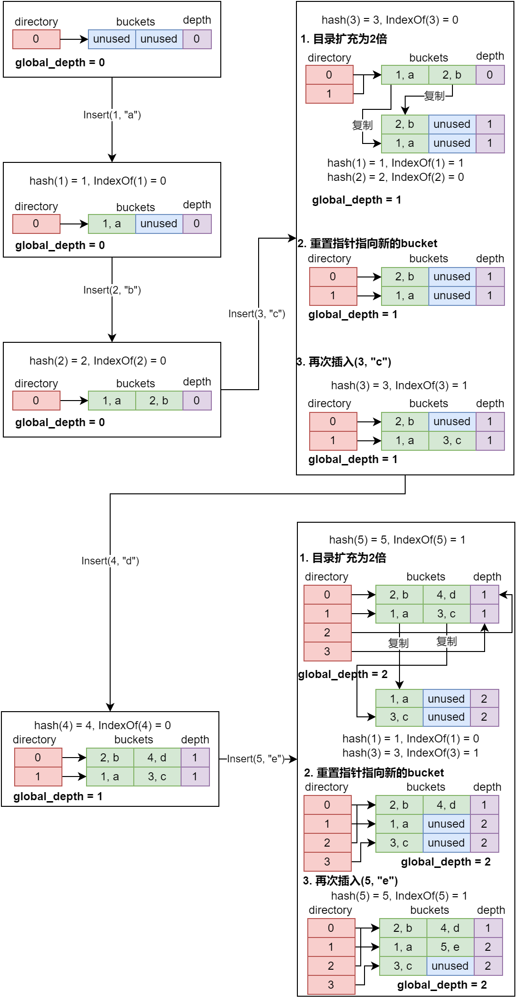

本文将介绍第一个`project: buffer poll`的实现思路
由于课程老师不允许放出自己的代码实现, 因此我只会涉及大概的实现思路, 而不涉及代码细节

官方`project`文档: https://15445.courses.cs.cmu.edu/fall2022/project1/

# 1 项目目标
本项目要实现的缓存池结构如下:
1. 实现一个可扩展哈希表, 将数据库中的一个`page`从磁盘缓存到内存中, 并且维持从`page_id`到`page`得到映射关系
2. 当`page`的大小超出容量时, 使用`lru-k`进行替换

# 2 可扩展哈希
## 2.1 整体介绍 
可扩展哈希（Extendible Hashing）是一种动态哈希技术，适用于数据库和文件系统中的索引结构，特别是在处理大量增减变化的数据集时。可扩展哈希表的主要特点是能根据数据量的变化动态地调整其大小，这样可以维持较均匀的访问性能，无论数据量的多少。

## 2.2 工作原理

1. **哈希函数**：
   可扩展哈希表使用哈希函数对键值进行哈希，生成固定长度的位模式。通常，这个哈希函数产生的位数要比实际使用的位数多，以便表可以在未来扩展。
2. **目录结构**：
   该算法使用一个称为“目录”(`directory`)的结构，它包含指向数据桶（`buckets`）的指针。目录的大小取决于当前使用的哈希键的位数，初始时通常很小。

3. **桶**：
    存储实际数据项（例如键值对）的基本单元。每个桶可以存储一个或多个数据项，其容量通常是预先定义的。

1. **桶分裂**：
   当一个桶满时（即达到预设的装载因子），系统会进行桶分裂（`bucket splitting`）。分裂时，桶中的数据会根据新的哈希键位重新分配到两个新桶中。

2. **目录扩展**：
   如果所有数据项都使用了当前哈希键的全部位数，且某个桶满了需要分裂，则目录也需要扩展。目录扩展是通过增加哈希键的位数并复制当前目录项来实现的。

3. **局部性原理**：
   可扩展哈希表的一个关键特性是局部性原理，即桶分裂只影响某个特定桶中的记录，而不会影响到整个哈希表。

## 2.3 插入流程
### 2.3.1 流程概述
整体流程如下:
可扩展哈希的插入流程涉及将新的数据项（键值对）添加到哈希表中。以下是插入过程的步骤：

1. **哈希函数计算**：
   对插入项的键使用哈希函数，得到一个哈希值。这个哈希值包含足够多的位，以支持未来的目录扩展。

2. **确定目标桶**：
   使用哈希值的前几位（称为“全局深度”）来确定目标桶。全局深度是指目录中用于索引的位数。如果哈希表的目录大小是 $2^d$，那么全局深度就是 `d`。

3. **将数据插入桶**：
   1. 如果目标桶没有满，即其包含的数据项少于桶的最大容量，则直接将数据项插入到该桶中。
   2. **处理桶溢出**：
   如果目标桶已经满了，需要进行桶分裂。桶分裂的基本流程如下：
      1. **分裂桶**：
      创建一个新的空桶。将原来的桶中的所有数据项和新插入的数据项根据哈希值的下一位重新分配到这两个桶中。这通常意味着原桶和新桶会根据哈希值的那一位（原本相同的位）分别收集0和1的记录。
      2. **更新目录**：
      更新目录以反映新的桶分配。这可能需要增加目录的“全局深度”（即索引的位数）。如果分裂的桶的“局部深度”（该桶对应的哈希值的位数）已经等于全局深度，那么在分裂之前，目录需要加倍，即复制一遍，以增加一个位的索引深度。
      3. **重新指向桶指针**：
      将目录中与原桶相关的指针（那些仅在分裂位上有差异的指针）更新，使一部分指向原桶，另一部分指向新桶。
      4. **重复分裂（如有必要）**：
   如果在分裂后新插入的项还是无法被放入桶中（因为原桶中其他项与它有相同的新哈希值），则需要重复分裂过程。
      5. **完成插入**：
   当桶分裂和目录更新完成后，确保所有的数据项都被正确地放入桶中，包括新插入的数据项。

这个过程确保了可扩展哈希表可以根据数据量的变化动态调整，同时保持常数时间的平均插入性能。由于目录的深度和桶指针的更新是有限的，所以插入过程通常很高效。

### 2.3.2 图解插入
接下来结合插入的图例解释其工作原理:



通过上图我们可以明显看到可扩展哈希的下面几个特点:
1. 不同目录项可以指向相同的`bucket`
2. 每次超出`bucket`容量时, 只有超出`bucket`容量的那一个`bucket`需要`rehash`, 其余`bucket`保持不变
3. 每一个`bucket`有自己的深度, 全局的深度等于所有`bucket`的深度的最大值
4. `global_depth << 1== len(directory)`

**此处详细说明图中`IndexOf`的含义:**
`IndexOf`就是寻找`bucket`的序号, 将`key`进行`hash`后取`某几个低位`得到`bucket`的序号, `某几个低位`正是通过全局的`global_depth`确定的, `global_depth`就是指定了低位的数量, 以最后一次插入的`(5, "e")`为例:
1. `hash(5) = 5`;
2. 5的二进制表示是`0b101`, 此时的`global_depth`为2, 所以取低2为`0b01`, 目标`bucket`的序号为1
3. 向1号`bucket`插入`(5, "e")`, 容量足够, 插入成功

## 2.4 删除流程
由于本项目不需要实现哈希的收缩, 因此删除流程只需要将指定`bucket`中的元素删除即可

# 3 `LRU-K`替换策略
## 3.1 `LRU-K`工作原理
`LRU-K` 是传统的最近最少使用（`LRU`）算法的扩展。在 `LRU` 算法中，当需要替换一个页面时，选择最长时间未被访问的页面进行替换。而 `LRU-K` 算法则进一步利用了页面的访问历史信息，不仅考虑最后一次访问时间，还考虑到最后 `K` 次的访问时间。

`LRU-K` 跟踪并记录每个页面最后 K 次被访问的时间。它使用这些历史访问数据来预测每个页面未来被访问的可能性。

具体而言, `LRU-K`按照下面的规则来移除元素:
1. **寻找访问次数低于 K 次的页面**：首先检查是否有页面的访问次数低于 `K` 次。如果有，这些页面是候选被替换的对象，因为它们相对来说是最不常用的。在这些页面中，选取最新访问时间戳最旧的页面进行替换。

2. **寻找访问次数达到 K 次的页面**：如果所有的页面访问次数都达到了 `K` 次，则从这些页面中选择最新的第 `K` 次访问时间戳最旧的页面进行替换。这表示即使页面被频繁访问，但如果它的“第 `K` 次”访问已经很久远了，那么它可能在未来一段时间内不会再次被访问，因此成为了替换的目标。

## 3.2 实现思路
### 3.2.1 数据结构
可以看到, 传统的`LRU`直接移除时间戳最久的一个元素, 但`LRU-K`需要分为`访问次数低于 K 次`和`访问次数达到 K 次`2中情况, 在这2种情况下, 其移除的思路和传统的`LRU`是一样的。

由于我们的`LRU-K`是作为缓存池的一部分使用的，其更新、删除、读取都有时间复杂度的要求，查询最容易想到哈希表， 而插入和删除最容易想到的是链表， 因此可以结合这2个数据结构实现，由于2个情况都可以看做是传统`LRU`的实现, 因此可以用如下的数据结构实现:

1. 低于 `K` 次的页面记录数据结构
   1. 双向链表: `list_less_k`: 按照最新访问顺序记录页面`id`
   2. 哈希表: `map_less_k`: 记录页面在`list_less_k`中的位置(也就是迭代器), 以便快速删除
2. 达到 `K` 次的页面记录数据结构
   1. 双向链表: `list_reach_k`: 按照最新访问顺序记录页面`id`
   2. 哈希表: `map_reach_k`: 记录页面在`list_reach_k`中的位置(也就是迭代器), 以便快速删除
3. 全局计数器`map_count`: 记录每个页面`id`的访问次数, 控制页面从`list_less_k`/`map_less_k`转移到`list_reach_k`/`map_reach_k`
### 3.2.2 记录和删除
#### 3.2.2.1 新增访问记录
记访问记录的页面为`id`
1. 从`map_count`中查看`id`的访问次数
2. 如果访问次数达到了`k`次
   1. 将`id`的记录从`list_reach_k`和`map_reach_k`中删除
   2. 将`id`重新插入`list_reach_k`, 并更新这个新的头部或者尾部位置(取决于链表的排序是从新到旧还是从旧到新)的迭代器到`map_reach_k`
   3. 更新`map_count`计数
3. 如果访问次数不到`k`次
   1. 如果访问次数是`k-1`次
      1.  由于这次更新后就达到了`k`次, 需要将`id`从`list_less_k`和`map_less_k`中删除
      2.  将`id`插入`list_reach_k`, 并更新这个新的头部或者尾部位置(取决于链表的排序是从新到旧还是从旧到新)的迭代器到`map_reach_k`
      3.  更新`map_count`计数
   2. 如果访问次数小于`k-1`次
      1. 将`id`从`list_less_k`和`map_less_k`中删除
      2. 将`id`重新插入`list_less_k`, 并更新这个新的头部或者尾部位置(取决于链表的排序是从新到旧还是从旧到新)的迭代器到`map_less_k`
      3. 更新`map_count`计数

#### 3.2.2.2 替换策略
1. 如果`list_less_k`不为空
   1. 移除`list_less_k`头部或尾部的最旧页面号, 同时移除对应的`map_less_k`
   2. 更新对应`map_count`计数为0, 表示没有在缓存池中
2. 如果`list_less_k`为空
   1. 移除`list_reach_k`头部或尾部的最旧页面号, 同时移除对应的`map_reach_k`
   2. 更新对应`map_count`计数为0, 表示没有在缓存池中

>> 以上的新增和替换思路没有考虑到页面在逻辑上是否可以移除, 因为一个页面尽管长时间没有被访问, 但其数据和加载到内存时发生了变化, 还没有刷入磁盘, 因此不能被移除。在项目代码中， 还需要增加相应的判断，不过这个判断很简单，就没有写到上面的流程里了

# 4 Buffer Pool
之前我们只是一股脑地实现了可扩展哈希和`LRU-K`, 但实际上却不知道或者不完全知道这些东西和最后实现的缓存池有什么联系, 做完这一小节后这一切都有了答案

## 4.1 Buffer Pool 数据结构
首先需要说明`Buffer Pool`的数据结构:
```cpp
/** Number of pages in the buffer pool. */
const size_t pool_size_;
/** The next page id to be allocated  */
std::atomic<page_id_t> next_page_id_ = 0;
/** Bucket size for the extendible hash table */
const size_t bucket_size_ = 4;

/** Array of buffer pool pages. */
Page *pages_;
/** Pointer to the disk manager. */
DiskManager *disk_manager_ __attribute__((__unused__));
/** Pointer to the log manager. Please ignore this for P1. */
LogManager *log_manager_ __attribute__((__unused__));
/** Page table for keeping track of buffer pool pages. */
ExtendibleHashTable<page_id_t, frame_id_t> *page_table_;
/** Replacer to find unpinned pages for replacement. */
LRUKReplacer *replacer_;
/** List of free frames that don't have any pages on them. */
std::list<frame_id_t> free_list_;
/** This latch protects shared data structures. We recommend updating this comment to describe what it protects. */
std::mutex latch_;
```
上面这些都是`src/include/buffer/buffer_pool_manager_instance.h`中定义的类成员变量, 对其中主要的成员变量说明如下:
1. `pool_size_`: 缓存池的容量, 也是之前的`LRU-K`中的`num_frames`
2. `bucket_size_`: 之前的可扩展哈希的桶的容量
3. `pages_`: 实际缓存池的页的内容, 是一个数组
4. `disk_manager_`: 官方已经实现的从硬盘加载页面的类的实例, 相关函数的作用可以去看头文件
5. `page_table_`: 之前实现的可扩展哈希表, 用于快速查找指定的`page_id_t`在`pages_`数组中的位置
6. `replacer_`: 之前实现的替换类, 用于记录读写记录并在缓存池满时进行替换
7. `free_list_`: 空闲链表, 记录的是空闲的页的索引, 也就是在 `pages_`数组中的下标

通过上面的分析, 我们对之前实现的可扩展哈希表和`LRU-K`的作用就已经很明白了, 而且在实现了可扩展哈希表和`LRU-K`后, 最后这一部分的任务已经很简单了, 简单阅读一下`proj`文档, 应该就能试着写出来了

## 4.2 实现思路
### 4.2.1 `NewPgImp`
要求在缓存池中创建一个新页, 逻辑如下:
1. 如果`pages_`中的所有页都不能被替换(`GetPinCount() > 0`), 返回空指针
2. 此时创建新页, 如下获取一个新页
   1. 如果空闲列表`free_list_`不为空, 从中取一个页
   2. 否则用替换类`replacer_`驱逐一个页
      1. 如果驱逐页是脏页, 还需要用`disk_manager_`写回磁盘
      2. 缓存池哈希表`page_table_`移除驱逐页
3. 在缓存池哈希表`page_table_`记录新页位置
4. 更新页的`pin_count_`和页号
5. 用替换类`replacer_`更新新页的访问记录, 并设置其不可驱逐(马上要被使用)

### 4.2.2 `FetchPgImp`
要求从缓存池取出指定页号的页面, 如果页面不存在于缓存池但缓存池没有可以驱逐的页面, 返回空指针, 逻辑如下:
1. 如果哈希表中存在映射, 说明页存在:
   1. 自增其`pin_count_`
   2. 用替换类`replacer_`更新页的访问记录, 并设置其不可驱逐(马上要被使用)
   3. 返回
2. 不存在映射, 需要驱逐
   1. 如果`pages_`中的所有页都不能被替换(`GetPinCount() > 0`), 返回空指针
   2. 分配新页
      1. 如果空闲列表`free_list_`不为空, 从中取一个页
      2. 否则用替换类`replacer_`驱逐一个页
         1. 如果驱逐页是脏页, 还需要用`disk_manager_`写回磁盘
         2. 缓存池哈希表`page_table_`移除驱逐页
3. 更新新页的`pin_count_`和页号
4. 用替换类`replacer_`更新新页的访问记录, 并设置其不可驱逐(马上要被使用)
5. 调用`disk_manager_`的相关方法从硬盘上读取指定页的内容到这个新页

### 4.2.3 `DeletePgImp`
要求在缓存池删除指定页号的页, 逻辑如下:
1. 如果该页不存在于缓存池, 返回`true`表示删除成功
2. 如果该页被占用(`GetPinCount() > 0`), 返回`false`表示删除失败
3. 删除该页
   1. 从哈希表从移除
   2. 从替换类`replacer_`中移除
   3. 更新删除页的页号为`INVALID_PAGE_ID`, 更新`pin_count_ = 0`, 标记`is_dirty_ = false`
   4. 将该页的索引号放回空闲列表
   5. 返回`true`表示删除成功
