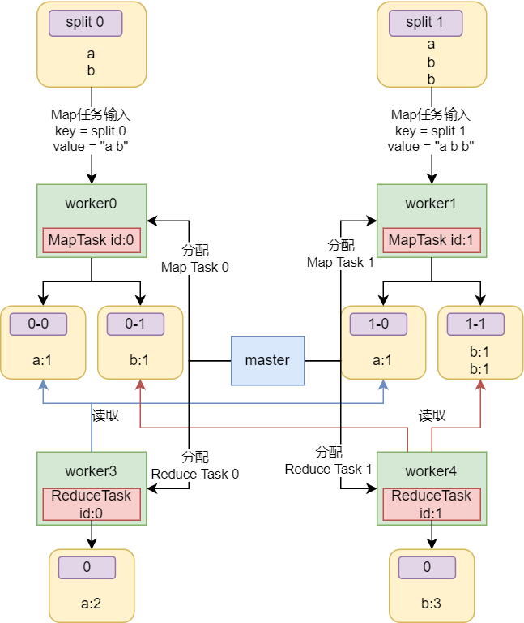

课程主页: https://pdos.csail.mit.edu/6.824/schedule.html

本次课程包括了分布式系统的引入内容和`MapReduce`, 前者是引入性质的内容就不过多介绍了, 这里介绍`MapReduce`

# 1 MapReduce是什么?
`MapReduce`是一种编程模型, 用于处理和大数据。其思想是使程序员能通过简单的`Map`函数和`Reduce`函数的编写就能完成分布式计算的任务, 而不需要知道任何有关分布式的事情，`MapReduce`框架会处理剩下的事情。

# 2 MapReduce结构

上图所示是论文中对`MapReduce`架构描述, `MapReduce`中有如下术语:
- `Worker`: 分布式系统中不同计算机上运行的进程
- `Master`: 也是一个计算机上的进程, 负责协调整个处理过程，包括分配任务、监控进度和处理失败的工作节点
- `Task`: 计算任务, 包括`Reduce`和`Map`
- `Map`: 一个用用户程序提供的函数, 用于将输入的`key:value`转化为一组`mid-key:mid-value`
- `Reduce`: 一个用用户程序提供的函数, 用于将输入的`mid-key:[]mid-value`转化为输出`output`

通常, `Master`将`Map`和`Reduce`作为任务分配给`Worker`进行计算, 称为`Map Task`和`Reduce Task`, 以下是其一次`MapReduce`任务(称为`Job`)执行的过程:
1. 文件分片
   通常是在任务开始之前由`Master`完成的。这是初始化阶段的一部分
2. `Master`分配`Map Task`
   `Master`将分片信息分配给`Worker`节点, 例如: 最开始将`切割的文件名和文件内容`作为`key:value`通过`RPC`提供给`worker`使其利用提供的`map func`进行计算, 这也是`lab 1`中的工作方式
3. `Map Task`执行
   `Map Task`的计算过程除了利用`map func`进行计算外, 还需要将输出的多个`mid-key:mid-value`分割成片存储于不同的本地文件, 不同的分片将提供给不同的`Reduce Task`, 通常使用`Hash`函数并对取`Reduce Task`的数量模得到分片序号。执行`Map Task`的`Worker`在执行结束后报告`Master`某个`Map Task`的执行情况
4. `Master`等待所有的`Map Task`执行成功
   `Master`根据`Worker`对`Map Task`的执行情况的报告进行决策, 保证所有的`Map Task`执行成功
5. `Master`分配`Reduce Task`
   `Master`会给`Worker`分配某个`Reduce Task`， `Worker`根据其任务序号读取之前所有`Map Task`对应分片的内容，这也是为什么要等待所有的`Map Task`执行成功后才执行`Reduce Task`，这样才能保证`Reduce Task`不遗漏`mid-key`, 整合这分片文件后遍历所有的`mid-key:[]mid-value`并应用`reduce func`, 并存储输出结果。同样， 执行`Reduce Task`的`Worker`在执行结束后报告`Master`某个`Reduce Task`的执行情况
6. `Master`协调所有的`Reduce Task`执行成功
   `Master`根据`Worker`对`Reduce Task`的执行情况的报告进行决策, 保证所有的`Reduce Task`执行成功

最后, 不同的`Job`可以链式执行, 前一个`Job`的输出可以作为下一个`Job`的输入, 以此实现负责而庞大的计算任务

# 3 容错与恢复
- 心跳信号
  `Worker`只需要向`Master`发送心跳信号表示自身的存活, 如果Master在预定时间内没有收到来自某个`Worker`的心跳，它就会将该`Worker`标记为失效，并将其上运行的所有`Map`和`Reduce`任务重新调度到其他节点上。不过这种设计不太会再`lab 1`中出现, 因为这样会使`Master`记录太多有关`Task`和`Worker`的信息, 设计相对复杂
- 超时重试
  如果一个`Worker`节点在执行`Map`或`Reduce`任务耗时过长，`Master`会检测到这种情况。`Master`将其认定为失败, 可以将失败的任务重新分配给其他健康的`Worker`节点执行。这种重试机制可以处理机器故障、软件错误或其他导致任务失败的问题。
- `checkpoints`
  `Master`会周期性地写入`checkpoints`到磁盘以预备可能的崩溃恢复
- 原子重命名
  将`Map`和`Reduce`任务的输出写入到一个命名好的临时文件，并且只在任务成功完成时才对其进行重命名，来实现任务的幂等性。
- 文件系统备份
  在`MapReduce`框架中，输入数据通常存储在一个分布式文件系统（如`GFS`）中，该文件系统会将数据块复制到多个节点上。这种数据副本机制确保了即使某些机器发生故障，数据仍然可用。

# 4 一个wc执行流程的案例
此处给出一个统计单词出现数量任务执行流程的案例, 助于理解

> 假设单词`a`的哈希值为0, `b`的哈希值为1