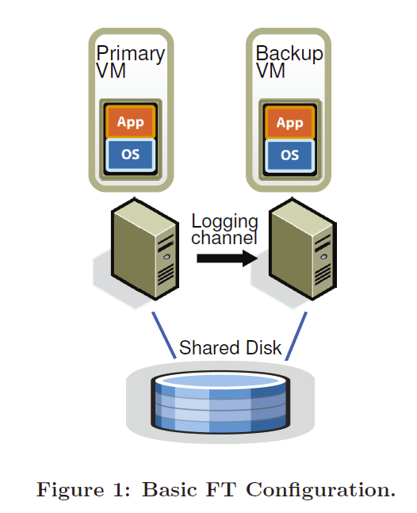
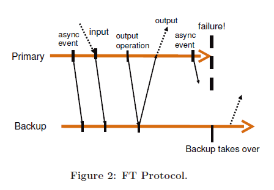
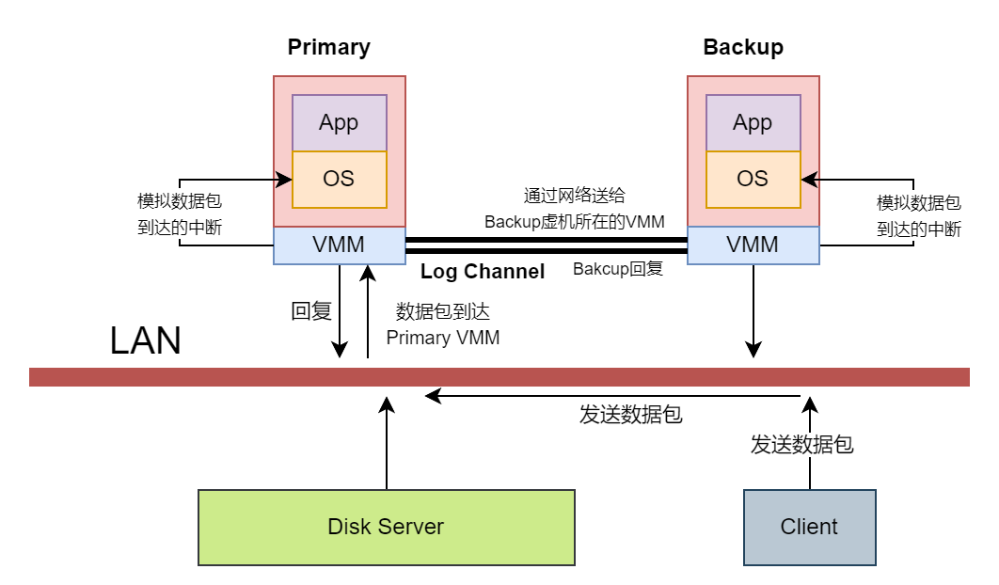

课程主页: https://pdos.csail.mit.edu/6.824/schedule.html

# 1 整体介绍
论文介绍了一种在虚拟机上实现的备份系统的设计: **VMWare Fault-tolerant**, 使用了较小的带宽, 支持在远距离实现容错。该实现是基于**状态机**的。

传统的主从备份的复制方法称为**状态转移**（State Transfer），备份服务器几乎连续地将主服务器的所有状态更改进行传输到备份服务器，包括CPU、内存和I/O设备的更改。然而，发送这些状态所需的带宽，特别是内存中的变化，可能非常大。

本文使用了**复制状态机**（Replicated State Machine）以减小带宽需求，其思想是将服务器建模为**确定性状态机**，通过从相同的初始状态开始，并确保它们以相同的顺序接收相同的输入请求来保持同步。

本质来说, **状态转移**是复制主节点内存或寄存器中的内容, **复制状态机**是传输来自客户端的操作或其他外部事件。使用复制状态机的主要原因是，外部操作或事件通常比服务的状态要小很多。

但是大多数服务器或服务存在一些非确定性操作，因此必须使用额外的协调来确保主服务器和备份服务器保持同步。对于物理机而言，实现确定性执行的协调非常困难。因此，论文将**VM虚拟机**定义为一个定义状态机。尽管**VM虚拟机**也有一些非确定性操作，但可以通过宿主对VM的执行有完全的控制权，包括所有输入的传递，它能够捕获主VM上非确定性操作的所有必要信息，并在**备份VM**上正确地重放这些操作。

> 为什么非确定性操作需要额外的协调机制?
> 例如: 获取时间这个指令, 在主节点和副本上, 即使指令和内存相同, 其结果页不一样。类似的情形还包括：获取`CPU`的`ID`
> 对这种情况, 解决方案是主节点直接将这些指令的执行结果发送给副本, 副本不执行指令, 接收主节点的结果

接下来是几个论文中定义的概念：
1. **状态机**：将服务器建模为确定性状态机，从相同的初始状态开始，并确保它们以相同的顺序接收相同的输入请求来保持同步
2. **确定性重放**：能够记录主服务器的执行并确保备份服务器执行相同的基础技术
3. **虚拟锁步状态**：2个**VM**构成的容错虚拟机，**主VM**的操作会在**备份VM**上再次执行

## 局限性
目前为止, 论文讨论的都是单核CPU的场景, 因为多核处理器指令间的交互很复杂

## 疑问
本论文的复制和之前提到过的`GFS`的复制有什么区别?
> `GFS`没有复制内存中的每一个bit，它复制的更多是应用程序级别的`Chunk`, 而`VMware FT`是从底层开始的复制, 复制的是寄存器和内存

# 2 基本架构
## 2.1 基本配置
下图所示为**容错虚拟机VM**的基本设置。左边是**主VM**，右边是**备份VM**，他们运行在不同的物理服务器上。**备份VM**与**主VM**保持同步并执行相同的操作，尽管会有小的时间延迟。工作时，只有主VM在网络上宣告其存在，即只有**主VM**产生实际的输出并返回给客户端，**备份VM**的输出被丢弃。**主VM**接收的所有输入都通过一个称为`logging channel`的通道发送给**备份VM**。

系统使用服务器之间的**心跳**和对`logging channel`的监控来判断是否有`VM`宕机。

## 2.2 确定性重放实现
`VM`的输入包括了常规的输入和**非确定性输入**, 常规的输入包括:网络数据、磁盘数据、键盘和鼠标输入等， **非确定性输入**主要包括虚拟中断和非确定性操作。

**确定性重放**将一个`VM`的输入和所有与`VM`执行相关的可能的非确定性输入都写入到日志文件中。通过从文件中读取日志条目，可以稍后完全精确地重放`VM`执行。对于非确定性事件，如**定时器**或**IO中断**，其确切指令也被记录下来。在重放期间，事件在指令流中的相同点被传递。

## 2.3 对外输出的规则
下图为摘自论文中, 展示了`FT Protocol`:
> **主VM**在等待**备份VM**回复日志写入成功后才向外输出

这样的目的是使得**备份VM**收到输出操作之前生成的所有日志条目, 因此如果输出之后**主VM**宕机, **备份VM**具有重放**主VM**宕机前所有指令的能力, 在重放操作完成后就可以上线替代原来的**主VM**。

为了做到一点，要在每次输出操作时创建一个特殊的日志条目， 然后**主VM**就会在这个特殊条目的回复到达前等待。

## 2.4 故障检测与备份VM上线
在**备份VM**上线前, 还缺少一个关键点：**如何判断`主VM`故障？**

这个问题其实是如何处理备份落后的问题, 因为`主VM`接收客户端的命令, 因此`备份VM`一定是滞后的。要确保故障发生时, `备份VM`已经跟上了`主VM`。

最容易想到的方案是监控管道中日志的流量和二者之间的心跳, 到那时这都会导致**脑裂问题**: **主VM**与**备份VM**之前的网络发生故障, 但客户端与二者之间的网络正常, 因此导致数据损坏和与`VM`通讯的客户端出现问题。问题发关键在于确保：**只有`主VM`或`备份VM`中的一个变为活动状态**

### 解决方案:
使用**共享存储**。当**主VM**或**备份VM**想要变为活动时，它在共享存储上执行一个原子测试并设置操作。如果操作成功，允许VM变为活动。如果操作失败，那么另一台`VM`必须已经变为活动状态，因此当前`VM`实际上会自行停止（“自杀”）。

具体而言，这个原子测试被称为**Test-and-Set 服务**，当其收到一个`Test-and-Set`请求，它会设置标志位，并且返回旧的值。这很像锁的实现。

# 3 非确定性事件的处理
## 3.1 什么是非确定性事件?
**再次解析: 什么是非确定性事件?**
> 不由当前内存直接决定的指令, 其在`Primary`和`Backup`的运行结果可能会不一样。这些指令就是所谓的非确定性事件。

## 3.2 非确定性事件分类
1. 客户端输入
   为什么客户端输入是非确定性事件? 因为客户端的输入实际上是网络报文。网络报文的数据会被网卡的`DMA`拷贝到内存，之后触发一个中断。尽管这个过程在`Primary`和`Backup`中是一样的， 但中断触发的时间是不确定的（大概率不一样），因此中断的触发打乱了指令流
2. 特殊指令
   1. 日期相关指令
   2. 随机数相关指令
   3. 获取`CPU ID`等类似的硬件相关的指令
3. 多核场景
   指令在多个`CPU`上会交错运行，其指令顺序不可预期(目前不考虑次场景)
   > PS: 这里的多核指的是`Primary`和`Backup`虚机操作系统的硬件是单核的, `VMM`以下的硬件一定是多核的

## 3.3 日志设计
日志设计可以处理以上的非确定性事件分类, 日志应当包含如下内容:
1. 事件发生时的指令序号
   `Backup`按照指令序号执行命令
2. 日志条目的类型
   可以判断这个指令是不是非确定性事件
3. 数据

课程中的例子是这样的:
> Primary和Backup两个虚机内部的guest操作系统需要在模拟的硬件里有一个定时器，能够每秒触发100次中断，这样操作系统才可以通过对这些中断进行计数来跟踪时间。因此，这里的定时器必须在Primary和Backup虚机的完全相同位置产生中断，否则这两个虚机不会以相同的顺序执行指令，进而可能会产生分歧。所以，在运行了Primary虚机的物理服务器上，有一个定时器，这个定时器会计时，生成定时器中断并发送给VMM。在适当的时候，VMM会停止Primary虚机的指令执行，并记下当前的指令序号，然后在指令序号的位置插入伪造的模拟定时器中断，并恢复Primary虚机的运行。之后，VMM将指令序号和定时器中断再发送给Backup虚机。虽然Backup虚机的VMM也可以从自己的物理定时器接收中断，但是它并没有将这些物理定时器中断传递给Backup虚机的guest操作系统，而是直接忽略它们。当来自于Primary虚机的Log条目到达时，Backup虚机的VMM配合特殊的CPU特性支持，会使得物理服务器在相同的指令序号处产生一个定时器中断，之后VMM获取到这个中断，并伪造一个假的定时器中断，并将其送入Backup虚机的guest操作系统，并且这个定时器中断会出现在与Primary相同的指令序号位置。

# 4 如何避免重复输出
考虑以下的场景:
1. `Primary`在客户端收到了回复后崩溃
2. `Backup`上线, 但其还没有处理完缓冲区的`log`
3. `Backup`处理完`log`后, 由于自己已经上线, 其将输出发送给客户端
4. 客户端收到了2个相同的输出

几乎所有的分布式场景都会遇到类似以上的重复输出的问题, 常规的解决方法是在客户端形成一套重复检测机制。

在`VMWare FT`中, 客户端通过`TCP`与服务进行交互, 而`Backup`由于与`Primary`状态相同, 其`TCP`报文也具有相同的序列号, 因此`VMWare FT`可以在客户端通过`TCP`简单地实现去重。

# 5 具体案例说明
下图为从`Lecture04`中总结出来的一个命令被执行的流程示意图

- **结构介绍**
1. `primary`和`backup`各自运行在不同的服务器的`VMM`上
2. `primary`, `backup`以及`client`都运行在同一个局域网
3. `VMware FT`里的多副本服务没有使用本地盘，而是使用了一些`Disk Server`（远程盘）
4. `primary`和`backup`之间通信的通道称为`Log Channel`

- **`client`执行命令的流程**
1. `client`发送包含命令的数据包
2. 数据包服务器上被收到, 产生一个中断被`primary`的`VMM`捕获
3. `primary`的`VMM`捕获到中断后, 进行如下两项操作
   1. 在自己虚拟化的`OS`中, 模拟网络数据包到达的中断
   2. 将网络数据包拷贝一份，并通过`Log Channel`送给`Backup`虚机所在的`VMM`
4. `Backup`虚机所在的`VMM`收到数据包, 同样在自己虚拟化的`OS`中, 模拟网络数据包到达的中断
5. `primary`和`backup`执行数据包中的命令
6. `primary`产生回复报文, 通过`VMM`返回给客户端
7. `Backup`只是将回复简单的丢弃掉

**网卡驱动在这里做啥什么事?**
网卡会将网络数据包拷贝给`VMM`的内存，之后，网卡中断会送给`VMM`, 然后由`VMM`负责如何处理这个中断和数据, 例如:
1. 暂停Primary虚机，记住当前的指令序号，将整个网络数据包拷贝给`Primary`虚机的内存，
2. 之后模拟一个网卡中断发送给`Primary`虚机。
3. 同时，将网络数据包和指令序号发送给`Backup`。`Backup`虚机的`VMM`也会在对应的指令序号暂停`Backup`虚机，将网络数据包拷贝给`Backup`虚机，之后在相同的指令序号位置模拟一个网卡中断发送给`Backup`虚机

