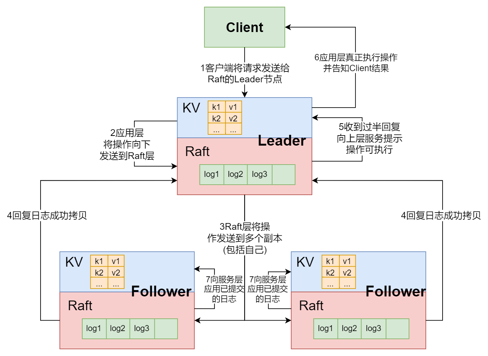

课程主页: https://pdos.csail.mit.edu/6.824/schedule.html

本节课是介绍`Raft`共识算法的第一部分, 建议阅读[论文](https://pdos.csail.mit.edu/6.824/papers/gfs.pdf), 如果要做`Lab`的话, 论文是一定要看的, 尤其是要吃透论文中的图2。

# 1 引入: 脑裂（split brain）
脑裂的定义:
> 当系统中的节点因为网络故障而无法相互通信时，可能会发生脑裂现象，即系统被分割成两个或多个互不连通的子集，每个子集都可能认为自己是完整的系统。

在介绍`raft`算法之前, 课程首先总结了之前课程中的几个分布式应用程序的共性和潜在的问题:
- `MapReduce`: 主节点管理`Map`和`Reduce`任务的派发和信息收集, 自始至终没有发生变化
- `GFS`: 主节点管理`Chunk`信息、租约管理等, 主节点通过日志的形式避免宕机后信息的丢失
- `VMware FT`: 通过一个原子测试完成`Primary`和`Backup`之间的切换

以上讨论的问题都是主节点失效后系统能否正常工作的场景, 看起来`VMware FT`可以满足在一个服务器宕机后剩下的服务器也能正常运行的需求, 但这里仍然存在问题: **其原子测试本身也是一个`Test-and-Set服务`**

下图为课程中展示的案例:

因为`Test-and-Set服务`本身也算是一个分布式应用, 其也存在主从备份的概念, 因此会出现上图中描述 的场景:

1. `Primary`和`Backup`之间的网络出现问题, 都认为自己是唯一的服务节点
2. `Primary`与`Test-and-Set Server1`之间网络正常, 与`Test-and-Set Server2`之间网络不正常; `Backup`与`Test-and-Set Server1`之间网络不正常, 与`Test-and-Set Server2`之间网络正常
3. `Primary`和`Backup`的`Test-and-Set`测试都成功了, 此时存在2个上线的服务器, 这就是一种**脑裂**现象

以上的问题是一种**脑裂**现象, 因为`Primary`和`Backup`之间出现了网络分区, 每个区域之间不能彼此访问。

**补充:另外二者对脑裂现象的处理**:
- `MapReduce`中没有提及解决方案
- `GFS`的主节点会将关键的元数据信息存储在持久化的操作日志中，这个日志会被复制到多个地方，确保其可用性。如果发生网络分区，那么分布在不同分区的节点可能无法与主节点通信，但`GFS`的设计允许系统在某种程度的网络分区后仍然能够继续操作，只要分区中有足够的副本存在。

# 2 多数投票（Majority Vote）
以上的问题在于不同的网络分区并不知道自己是否在别的网络分区工作的同时也在工作， 为了解决这个问题， `raft`算法提出了`Majority Vote`: **任何决策必须要求过半的节点的投票支持**。这是`Raft`最基本的一个概念, 而且这个概念还有一个重要的前提: **节点数量必须是奇数**

因为如果是奇数的节点构成的分布式应用, 至多只有一个数量过半的网络分区, 因此至多只有一个网络分区能够完成正常的决策工作, 避免了脑裂。同时， 这个机制还表达了`raft`的容错能力: **至多允许一半的节点异常**。

# 3 raft的运行案例
课程中为了展示`raft`在实际应用中如何工作, 给出了`lab3`中将实现的`kv存储`的例子:

1. 客户端请请求(`Get`或`Put`)发送给`Leader`的服务层
2. `Leader`的服务层将这个`Get`或`Put`命令向下发送到`Raft`层
3. `Raft`层将操作封装成日志发送给多个`Follower`的`Raft`层
4. `Follower`的`Raft`层复制日志后回复
5. `Leader`的`Raft`层收到过半节点回复后, 向上发送一个通知到应用程序表示真正的执行这个操作了。
6. `Leader`的服务执行命令改变自身`Table`的状态, 并回复给客户端执行结果
7. `Follower`的应用层也应用`Raft`层的日志改变自身`Table`的状态(这里需要`Leader`告知哪些`log`是`commited`, 通常是通过心跳告知, 图中未画出, 而且这个操作通常有延迟, 客户端不需要等待这个操作完成)

**接口函数说明**
1. `Start`函数
   应用程序通过`Start`函数将一个操作传递给`Raft`层，返回值包括，这个请求将会存放在`Log`中的索引(如果成功`commit`的话)
2. `applyCh channel`
   当之前请求的操作`commit`之后, 通过`applyCh channel`向应用程序发出消息通知, 应用程序读取这个消息。

具体而言, 客户端调用应用层的`RPC`，应用层收到`RPC`之后，会调用`Start`函数，`Start`函数会立即返回，但是这时，应用层不会返回消息给客户端，因为它还没有执行客户端请求，它也不知道这个请求是否会被`Raft`层`commit`。只有在某一时刻，对应于这个客户端请求的消息在`applyCh channel`中出现, 应用层才会执行这个请求，并返回响应给客户端。

# 4 Log
`Raft`中的`Log`会被添加到节点的`Log数组`中, 每一个`Log`包含了以下内容:
- 具体的命令, 取决于应用
- 任期`Term`, 用于判断这个`Log`是否有效

`Leader`节点需要维护每个`Follower`的`Log`状态:
1. 目前已经复制的`Log`在数组中的索引
2. 下一个追加的`Log`应该从哪个索引开始

同时`Leader`也需要维护全局的日志状态:
- 目前已经提交的`Log`在日志数组中的索引

`Log`有3大作用:
1. 用于`Leader`和`Follower`之间的同步
2. 包含命令用以改变应用程序的状态
3. 每个`Raft`节点都需要将`Log`写入到它的磁盘中, 因此`Log`还可以被`Raft`节点用来从头执行其中的操作进而重建故障前的状态

**重启后`Leader`如何利用`Log`进行恢复?**
1. 首先重启后进行`Leader`选举，其中一个节点被选为`Leader`
2. `Leader`通过心跳来确定目前已经提交的日志的索引位置
3. 在这个索引位置以前, 所有的节点的日志是相同的, 可以应用到自身的状态机
4. 在这个索引位置以后, `Leader`迫使其他所有副本的`Log`与自己保持一致

# 5 Leader选举
## 5.1 选举机制
每一个运行的`raft`节点都包含一个任期号(`Term`), 每个任期只能有一个`Leader`。

如何保证每个任期只能有一个`Leader`？

首先， 每一个运行的`raft`节点只能是如下几个角色之一：
- `Leader`
- `Follower`
- `Candidate`

每个`Raft`节点都有一个选举定时器, 每次收到心跳`RPC`或追加`log`的`RPC`(都通过`AppendEntries`)时, 都将重置这个选举定时器, 在选举定时器没有到期时, 发出`AppendEntries`的节点是`Leader`, 接收`AppendEntries`的节点是`Follower`, 一旦因为没有接收到消息导致选举定时器到期, 节点转化为`Candidate`并进行投票选举。

每一次选举会增加`Term`，通过`RequestVote`向其他节点寻求投票, 由于节点数量是奇数, 而投票选举成功要求过半的投票, 因此只有一个`Leader`将在一个特定的`Term`内选举成功。

拿到过半投票的`Leader`将通过心跳告知新`Leader`的诞生, 如果没有这样的节点, 则再次自增`Term`进行新一轮的选举。

## 5.2 避免选票分裂
因为每个`Candidate`都会给自己投票, 因此如果所有的`Follower`同时转化为`Candidate`并发起选举, 结果一定是各自一张投票, 形成了选票分裂(`Split Vote`), 并且恶心循环地再次进行新一轮选举。

为了避免这种情况，不同的服务器都应该选取随机的超时时间。先超时的节点有更大的概率获得更多的选票，因此避免了多次选票分裂的情况。

> PS: 选举超时的设定要求: 至少大于`Leader`的心跳间隔, 否则该节点会在收到正常的心跳之前触发选举

## 5.3 `Raft`未考虑的情形: 单向网络故障
以下的情形会导致`Raft`不能正常工作:
1. `Leader`可以发出心跳，但是又不能收到任何客户端请求
2. `Leader`的心跳会抑制其他服务器开始一次新的选举

以上情形将导致客户端请求永远不被执行, 教授提出的解决方案是:**通过一个双向的心跳解决**: 
1. `Follower`需要回复心跳
2. 如果`Leader`一段时间没有收到自己发出心跳的回复，将让出`Leader`

