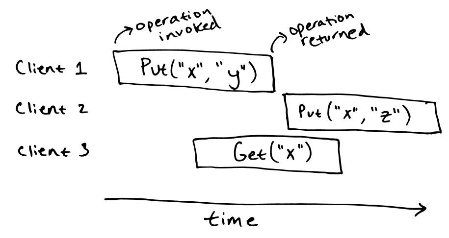
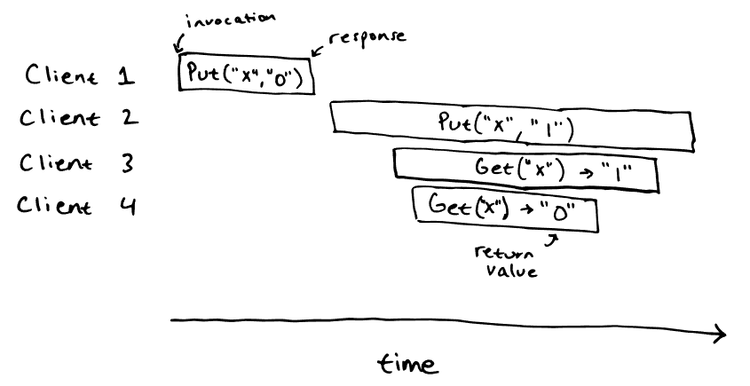
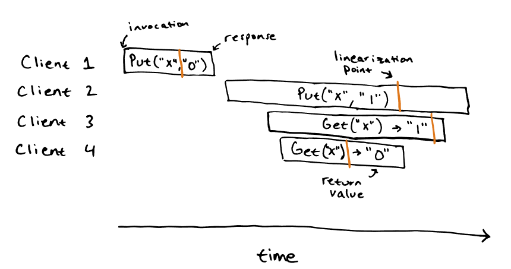
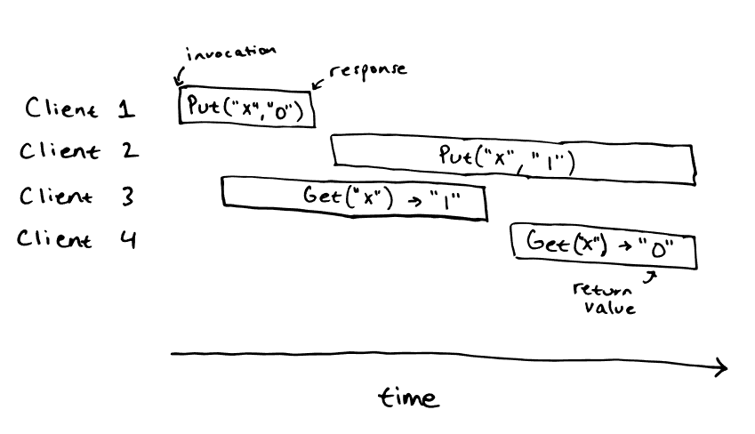
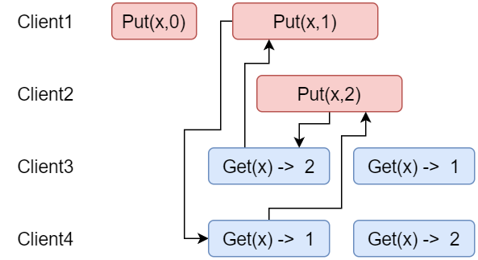

# 1 分布式系统正确性的定义
这里, 课程还是给出了一个`K/V存储`的案例来说明如何定义分布式系统重操作的正确性, 并引入了线性一致性
## 2.1 场景描述
课程中的`K/V存储`的案例用`Python`代码描述如下:
```python
class KVStore:
    def __init__(self):
        self._data = {}

    def put(self, key, value):
        self._data[key] = value

    def get(self, key):
        return self._data.get(key, "")
```

对于什么是正确的操作, 最直观的理解是:**`Get` 操作必须反映应用所有先前 `Put` 操作的结果**, 

在非并发的单机单线程环境下, 以上要求是自然被满足的, 但我们需要考虑的是如下一个分布式场景:



上图的每一个操作的全过程用一个矩形条来表示, 左边表示操作开始, 右边表示操作结束。在上图的场景下， 很难确定`Get("x")`返回值究竟是多少, 因为并发场景下, 我们不知道两个`Put`操作真正被执行时`Get`操作到哪一步了。为了定义在上述场景下的操作正确性，引入了**线性一致性**的概念

## 2.2 线性一致性的定义
什么是线性一致性(`Linearizability`)? 简单来说, 线性一致性是指一个系统表现得就像只有一个服务器，并且服务器没有故障，每次执行一个客户端请求，并且没有奇怪的事情发生。在线性一致性系统中，执行历史是一系列的客户端请求，可以按照一个顺序排列，并且排列顺序与客户端请求的实际时间相符合。这意味着操作是非并发的，每一个读操作都看到的是最近一次写入的值。

## 2.3 案例
考虑下面的这个场景：



该场景是可线性化的，其结果如下：



但下面这个场景就是不可线性化的:



原因在于, 既然`Client 3`得到了1这个结果, 那么`Client 2`的`Put`操作一定在`Client 3`的`Get`操作结束前完成了, 那么`Client 4`的`Get`操作就不应该得到旧值0

- 总结一下, 如何判断操作是否线性一致:
如果能构建一个操作序列, 满足每个才做读取的值都是前一个操作实际写入的结果, 那么其就是线性一致的

换言之，**不允许一个存储在系统中的数据有不同的演进过程。**

## 2.4 非线性一致的另一种解释:环



上图所示为`KV`场景下的一个非线性一致案例, `Client4`读取到`x=1`, 因此`Client1`的`Put(x,1)`应该先于`Client4`的第一个`Get`完成, 我们用一个从`Client1`的`Put`指向`Client4`的第一个`Get`的箭头表示这种先后关系。同理，也存在这样一条从`Client2`的`Put`指向`Client3`的第一个`Get`的箭头。由于`Client4`的第二个`Get`读取到了2, 因此第一个`Get`完成后, `Client2`的`Put`一定先于`Client4`的第2个`Get`, 因此存在从`Client4`的第一个`Get`指向`Client2`的`Put`的箭头。同理, 也存在从`Client3`的第一个`Get`指向`Client1`的第二个`Put`的箭头。

到这里为止，就出现了上图所示的**环**，这也是另一种非线性一致的表达方式。

# 3 重复的`RPC`和线性一致的关联
由于我们目前已经完成了`Lab2`的实验, 在`Lab2: raft`中, 请求失败后将导致`cleint`重新发送请求, 但在`cleint`侧看到的只是第一个请求失败了, 其可能的状况是:
1. `Leader`根本就没有执行过这个请求, 因为`Leader`发生了网络分区
2. `Leader`已经执行过这个请求了, 但回复时发生了丢包
3. `Leader`收到了第一次请求, 但执行过程中故障了
4. 第一次请求本身就发生了丢包
5. ...

因此`client`不能判断具体的原因, 但这将导致第二个请求可能被`Leader`(可能是新的, 也可能是旧的)看做一个重复的请求, 而有些请求被再次执行将导致状态机错误, 因此服务端应该能够判断这是不是一个重复的请求, 最简单的方案就是为每一个请求加上一个全局的索引, 服务端维护一个请求索引的哈希表烂判断请求是否重复。