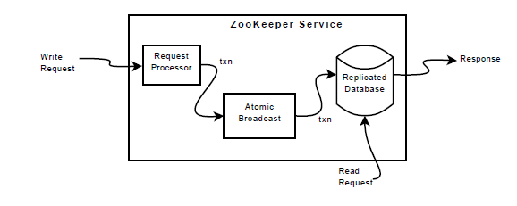

本次课程介绍了`ZooKeeper`, 并且我结合教授的课程和原论文总结了`ZooKeeper`的关键知识点形成了本文

课程主页: https://pdos.csail.mit.edu/6.824/schedule.html

原论文地址: https://pdos.csail.mit.edu/6.824/papers/zookeeper.pdf

# 0 引入: ZooKeeper是什么? 和Raft区别是什么?
- **更容易的交互**
1. `Apache ZooKeeper` 是一个开源的分布式协调服务，它为分布式应用提供了一种可靠的同步服务。`ZooKeeper` 允许分布式进程通过一个共享的层次名称空间互相协调，这个名称空间类似于文件系统的目录树结构，但是它更专注于协调，而不是存储。ZooKeeper的设计目标是将分布式协调的复杂性封装起来，为开发人员提供一个简单一致的编程接口。也就是说, `ZooKeeper` 可以直接供应用程序进行交互, 应用程序不需要与`ZooKeeper`在底层上关联(例如加载二进制库文件)
2. `Raft`不是一个可以直接交互的独立的服务， 而是以一个库的形式提供服务, 因此必须要设计自己的应用程序来与`Raft`库交互。
> `Zookeeper`运行在`Zab`之上，`Zab`和之前的`Lab`实现的`Raft`属于同一层级, `Zab`在更低的层级也是维护一系列的`log`, 和`raft`类似

- 提升读请求的性能
1. `raft`的效率
由于我们目前已经实现了`raft`协议, 因此我们知道, 服务的性能并不随服务器数量的提升线性增长, 甚至会有性能下降, 因为`raft`需要将一个日志复制到过半的节点后才能标记为`commit`, 因此服务器越多, 这一步骤耗费越大, 甚至拖累整个几集群的运行速度。

2. `ZooKeeper`的效率
`ZooKeeper`的读请求直接发送给一个随机的副本处理, 不需要在真个集群内进行同步, 因此其运行速度更快, 缺点是**除了`Leader`以外的任何一个副本节点的数据是不一定是最新的**
> 因此, `Zookeeper`的读操作放弃了线性一致性

# 1 `ZooKeeper`如何提供服务?
## 1.1 服务保证
简单来说, `ZooKeeper`是通过`client`对一个**分层的命名空间**中节点(`znodes`)的`CRUD`操作来实现各种分布式服务, `ZooKeeper`为这个命名空间的各种操作做出了如下的保证:

1. 写操作的线性一致性 (`Linearizable Writes`)
ZooKeeper保证所有更新其状态的请求都是可序列化的，并且遵循先行顺序。这意味着写操作是原子的，并且系统中的所有其他操作都将看到这一操作之前或之后的状态，而不会有部分更新的现象。这是分布式系统中对于一致性的一个关键保证。
> 需要注意的是, `ZooKeeper`中的读操作默认情况下并不是线性一致的，这意味着读操作可能会返回一个稍微过时的数据状态，而不是最新的写操作之后的状态。这样做的目的是为了提高性能，因为读操作可以在没有与其他服务器通信的情况下本地快速完成。如果需要读取最新的数据状态, `ZooKeeper`提供了后面提到的`sync`操作

2. 客户端FIFO顺序 (`FIFO Client Order`)
来自同一个客户端的所有请求都将按照它们被客户端发送的顺序执行。这意味着同一个客户端发起的操作将会按照其发起的顺序被严格处理，保证了客户端视图的顺序性。

3. 线性一致性 (`A-linearizability`)
`ZooKeeper`定义的线性一致性称为异步线性一致性（`A-linearizability`）。在Herlihy的定义中，客户端一次只能有一个操作在执行中（如同一个线程）。而在`ZooKeeper`的定义中，一个客户端可以有多个未完成的操作，因此可以选择不保证同一客户端的未完成操作的特定顺序，或者保证FIFO顺序。`ZooKeeper`选择了后者。

4. 读操作的本地处理
由于只有更新请求是`A-linearizable`，`ZooKeeper`将读请求在每个副本上本地处理。这允许服务随着服务器的增加而线性扩展。

5. 交互的保证
举例来说，如果一个系统中的多个进程选举出一个`Leader`来指挥工作进程，当一个新的`Leader`接管系统时，它必须更改许多配置参数，并在完成后通知其他进程。在这种情况下，`ZooKeeper`需要保证：
- 当新`Leader`开始进行更改时，不希望其他进程开始使用正在更改的配置；
- 如果新`Leader`在配置完全更新之前死亡，不希望进程使用这个部分配置。

6. 存活性和持久性保证
`ZooKeeper`还保证了存活性和持久性：
- 只要`ZooKeeper`服务器的大多数都是活跃的并且能够通信，服务就会可用；
- 如果`ZooKeeper`服务成功响应了一个变更请求，那么只要服务器的法定人数最终能够恢复，该变更就会持续存在，不会因为任何数量的故障而丢失。

7. 同步读 (`sync`)
为了处理由于客户端之间通信延迟导致的潜在问题，`ZooKeeper`提供了`sync`请求。如果在执行读操作之前使用`sync`，它会导致服务器先应用所有挂起的写请求再处理读请求，这样客户端就能看到最新的状态，而不需要承担完整写操作的开销。

通过以上的几项基本保证, 应用程序可以通过`ZooKeeper`构建许多的分布式服务, 如分布式锁、配置管理等。

## 1.2 命名空间

下图所示为`ZooKeeper`的命名空间图解， 实际上就是一棵树


树中的每一个节点用数据结构`Znode`表示, `Znode`可以有子节点，并且可以存储数据。每个`Znode`都由路径唯一标识，例如`/app1/myconfig/dbconfig`。具体而言, `Znode`有一下几个类比:
1. `Regular znodes`: 一旦创建，就永久存在，除非显示删除
2. `Ephemeral znodes`: 与`client session`绑定, `session`结束则被删除(通过心跳判断`session`是否存活)
3. `Sequential znodes`: 会自动为指定的文件名再加上一个数字并确保数字不重合且单调递增

## 1.3 API
`ZooKeeper`的设计目标是将分布式协调的复杂性封装起来，为开发人员提供一个简单一致的编程接口。
基于您提供的格式，以下是对Apache ZooKeeper核心API的简化解释：

1. create(path, data, flags)
用于创建一个新的`znode`。
- `path`: 想要创建的`znode`的路径。
- `data`: 一个字节数组，您想要存储在新`znode`中的数据。
- `flags`: 这个参数用来指定创建`znode`的类型。可以选择创建一个普通`znode`，一个临时的`znode`（`ephemeral`），或者是一个顺序的`znode`（`sequential`）。临时`znode`在创建它的客户端会话结束时会被删除，而顺序`znode`会有一个唯一的递增序号自动追加到它的路径名中。

2. delete(path, version)
删除指定路径的`znode`，但只在`znode`的版本号与提供的`version`参数匹配时才会执行。
- `path`: 要删除的`znode`的路径。
- `version`: 预期的`znode`版本号。如果指定的版本号与`znode`的当前版本号不匹配，删除操作将失败。

3. exists(path, watch)
这个API检查指定路径的`znode`是否存在。
- `path`: 要检查的`znode`的路径。
- `watch`: 一个布尔值，当设置为`true`时，如果这个`znode`的状态发生变化（比如被删除或数据被修改），客户端将被通知。

4. getData(path, watch)
获取一个`znode`的数据和元数据（如版本信息）。
- `path`: `znode`的路径。
- `watch`: 与`exists`中的`watch`相同，允许客户端在这个`znode`上设置一个监视器。如果这个`znode`不存在，ZooKeeper不会设置监视器。

5. setData(path, data, version)
向指定的`znode`写入数据，但只在当前版本号与提供的`version`参数匹配时才会执行。
- `path`: `znode`的路径。
- `data`: 要写入的数据的字节数组。
- `version`: `znode`的预期版本号。

6. getChildren(path, watch)
获取一个`znode`的所有子节点的名称集合。
- `path`: 父`znode`的路径。
- `watch`: 一个布尔值，作用与`exists`和`getData`中的`watch`相同。

7. sync(path)
同步API等待所有在操作开始时挂起的更新传播到客户端所连接的服务器。论文中提到目前实现中`path`参数被忽略，但在将来它可能会被用于指定同步操作的范围。

# 2 `ZooKeeper`的服务案例
## 2.1 配置管理
`ZooKeeper` 可以用来为分布式应用实现动态配置管理。其结构可以如下：

- **存储**：配置数据被存储在 `ZooKeeper` 的一个节点（`znode`），称为 `zc`。
- **初始化**：进程启动时带有`zc`的完整路径，并通过读取该`znode`获取配置。
- **监听**：进程在读取配置时对 `zc` 设置监听（`watch flag`），以便在配置更新时得到通知。
- **通知更新**：一旦 `zc` 节点更新，进程会收到通知，并读取新的配置信息，并再次设置监听以便未来的更新。
- **效率**：监听确保进程始终使用最新的配置信息，并且在连续更新发生时不需要接收多个通知。

> 为什么需要`watch`?
> 因为可能存在如下情况:
> 1. 某个副本通过`exist`发现`zc`存在
> 2. `Leader`删除了`zc`
> 3. 副本继续读取后续配置节点信息
> 
> 为了避免上述情况, `exist`查询时还会建立`watch`, 如果`zc`有任何变更, **副本会确保在合适的时机返回变化的通知, 并且这是在任何后续的读请求之前完成**, 体现在业务上就是: 读取配置读了一半，收到了`zc`删除的通知，放弃这次读再重试

## 2.2 会合点
`ZooKeeper` 使得分布式系统中的进程能够动态发现对方，尤其是在系统配置未知的情况下：

- **会合点`znode`**：创建一个会合点`znode`，`zr`，用于进程间协调。
- **启动参数**：将 `zr` 的完整路径作为启动参数传递给主进程(master)和工作进程(worker)。
- **主进程注册信息**：主进程启动后，将其地址和端口信息写入 `zr`。
- **工作进程发现**：工作进程读取 `zr` 并设置监听，以便在 `zr` 更新主进程信息时得到通知。
- **临时节点**：如果 `zr` 是临时节点，主进程和工作进程可以通过监听 `zr` 的删除来进行清理操作（表示客户端结束）。

## 2.3 组成员管理
`ZooKeeper` 使用临时节点来管理分布式系统中的组成员资格：

- **组表示**：指定一个 `znode`，`zg`，来代表组。
- **成员注册**：成员进程启动时，在 `zg` 下创建一个临时子节点。
- **唯一标识**：子节点以进程的唯一名称或标识符命名，或者使用SEQUENTIAL标志以自动获取唯一名称。
- **进程信息**：子节点的数据字段可以包含相关进程信息，例如使用的地址和端口。
- **自动清理**：当进程失败或结束时，其在 `zg` 下代表它的节点会被自动移除。
- **发现和监控**：进程通过列出 `zg` 的子节点来获取组信息，并且可以设置监听来监控组成员资格的变化，接到通知时刷新信息并再次设置监听。

## 2.3 分布式锁
### 2.3.1 简单锁
尽管 `ZooKeeper` 不是专门的锁服务，但它可以用来实现锁。使用 `ZooKeeper` 的应用程序通常会根据它们的需求使用定制的同步原语，如上所述。下面展示如何使用 `ZooKeeper` 实现锁，以表明它能够实现多种通用的同步原语。

最简单的锁实现使用“锁文件”。
1. 锁由一个 `znode` 表示。
2. 为了获得锁，客户端尝试使用 `EPHEMERAL` 标志创建指定的 `znode`。如果创建成功，客户端持有锁。否则，客户端可以使用 `watch` 标志读取 `znode`，以便在当前领导者死亡时得到通知。客户端在它死亡或显式删除 `znode` 时释放锁。
3. 其他等待锁的客户端一旦观察到 `znode` 被删除，就会再次尝试获得锁。
伪代码如下:
```go
WHILE TRUE:
    IF CREATE("f", data, ephemeral=TRUE): RETURN
    IF EXIST("f", watch=TRUE):
        WAIT
```

> 这里在获取锁失败后还需要检测锁文件是否存在, 因为`CREATE`和`EXIST`之间可能其他客户端删除了锁文件

这种简单的锁定协议虽然有效，但存在一些问题。首先，它会遭受羊群效应（`herd effect`）。如果有许多客户端等待获得锁，当锁释放时，他们都会争夺锁，尽管只有一个客户端可以获得锁。其次，它只实现了独占锁定。以下两个原语展示如何克服这两个问题。

### 2.3.2 不具有羊群效应的锁
定义一个锁 `znode` `l` 来实现这样的锁。直观地，排列所有请求锁的客户端，每个客户端按请求到达的顺序获得锁。因此，希望建立锁的客户端会执行以下操作：

**加锁**:
```plaintext
1 n = create(l + "/lock-", EPHEMERAL|SEQUENTIAL)
2 C = getChildren(l, false)
3 if n is the lowest znode in C, exit
4 p = znode in C ordered just before n
5 if exists(p, true) wait for watch event
6 goto 2
```

**解锁**:
```plaintext
1 delete(n)
```

在加锁的第 1 行中使用 `SEQUENTIAL` 标志，按顺序排列客户端尝试获得锁的尝试。如果客户端的 `znode` 在第 3 行时具有最低的序列号，那么该客户端持有锁。否则，客户端等待删除拥有锁或在该客户端的 `znode` 之前将获得锁的 `znode`。通过只监视在客户端的 `znode` 之前的 `znode`，通过在释放锁或放弃锁请求时只唤醒一个进程来避免羊群效应。一旦客户端正在监视的 `znode` 消失，客户端必须检查它现在是否持有锁。（之前的锁请求可能被放弃，还有一个具有较低序列号的 `znode` 仍在等待或持有锁。）

释放锁就像删除代表锁请求的 `znode` `n` 一样简单。通过在创建时使用 EPHEMERAL 标志，崩溃的进程将自动清理它们可能拥有的任何锁请求或释放的锁。

这种锁定方案有以下优点：
1. 一个 `znode` 的移除只会使一个客户端唤醒，因为每个 `znode` 仅被一个其他客户端监视，所以没有羊群效应；
2. 没有轮询或超时；
3. 由于实现锁定的方式，可以通过浏览 `ZooKeeper` 数据来了解锁竞争的数量，打破锁，以及调试锁定问题。

### 2.3.3 读/写锁
为实现读/写锁，需要稍微修改锁定程序，并且有单独的读锁和写锁程序。解锁程序与全局锁情况相同。

**写锁**:
```plaintext
1 n = create(l + "/write-", EPHEMERAL|SEQUENTIAL)
2 C = getChildren(l, false)
3 if n is the lowest znode in C, exit
4 p = znode in C ordered just before n
5 if exists(p, true) wait for event
6 goto 2
```

**读锁**:
```plaintext
1 n = create(l + "/read-", EPHEMERAL|SEQUENTIAL)
2 C = getChildren(l, false)
3 if no write znodes lower than n in C, exit
4 p = write znode in C ordered just before n
5 if exists(p, true) wait for event
6 goto 3
```

这种锁定程序与之前的锁略有不同。写锁只在命名上有所不同。由于读锁可以共享，第 3 和第 4 行略有不同，因为只有较早的写锁 `znode` 会阻止客户端获得读锁。看起来在多个客户端等待读锁时可能会有“羊群效应”，并且在删除序列号较低的“write-” `znode` 时得到通知；实际上，这是一种期望的行为，所有那些等待读锁的客户端应该被释放，因为他们现在可能持有锁。

## 2.4 双重屏障
双重屏障使客户端能够同步计算的开始和结束。当足够多的进程（由屏障阈值定义）加入屏障时，进程开始他们的计算，并在他们完成后离开屏障。
1. 用一个称为 `b` 的 `znode` 在 `ZooKeeper` 中表示一个屏障。
2. 每个进程 `p` 通过在入口处创建一个作为 `b` 的子节点的 `znode` 来注册，并在准备离开时注销（删除该子节点）。
3. 当 `b` 的子节点数超过屏障阈值时，进程可以进入屏障。
4. 当所有进程都移除了它们的子节点时，进程可以离开屏障。
5. 使用 `watches` 高效等待进入和退出条件得到满足。
6. 为了进入，进程监视 `b` 的一个 `ready` 子节点的存在，该节点将由导致子节点数超过屏障阈值的进程创建。为了离开，进程监视特定子节点的消失，并且只有在该 `znode` 被移除后才检查退出条件。

## 2.5 并发计数器
通过`ZooKeeper`提供的版本号, 可以在无锁的条件下实现一个并发计数器:
```go
WHILE TRUE:
    X, V = GETDATA("F")
    IF SETDATA("f", X + 1, V):
        BREAK
```

在这个循环中先调用`GETDATA`读取一次数据并记录其版本号`V`, 然后调用`SETDATA`更新数据, 且这个函数只在办好匹配的情况下才更新数据, 如果版号不匹配则进入下一次循环

# 3 `ZooKeeper`的实现
## 3.1 基本架构



上图所示为`ZooKeeper `服务的组件: 收请求、准备执行请求的`request
processor` 以及对需要多个服务器之间协调的请求（写请求）使用的一致性协议(`Atomic Broadcast`), 数据将保存在一个内存数据库中, 其包含包含完整的树结构。

其处理请求的逻辑如下：
- **写请求**：需要协调的请求，将通过一致性协议来确保所有服务器都同意状态变更。之后，服务器将更改提交到 `ZooKeeper` 数据库，该数据库在整个集群的所有服务器之间完全复制。
- **读请求**：不需要协调的请求，服务器将直接从本地数据库读取状态并生成响应。

## 3.2 `Request Processor`
在 `ZooKeeper` 的实现中，请求处理器（`Request Processor`）是负责处理客户端发来的写请求并将其转换为事务的组件。其实现包含了如下特性:

1. **原子性消息层**：`ZooKeeper` 的消息层是原子性的，这保证了本地副本之间永远不会出现数据分歧。虽然在任何时候，一些服务器可能已经应用了更多的事务。

2. **幂等事务**：与来自客户端的请求不同，事务是幂等的，意味着多次执行相同的事务不会改变系统的状态。

3. **事务生成**：当`Leader`服务器接收到写请求时，它会计算出当写操作应用时系统的状态，并将其转换为捕获这种新状态的事务。

4. **计算未来状态**：必须计算未来的状态，因为可能有尚未应用到数据库的未完成事务。这意味着，系统的当前状态可能不完全反映所有排队事务的结果。

5. **条件写操作**：例如，如果客户端执行了一个条件 `setData` 操作，且请求中的版本号与更新中的 znode 的未来版本号匹配，那么服务会生成一个包含新数据、新版本号和更新时间戳的 `setDataTXN`。

6. **错误处理**：如果出现错误，如版本号不匹配或待更新的 znode 不存在，则生成一个 `errorTXN`。这样的错误事务可以用于向客户端指示操作失败的原因。

通过这种方式，请求处理器保证只有当写请求能够成功应用到数据库的未来状态时，才会生成并广播事务。这种设计允许 `ZooKeeper` 在保持一致性的同时，优化读写操作的处理效率。请求处理器的幂等性质也确保了即使在出现网络重试或其他重复操作的情况下，不会对系统状态产生意外的影响。

## 3.3 内存数据库
`ZooKeeper` 的每个副本都在内存中维护了一个 `ZooKeeper` 状态的副本。当服务恢复自崩溃时，它需要恢复这个内部状态。如果要通过重放所有已交付的消息来恢复状态，在服务运行一段时间后，这将花费过长时间，因此 `ZooKeeper` 使用周期性的快照，并且只需要重新交付自快照开始以来的消息。

快照在 `ZooKeeper` 中被称为“模糊快照”（`fuzzy snapshots`），因为在进行快照时，`ZooKeeper` 不会锁定状态。相反，它会进行一次深度优先扫描，原子性地读取每个 `znode` 的数据和元数据，并将它们写入磁盘。由于在生成快照期间可能已经应用了一部分状态变更，所以得到的模糊快照可能不对应于 `ZooKeeper` 在任何时间点的状态。然而，由于状态变更是幂等的，我们可以重复应用它们，只要我们按照顺序应用这些状态变更。

## 3.4 `Client`和`Server`的交互
### 3.4.1 写请求
在`ZooKeeper`中，写请求的处理过程是为了确保系统的一致性和数据的同步。这里详细说明写请求的处理：

1. **写请求的提交**
   1. **客户端发起写请求**：客户端向其连接的`ZooKeeper`服务器（可能是任何一个`follower`或者`leader`）发出一个写请求。

   2. **请求转发至Leader**：如果客户端连接的不是`leader`节点，该请求将被转发到`leader`节点。`ZooKeeper`集群中的所有写请求都必须由`leader`节点来协调。

   3. **Leader预处理请求**：`leader`节点接收到写请求后，它会为该请求分配一个全局唯一的事务ID，称为`zxid`。这个ID体现了写请求的顺序，保证了事务的处理顺序与到达顺序相同。

   4. **提议（Proposal）**：`leader`节点根据写请求创建一个提议（`proposal`）并将该提议发送给所有的`follower`节点。

   5. **投票（Voting）**：每个`follower`节点接收到提议后，会进行投票。如果`follower`节点同意该提议，它将发送一个“赞成”投票给`leader`。

   6. **确认（Acknowledge）**：`leader`节点收集足够多的“赞成”投票（超过半数的`follower`节点）后，该提议被认为是已经被接受。

2. **写请求的执行**
   1. **提交（Commit）**：一旦提议被接受，`leader`节点会发送一个提交消息给所有`follower`节点，指示它们将该写操作应用到它们的本地存储。

   2. **本地写入**：每个`follower`节点接收到提交消息后，将写操作应用到它们的本地副本上。

   3. **响应客户端**：写操作被成功应用到数据存储后，每个服务器（包括`leader`和`follower`）都会向发起写请求的客户端发送响应，告知写操作已经成功完成。

3. **写请求的监视（`Watches`）和通知**
   1. **设置监视**：客户端可以在节点上设置监视（`watch`），这样当该节点发生变化时，客户端会收到通知。
     
   2. **通知过程**：当写请求导致节点发生变化时（例如数据更新、节点创建或删除等），`ZooKeeper`服务器会触发监视事件，并向设置了监视的客户端发送通知。

通过上述步骤，`ZooKeeper`保障了写请求的顺序性、一致性和可靠性。此外，通过要求写操作在大多数节点上被提交，`ZooKeeper`还确保了数据的持久性和容错性。这些是`ZooKeeper`作为分布式协调服务的核心特性。

### 3.4.2 读请求
**从服务视角看读请求**:

1. 读请求在每个服务器本地处理，不需要磁盘活动或运行共识协议。
2. 每个读请求都会被标记一个`zxid`（`ZooKeeper`事务ID），该ID指示服务器看到的最后一次事务，为读请求相对于写请求定义了部分顺序。
3. 本地处理读取请求确保了极好的性能，因为这只是在本地服务器上的内存操作。

**从`log`的视角看读请求**:

如果`client`以某种顺序读某个数据, 那么读请求需要在`Log`的某个特定的点执行, 并且后续的读请求只允许在第一个读请求对应的`Log`位置或者更后的位置执行。

但是如果出现了故障呢? `client`在一个副本执行了一个读请求并看到了对应于`Log`中这个点的状态, 此后副本故障了, `client`切换到了一个新的副本并且发起了另一个读请求, 在新的副本的读请求，必须在之前读请求对应的`Log`点或者之后的点执行。如何实现呢? 

答案是, 每个`Log`条目都会被`Leader`打上`zxid`的标签，这些标签就是`Log`对应的条目号。任何时候一个副本回复一个`client`的读请求，首先这个读请求是在`Log`的某个特定点执行的，其次回复里面会带上`zxid`，对应的就是`Log`中执行点的前一条`Log`条目号。`client`会记住最高的`zxid`，当`client`发出一个请求到一个相同或者不同的副本时，它会在它的请求中带上这个最高的`zxid`。这样，其他的副本就知道，应该至少在`Log`中这个点或者之后执行这个读请求。

> 如果第二个副本并没有最新的`Log`，当它从`client`收到一个请求，`client`说，上一次我的读请求在其他副本Log的这个位置执行。那么在获取到对应这个位置的Log之前，这个副本不能响应客户端请求。

### 3.4.3 同步原语（Sync Primitive）
- 对于需要最新读取信息的应用程序，`ZooKeeper`提供了`sync`原语。
- `sync`在领导者处理完所有挂起的写操作到其本地副本之后按顺序执行，并且是异步的。
- 为了获取最新的更新，客户端可以先调用`sync`然后再进行读操作，以确保读取反映了`sync`之前的任何更改。

> 实际上, 可以把`sync`看出空的写操作

### 3.4.4 实施细节
- 由于采用了基于领导者的算法，`sync`不需要原子广播；它只是在领导者和执行`sync`的服务器之间请求队列的末尾。
- 执行`sync`的服务器必须确信领导者仍然是领导者；否则，领导者会在排序`sync`之前发出一个空事务来提交。
- 系统设计避免在领导者负载下产生额外的广播流量，并通过超时设置来防止不必要的空事务。

### 3.4.5 客户端会话管理
- `ZooKeeper`服务器以FIFO顺序处理客户端请求，响应包括它们相对的`zxid`。
- 无活动期间发送的心跳消息包括客户端连接的服务器所看到的最后一个`zxid`。
- 如果客户端连接到新服务器，服务器通过比较`zxid`来确保其视图至少像客户端的视图一样最新。
- 客户端可以确保找到一个具有系统最新视图的服务器，因为它们只看到已经复制到`ZooKeeper`服务器多数的更改，确保了持久性。

### 3.4.6 会话失败和超时
- `ZooKeeper`使用超时来检测客户端会话失败；如果在会话超时期间没有服务器收到客户端的任何消息，则假定会话失败。
- 在活动低时期或在没有通信的足够时间过去后，客户端会发送心跳消息来避免会话超时。
- 客户端库在会话空闲时间达到会话超时的三分之一后发送心跳，并在超过会话超时的三分之二时间内没有从服务器收到消息时切换到新服务器。


