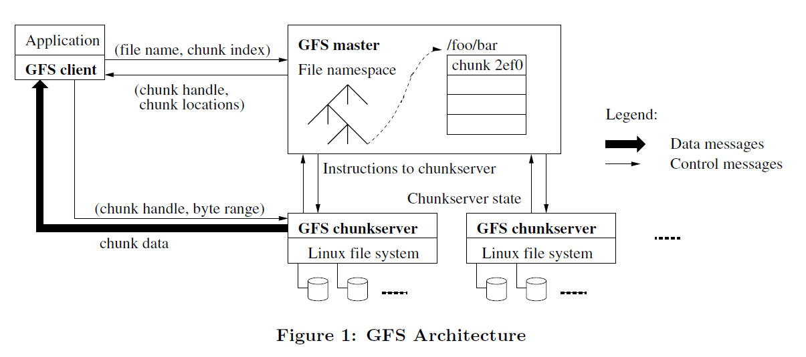

课程主页: https://pdos.csail.mit.edu/6.824/schedule.html

本节课是解释谷歌的分布式文件系统`GFS`, 强烈建议阅读其[论文](https://pdos.csail.mit.edu/6.824/papers/gfs.pdf)

# 1 GFS简介
`GFS`（`Google File System`）是`Google`特别为应对大规模数据处理而设计的分布式文件系, 其设计目的是满足对处理大量数据集、高吞吐量的数据访问、可靠性、可扩展性的需求。其特性包括:

1. **分布式架构**：`GFS`是一个分布式的文件系统，它将数据存储在多个网络连接的机器上。这种设计可以提供高容错性和高数据可靠性。

2. **容错能力**：`GFS`通过副本机制来确保数据的安全。即使某些硬件组件或机器出现故障，系统仍能确保数据不丢失，并继续提供服务。

3. **一致性模型**：`GFS`采用了一致性模型，以容忍网络延迟和系统故障，同时保持数据的一致性。

4. **大文件优化**：`GFS`被设计来存储大文件。它将每个文件分割成多个固定大小的块（`chunks`），每个块一般大小为64MB或更大。这种设计简化了文件管理，并且对于大规模数据处理非常有效。

5. **高吞吐量**：`GFS`针对高吞吐量的数据访问进行了优化，尤其是顺序读写操作，这对于数据挖掘和内容索引等操作非常重要。

6. **主/从架构**：`GFS`采用了**主/从架构**，有一个主服务器（Master）负责管理文件系统的命名空间、控制元数据和调度访问请求。数据被存储在多个分布式的块服务器（`Chunkserver`）上。

7. **写入模型**：`GFS`的写入模型设计用于最小化由于远程写入导致的网络拥堵。它采用了**写入一次，多次读取**的模式，这意味着一旦写入，文件就不再修改，只允许追加操作。

8. **客户端和服务器交互**：`GFS`客户端和服务器之间的交互尽可能地简单，并且大部分复杂的操作逻辑都在服务器端完成。

`GFS`的设计论文被广泛研究，并激发了其他分布式文件系统的开发，如`Apache Hadoop`的`HDFS`（`Hadoop Distributed File System`）等。

# 2 GFS架构

## 2.1 架构图
下图所示为摘自论文中的`GFS`架构:

架构图中包括如下术语:

1. `Master`
   `GFS`中的中心节点，负责管理文件系统的全局视图。`Master`节点保存了所有文件的元数据，这包括文件和目录的命名空间结构、每个文件的`chunks`信息、每个`chunk`的位置以及每个操作的日志。`Master`调度客户端对`chunks`的读写请求，并处理命名空间的修改和访问控制。
2. `Chunkserver`
   `Chunkserver`是GFS中的工作节点，负责存储实际的文件数据。文件数据被分割成多个`chunks`，每个`chunk`通常大小为64MB（可进行配置）。每个`Chunkserver`可能会存储数千个这样的`chunks`，并负责处理来自客户端的读写请求。它们向`Master`报告存储的`chunks`的状态，并根据`Master`的指示执行诸如创建副本或删除旧副本等操作。本质上, `Chunkserver`就是一个`Linux`的管理文件的进程。
3. `Client`
   `Client`指的是使用GFS存储数据的应用程序。客户端通过`GFS`提供的`API`(其实就是链接一个库)与文件系统进行交互。客户端会先与`Master`节点通信以获取文件元数据和`chunks`的位置信息，然后直接与一个或多个`chunkservers`通信进行数据的读写操作。
4. `Chunk`
   文件分割的基本单位，是数据存储的块。每个`chunk`由`Chunkserver`存储和管理，具有固定的大小，例如64MB。通过使用固定大小的`chunks`，`GFS`能够简化存储管理，并且优化大规模数据的读写效率。文件有多少个`Chunk`, 每个`Chunk`在什么位置, 这些信息都存在`Master`的内存中。
5. `Chunk Handle`
   `Chunk Handle`是`GFS`分配给每个chunk的唯一标识符。它是一个全局唯一的64位值，用于标识和引用存储在`chunkservers`上的特定`chunk`。`Chunk Handle`在`chunk`的整个生命周期中保持不变，即使其副本在不同的`chunkservers`之间移动或复制。
6. `Chunk Location`
   `Chunk Location`是指存储特定`chunk`的`Chunkserver`的网络地址。Master节点跟踪每个`chunk`的所有副本的位置，并将这些位置信息提供给客户端，以便客户端可以直接与存储所需`chunks`的`Chunkserver`建立连接进行数据读写。

## 2.2 架构特点
`GFS`的架构特点可以总结如下:
1. 单`Master`
   所有文件系统元数据(包括文件系统命名空间、文件名与`chunk`的映射关系、`chunk`的位置、`chunk`版本号、日志等)都存储在单个`Master`节点的内存中
2. 文件分块
   件被切分成固定大小的`chunks`, `chunkservers`将`chunks`存储在本地磁盘上作为`Linux`文件, `chunks`在多个`chunkservers`中备份存储
3. 心跳同步
   `chunkservers`与`master`通过心跳函数进行信息交互
4. 数据和指令分开传送
   `client`与`Master`节点交互来进行元数据操作，比如打开文件、获取文件信息、获取`chunk`位置等。之后， `client`直接与Chunkserver节点交互来进行实际的数据读写
5. 租约（`Leases`）机制
   (此机制未在架构图中体现)`Master`节点给某个`chunk`的一个副本授予租约，该副本被称为`primary chunk`。持有租约的`Chunkserver`有责任在写操作中协调其他副本（`secondary chunks`）的更新顺序。

# 3 GFS如何保证一致性?
`GFS`采用了一种宽松的一致性模型来在分布式的环境中保持系统性能和可用性。

## 3.1 原子性命名空间操作
- **文件命名空间的变更**（例如，创建文件）是**原子性**操作，由`master`服务器独家处理。
- **命名空间锁定**和**操作日志**（记录操作的全局总顺序）保证了这些变更的原子性和正确性。

## 3.2 数据变更后的文件区域状态
- 在数据变更后，文件区域的状态取决于变更的类型、变更是否成功，以及是否存在并发变更。
- 如果所有客户端无论读取哪个副本都看到相同的数据，那么这个文件区域就是一致的。
- 如果数据变更后文件区域是一致的，并且客户端可以完整地看到变更写入的内容，那么这个区域就是已定义的。
- 当变更在没有并发写入者的干扰下成功时，受影响的区域是已定义的（也就是一致的）。
- 并发的成功变更会使区域变得未定义但仍然一致：所有客户端看到的是相同的数据，但可能不反映任何单一变更所写入的内容。通常包含来自多个变更的混合片段。
- 失败的变更会使区域变得不一致（因此也是未定义的）：不同的客户端可能在不同时间看到不同的数据。
## 3.3 数据变更：写操作和记录追加
- **写操作**在应用程序指定的偏移量处执行。
- **记录追加**是一种原子操作，即使存在并发变更，也会在GFS选择的偏移量处至少追加一次数据。
- `GFS`可能在中间插入填充或重复的记录，这些被视为不一致。
- 在成功的变更之后，变更的文件区域是**已定义**的，并包含最后一次变更的数据。

## 3.4 确保一致性的手段
- 在序列成功的变更后，变更的文件区域保证是已定义的，并且包含最后一次变更写入的数据。
- `GFS`通过在所有副本上以相同的顺序应用变更来实现这一点。
- 使用块版本号来检测任何因为在其`chunkserve`r关闭时错过变更而变得陈旧的副本。这些陈旧副本不会参与变更，也不会提供给寻求块位置的客户端。这些副本会在最早的机会被垃圾回收。

## 3.5 处理故障
- `GFS`通过定期的`master`与所有块服务器之间的握手以及校验和来识别失败的块服务器和数据损坏。
- 数据会尽快从有效副本中恢复，且在`GFS`能够反应之前，只有当所有副本丢失时，块才会不可逆转地丢失。即使在这种情况下，它也会变得不可用，而不是损坏：应用程序会收到清晰的错误而不是损坏的数据。

## 3.6 总结
- 依赖**追加**操作：而非覆盖操作来变更文件，这不仅可以应对一致性和并发问题，而且比随机写入更高效、更能抵御应用程序故障。
- 使用**检查点**（`Checkpointing`）：允许写入者在失败后能够部分地重新开始，同时使读取者避免处理尚未完成的文件数据。
- 写入自验证、自识别的记录：通过额外的信息如校验和来确保记录的有效性，以及通过唯一标识符来处理可能的重复记录。

> PS: 这一部分论文中感觉有些泛泛而谈, 缺乏距离和图示, 感觉有些迷糊

# 4 租约(`Leases`)机制
## 4.1 租约(`Leases`)机制的工作流程
租约机制主要是用于协调分布式环境下的多个对相同`chunk`的变更操作, 因为多个变更操作的变更顺序很重要, 所有副本在应用变更时都遵循这个顺序。`Leases`的设计思路是将某一时间段内的处理任务交付给某一个`chunkserver`完成, 称为其获得了租约(`lease`), 

具体流程为:
1. `client`询问`master`哪个数据块服务器持有当前对于该数据块的租约，以及其他副本的位置。如果没有任何副本持有租约，`master`会选择一个副本授予租约（未展示）, 这个被授予租约的`server`称为`primary replica`, 其协调的`server`称为`secondary replica`。
2. `master`回复`client`其`primary replica`的身份和其他（次级）副本的位置。`client`缓存这些数据以用于未来的变更。只有当`primary replica`变得无法联系，或者回复说它不再持有租约时，`client`才需要再次联系`master`。
3. `client`将数据推送到所有副本。`client`可以按任何顺序这么做。每个数据块服务器都会将数据存储在一个内部的`LRU`缓冲区中，直到数据被使用或者过时。通过将数据流与控制流解耦，我们可以根据网络拓扑优化昂贵的数据流的调度，而不考虑哪个数据块服务器是`primary replica`。第3.2节将进一步讨论这一点。
4. 所有副本确认收到数据后，`client`向`primary replica`发送写请求。该请求标识了之前推送给所有副本的数据。`primary replica`为它接收到的所有变更分配连续的序列号，可能来自多个`client`，这提供了必要的序列化。它按照序列号顺序将变更应用到自己的本地状态。
5. `primary replica`将写请求转发给所有次级副本。每个次级副本按照`primary replica`分配的相同序列号顺序应用变更。
6. 所有次级副本都回复`primary replica`，表明它们已经完成了操作。
7. `primary replica`回复`client`。在任何副本遇到的任何错误都会报告给`client`。如果出现错误，写操作可能已经在`primary replica`和任意子集的次级副本上成功。（如果在`primary replica`上失败，它不会被分配序列号并转发。）`client`请求被视为失败，而且被修改的区域处于不一致状态。我们的`client`代码通过重试失败的变更来处理此类错误。在回退到从写操作开始的重试之前，它会在步骤（3）到（7）中尝试几次。

## 4.2 流程图
下图所示为摘自论文中的读写流程实例:

> 需要补充说明的是数据流动并不是随意的, 为了充分利用每台机器的网络带宽，数据是沿着数据块服务器的链线性推送的, 即每台机器都将数据转发到网络拓扑中尚未接收数据的“最近”的机器。

# 5 `Master`节点: 命名空间与锁
与许多传统文件系统不同，`GFS`没有列出该目录中所有文件的每个目录的数据结构。它也不支持文件或目录的别名（即硬链接或符号链接）。`GFS`在逻辑上将其名称空间表示为一个查找表，将完整路径名映射到元数据。通过前缀压缩，可以在内存中有效地表示这个表。名称空间树中的每个节点（无论是绝对文件名还是绝对目录名）都有一个关联的读写锁。

每个操作在运行前都会获取一组锁。通常，如果它涉及到`/d1/d2/.../dn/leaf`，它将获得目录名`/d1、/d1/d2、...、/d1/d2/.../dn`的读锁，以及完整路径名`/d1/d2/.../dn/leaf`的读锁或写锁。请注意，`leaf`可能是文件或目录，具体取决于操作。

**一个获取锁的例子**
> 需求:如何防止以下情况: 当创建`/home/user`文件夹的快照到`/save/user`时, 文件`/home/user/foo被创建`。

快照操作获取的锁:
- `/home`和`/save`的读锁
- `/home/user`和`/save/user`的写锁。
文件创建获取的锁
- `/home`和`/home/user`的读锁
- `/home/user/foo`的写锁。

可以看出, 上述2个操作存在`/home/user`的锁冲突, 因此将被序列化。

**误区说明**
文件创建不需要对父目录的写锁，因为没有`目录`或类似`inode`的数据结构需要防止修改。名称上的读锁足以防止父目录被删除。

# 6 小结
`GFS`论文中涉及很多的细节在此处并没有完全列出, 例如确保内容完整性的`checksum`, 主节点的`recover`等, 因为这些内容较为琐碎且个人认为不算`GFS`最出色的特性, 个人认为`GFS`最值得学习的特性包括:
1. 单`master`结构, `master`尽量只负责处理逻辑
2. 租约机制: 将任务指派给`server`解决, 用租约解决潜在的不一致问题
3. 数据和逻辑指令分别传送: 简化了传送的内容与逻辑复杂度