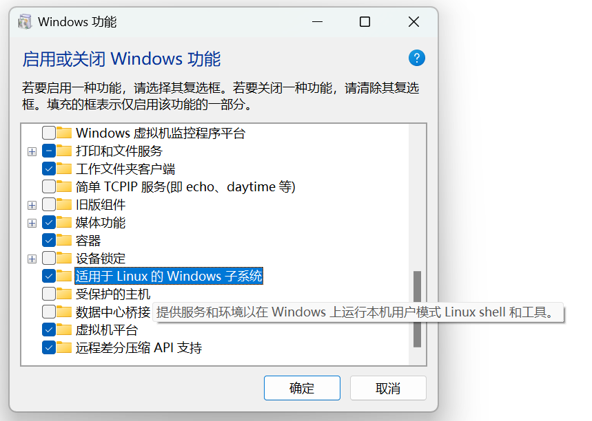
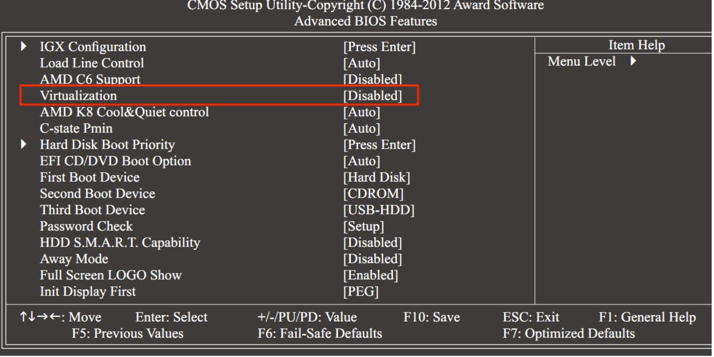
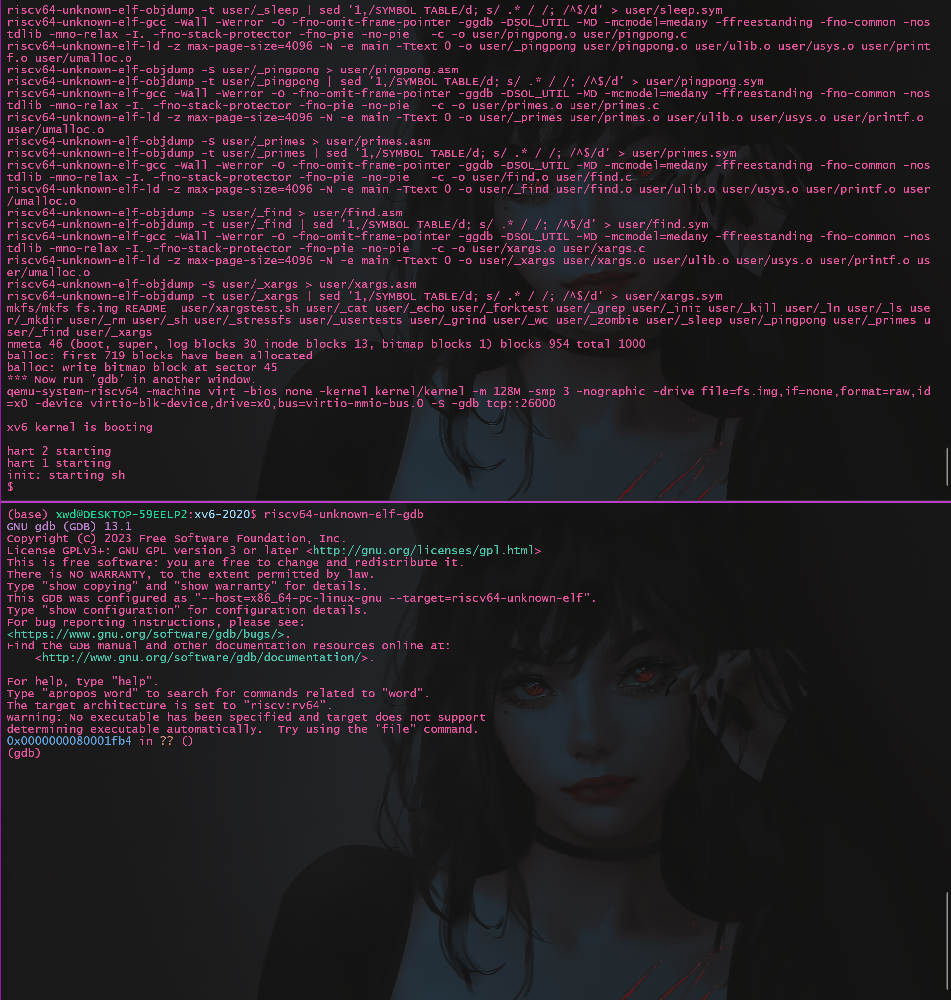
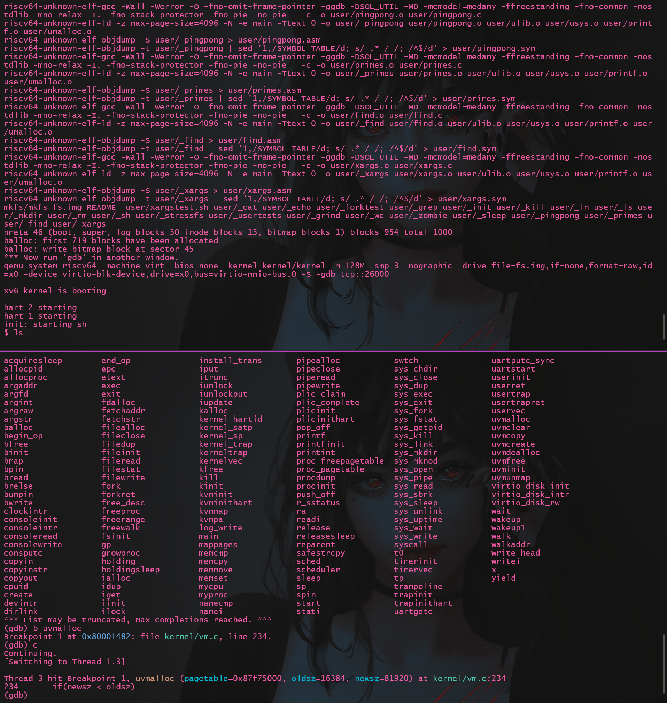

# 1 课程简介
MIT6.S081 Operating System Engineering 是麻省理工学院的 `PDOS` 实验室开设的面向MIT本科生的操作系统课程, 课程前身为MIT6.828。课程主题是介绍 `基于 RISCV 架构实现的类Unix OS xv6`, 基本上每一部分的内容都有对应的`xv6 lab`, 涉及页表、中断、内存管理、线程调度、锁、文件系统等OS的基本内容。课程附有专门的教材介绍`xv6`的设计架构, 并结合了与通用操作系统的比较和相应前沿技术的简单介绍。

# 2 资源汇总
1. 课程官网： 
   2020秋： https://pdos.csail.mit.edu/6.828/2020/schedule.html
   2021秋： https://pdos.csail.mit.edu/6.828/2021/schedule.html
2. 中文参考文献
   课程内容翻译（2020秋）： https://mit-public-courses-cn-translatio.gitbook.io/mit6-s081/
   xv6中文文档（版本较旧）： https://th0ar.gitbooks.io/xv6-chinese/content/index.html
3. 教材、lab指导书、视频、ppt等资源
   见官网

# 3 环境配置
官网的环境配置参考为： https://pdos.csail.mit.edu/6.828/2020/tools.html
我的方案是在 `Windows11 wsl2` 中进行环境配置
## 3.1 wsl2安装Ubuntu22.04
wsl2的安装参考 [微软官方文档](https://learn.microsoft.com/zh-cn/windows/wsl/)
### 3.1.1 启用Linux子系统功能
系统搜索**启用或关闭Windows功能**，如下图开启功能


### 3.1.2 BIOS开启CPU虚拟化功能
不同的主板厂商BIOS界面设置不同，大体上的位置可参考下图


### 3.1.3 安装wsl2
最好以管理员模式打开powershell，输入如下命令进行安装
```powershell
 wsl -l -o
# 改命令会搜索可在线安装的发行版
```
默认安装Ubuntu20.04
```powershell
wsl --install
```
或安装指定版本
```powershell
wsl --install -d Ubuntu-20.04
```
如果使用了[Windows Terminal](https://learn.microsoft.com/zh-cn/windows/terminal/install)，其选项卡中会自动添加安装的Linux发行版
也可以使用powershell进入虚拟机：
```powershell
wsl -d Ubuntu
```

### 3.1.4 Ubuntu换源
```bash
sudo vim /etc/apt/sources.list
```
将其替换为如下内容
```vim
# 默认注释了源码镜像以提高 apt update 速度，如有需要可自行取消注释
deb https://mirrors.tuna.tsinghua.edu.cn/ubuntu/ jammy main restricted universe multiverse
# deb-src https://mirrors.tuna.tsinghua.edu.cn/ubuntu/ jammy main restricted universe multiverse
deb https://mirrors.tuna.tsinghua.edu.cn/ubuntu/ jammy-updates main restricted universe multiverse
# deb-src https://mirrors.tuna.tsinghua.edu.cn/ubuntu/ jammy-updates main restricted universe multiverse
deb https://mirrors.tuna.tsinghua.edu.cn/ubuntu/ jammy-backports main restricted universe multiverse
# deb-src https://mirrors.tuna.tsinghua.edu.cn/ubuntu/ jammy-backports main restricted universe multiverse
deb https://mirrors.tuna.tsinghua.edu.cn/ubuntu/ jammy-security main restricted universe multiverse
# deb-src https://mirrors.tuna.tsinghua.edu.cn/ubuntu/ jammy-security main restricted universe multiverse

# 预发布软件源，不建议启用
# deb https://mirrors.tuna.tsinghua.edu.cn/ubuntu/ jammy-proposed main restricted universe multiverse
# deb-src https://mirrors.tuna.tsinghua.edu.cn/ubuntu/ jammy-proposed main restricted universe multiverse
```
然后更新源
```bash
sudo apt-get update
```

## 3.2 安装riscv交叉编译工具和qemu
### 3.2.1 安装riscv交叉编译工具
```bash
$ sudo apt-get install git build-essential gdb-multiarch qemu-system-misc gcc-riscv64-linux-gnu binutils-riscv64-linux-gnu 
```

### 3.2.2 编译安装qemu
官网指定版本为qemu-5.1.0
```bash
$ cd qemu-5.1.0
$ ./configure --disable-kvm --disable-werror --prefix=/usr/local --target-list="riscv64-softmmu"
$ make
$ sudo make install
# 验证安装
$ qemu-system-riscv64 --version
# 成功则输出如下内容
QEMU emulator version 5.1.0
Copyright (c) 2003-2020 Fabrice Bellard and the QEMU Project developers
```

## 3.3 安装gdb
按照指导书进行环境配置对于基础的代码运行是没有问题，但我发现自己按照指导书操作后无法进行`gdb`调试, 经过总结后在此处给出我的2种解决方案:
### 方案1: 安装完整的 `riscv-gnu-toolchain`
安装完整的`riscv-gnu-toolchain`流程如下, 次方法费时较长, 且占据空间较大, 更推荐第二种方法。
1. 安装依赖
```bash
$ sudo apt-get install autoconf automake autotools-dev curl libmpc-dev libmpfr-dev libgmp-dev gawk build-essential bison flex texinfo gperf libtool patchutils bc zlib1g-dev libexpat-dev
```
2. 克隆`riscv-gnu-toolchain`
```bash
$ git clone --recursive https://github.com/riscv/riscv-gnu-toolchain
```
3. 编译安装
```bash
$ cd riscv-gnu-toolchain
$ ./configure --prefix=/usr/local
$ sudo make
```
### 方案2: 编译安装 `riscv64-unknown-elf-gdb`
1. 安装依赖
```bash
$ sudo apt-get install libncurses5-dev python2 python2-dev texinfo libreadline-dev
```
2. 下载`gdb`源码
此处我选择gdb-13.1, 该版本在`wsl2 Ubuntu22.04`上使用正常。
```bash
# 推荐清华源下载
$ wget https://mirrors.tuna.tsinghua.edu.cn/gnu/gdb/gdb-13.1.tar.xz
# 解压
$ tar -xvf gdb-13.1.tar.x
```
3. 编译安装
只需要指定编译安装`riscv64-unknown-elf`并配置相关参数。
```bash
$ cd gdb-13.1
$ mkdir build && cd build
$ ../configure --prefix=/your_path --target=riscv64-unknown-elf --enable-tui=yes
$ make -j$(nproc)
$ sudo make install
```

# 4 测试
## 4.1 克隆仓库
```bash
$ git clone git://g.csail.mit.edu/xv6-labs-2020
$ cd xv6-labs-2020
$ git checkout util
```
## 4.2 第一次运行前设置`gdbinit`
/.gdbinit 是 GNU 调试器（GDB）的一个配置文件，它位于用户的主目录中。当 GDB 启动时，它会自动读取这个文件（如果存在的话），并执行文件中的命令。这允许用户自定义 GDB 的启动行为，包括设置断点、定义宏、修改显示格式等。

在 ~/.gdbinit 文件中，用户可以编写 GDB 命令脚本，这些脚本在每次启动 GDB 时自动执行。这可以极大地提高调试效率，尤其是对于那些需要频繁调试并希望每次调试会话都有一组固定设置的用户来说。

按照指导, 我们如下进行设置:

```shell
$ echo set auto-load safe-path / >> ~/.gdbinit
```

## 4.3 启动qemu调试
在一个终端的xv6仓库下:
```bash
$ make qemu-gdb
```

在另一个终端的xv6仓库下:
```bash
$ riscv64-unknown-elf-gdb
```

结果如图所示


进行断点调试, 例如指定函数`uvmalloc`断点:


可以看出, 运行`ls`程序后, 程序停留在了`uvmalloc`函数的入口处, 证明了gdb调试功能正常。

