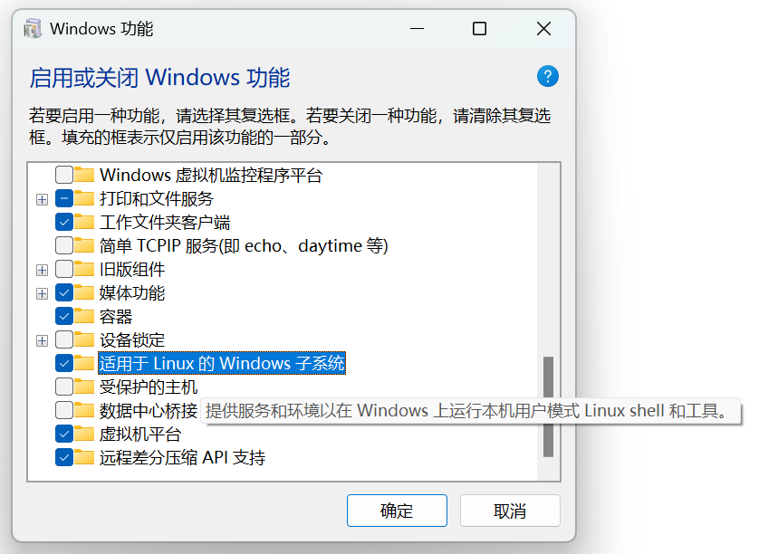
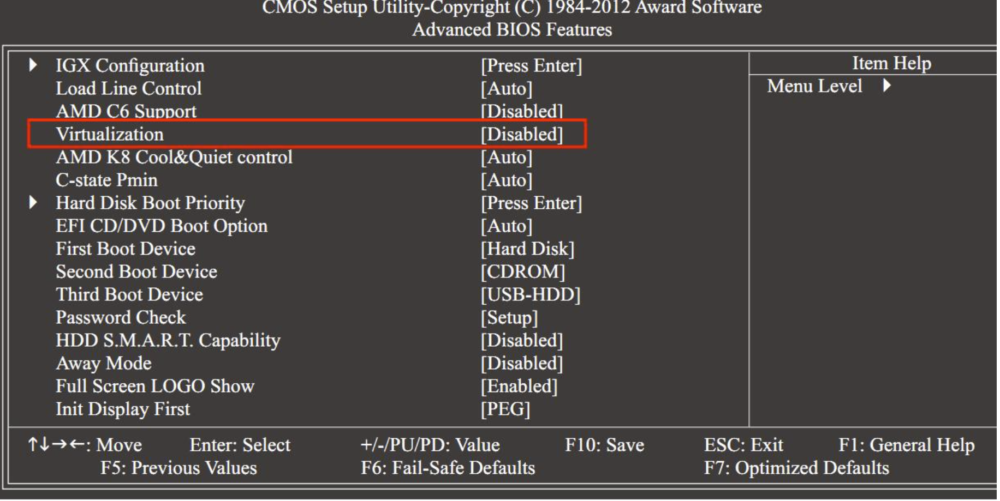
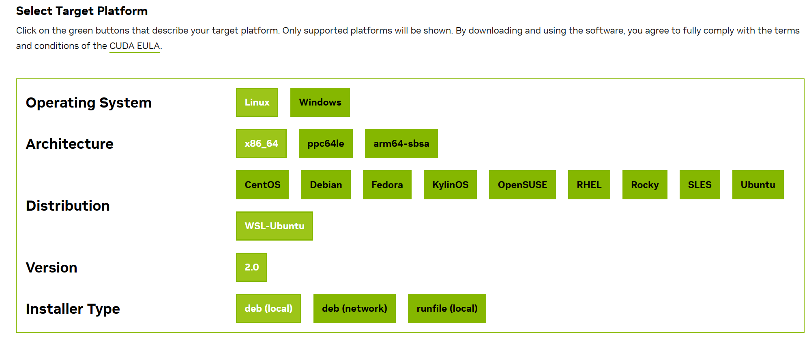

# 1 wsl是什么?
`wsl`的官方文档点这里: https://learn.microsoft.com/zh-cn/windows/wsl/
官方称之为`适用于 Linux 的 Windows 子系统文档`, 我们把他当成一个和`windows`为什么我们要使用wsl呢？对于我个人而言，`wsl`相比`VMWarwe`存在如下几个优势：
1. 文件与环境共享
   `WSL` 与 `Windows` 系统紧密集成，允许用户在 `Windows` 和 `Linux` 系统之间无缝地运行命令和程序，共享文件系统，甚至可以在 `Windows` 中运行 Linux 应用。例如, 你可以在`wsl`中使用`explorer.exe .`使用资源管理器打开虚拟机中的文件夹。你可以使用`mnt/`路径访问宿主机文件系统等待。
2. VSCode完美兼容
   VSCode的插件完美兼容wsl， 你可以在wsl的终端输入`code .`直接唤起VSCode, 此外Docker Desktop也使用wsl2作为后端
3. 支持CUDA
   NVIDIA官方提供了wsl的cuda程序包, 这意味着可以在wsl中运行各种主流的深度学习框架, 如Pytorch和TensorFlow
4. 轻量
   相比`VMWarwe`, wsl消耗的系统资源更少, ~~甚至可以开着wsl打FIFA~~

# 2 安装
## 2.1 前置要求
### 2.1.1 启用Windows功能
系统搜索**启用或关闭Windows功能**，如下图开启功能


### 2.1.2 BIOS开启CPU虚拟化功能
不同的主板厂商BIOS界面设置不同，大体上的位置可参考下图

## 2.2 下载Linux 内核更新包(可选)
如果后续操作失败了, 需要下载Linux 内核更新包: https://learn.microsoft.com/zh-cn/windows/wsl/install-manual#step-4---download-the-linux-kernel-update-package
## 2.3 安装指令
参考 https://learn.microsoft.com/zh-cn/windows/wsl/install 即可, 简单说就是
```bash
wsl --install
wsl --install

安装 WSL 默认版本和默认 Linux 发行版。
wsl --list [--online]
# 列出已安装的 Linux 发行版，使用 --online 参数可显示可供安装的发行版列表。

wsl --set-default <DistributionName>
# 设置默认的 Linux 发行版。
```
其中, `--`参数都可以用`-`加首字母代替。
另外， win10环境下强推[Windows 终端](https://learn.microsoft.com/zh-cn/windows/terminal/install)

# 3 基本命令
```bash
wsl
# 启动默认的 Linux 发行版的默认 shell。

wsl <command>
# 在默认的 Linux 发行版中运行指定的命令。

wsl -d <DistributionName>
# 启动指定的 Linux 发行版。
# 实际上, 使用`Windows 终端`直接拉选项卡是最常用的方法

wsl -u <UserName>
# 以指定的用户身份启动 WSL。

wsl --set-version <DistributionName> <VersionNumber>
# 设置指定发行版的 WSL 版本（如 wsl --set-version Ubuntu 2 切换到 WSL 2）。

wsl --shutdown
# 立即终止所有运行的 WSL Linux 发行版并关闭虚拟机。

wsl --unregister <DistributionName>
# 注销并删除指定的 Linux 发行版, 同时会删除磁盘文件。

wsl --update
# 更新 WSL 的 Linux 内核。

wsl --status
# 显示 WSL 的状态以及默认的 WSL 版本和发行版。

wsl --help
# 显示所有可用的 WSL 命令和用法选项。
```

# 4 网络配置
## 4.1 代理设置
设置代理只需要导出环境变量即可, 以`Clash`代理的7890端口为例:
```bash
export http_proxy=http://127.0.0.1:7890
export https_proxy=http://127.0.0.1:7890
```
类似的, 可以使用如下命令配置git代理:
```bash
git config --global http.proxy ${PROXY_HTTP}
git config --global https.proxy ${PROXY_HTTP}
```
如同Linux物理机一样, 在`.bashrc`中配置环境变量即可永久生效

## 4.2 固定IP
默认情况下, WSL实例的 IP 地址不是固定的。每次 WSL 实例启动时，它通常会从 Windows 主机的一个虚拟网络适配器获得一个新的 IP 地址。这个虚拟网络适配器充当 DHCP 服务器，为 WSL 实例分配 IP 地址。
最常用的方案是与宿主机共享IP, 这可以通过配置`wslconfig文件`做到:
在用户目录下的`.wslconfig文件`中添加如下内容:
```config
[experimental]
networkingMode=mirrored
dnsTunneling=true
firewall=true
autoProxy=true
```
此后启动wsl, 其与 `Windows` 主机的网络互通而且 IP 地址相同了

另外还有别的方式固定IP
1. 使用桥接模式, 参考这篇文章: https://blog.csdn.net/keyiis_sh/article/details/113819244
2. 配置虚拟网络, 参考这篇文章: http://www.manongjc.com/detail/28-qmgskvmcxbjzfaj.html
## 4.3 端口映射
端口映射命令如下:
建立映射
```bash
netsh interface portproxy add v4tov4 listenport=80 listenaddress=0.0.0.0 connectport=80 connectaddress=172.29.41.233
```
其中`172.29.41.233`是wsl中的ip地址, 第一个80表示宿主机端口,第二个80表示wsl端口

查看已有的映射
```bash
netsh interface portproxy show all
```

移除映射:
```bash
netsh interface portproxy delete v4tov4 listenport=80 listenaddress=0.0.0.0
```

# 5 磁盘管理
## 5.1 安装或迁移wsl到其他磁盘
wsl默认安装在C盘, ... 
WSL会在宿主机上创建一个虚拟硬盘文件（通常是一个名为 ext4.vhdx 的文件），用于存储 Linux 发行版的文件系统, 而这个文件貌似是以追加写入的方式运行的, 因此容量会越来越大。**因此将其安装在非系统盘是十分必要的。**
最简单的方式是手动迁移vhdx文件，注销Linux发行版， 再重新导入。**此操作对于老旧版本的wsl是不适用的！**

- **方法1 直接迁移ext4.vhdx文件**
例如， 我的wsl文件位于`"C:\Ubuntu-20.04\ext4.vhdx"`下, 先进行如下操作
1. 复制`ext4.vhdx`文件到指定路径
   ```bash
   cp "C:\Ubuntu-20.04\ext4.vhdx" <targetPath>
   ```
2. 注销对应的发行版
   ```bash
   wsl --unregister Ubuntu-20.04
   ```
3. 重新导入
   ```bash
   wsl --import-in-place Ubuntu-20.04 <targetPath>
   ```
   
这时wsl发行版已经被迁移到其他磁盘了, 这种方法的优势是原位导入, 也就是`<targetPath>`就是wsl真正的磁盘文件了, 不过确定是只能用于`ext4` 文件系统类型格式。

- **方法2 导出镜像**
```bash
wsl --export <Distribution Name> <FileName>
# 导出:

wsl --import <Distribution Name> <InstallLocation> <FileName>
# 导入
```
通过`--import`可以看出, 这种方法是将<FileName>`安装`到了`<InstallLocation>`, 可以看作多复制了一份, 因此如果我们的wsl无比庞大时, 这样的操作是很费时间的

## 5.2 清理vhdx磁盘空间
如前文所述, WSL 不会自动收缩vhdx文件的大小, 我们需要手动压缩:
使用管理员打开`powershell`:
```powershell
# 关闭WSL
wsl --shutdown
 
# 打开Diskpart窗口
diskpart
 

select vdisk file="path to ext4.vhdx"
 
attach vdisk readonly
compact vdisk
detach vdisk
 
# 退出
exit
```
# 6 安装CUDA
此过程较为繁琐, 且方案迭代过快, 因此给出官方文档: https://docs.nvidia.com/cuda/wsl-user-guide/index.html
以下的过程仅供参考:
1. 确保Windows中安装了NVIDIA的显卡驱动(不需要安装cuda)
2. 在官网下载适用于wsl的cuda toolkit, 
   网址: https://developer.nvidia.com/cuda-downloads?target_os=Linux&target_arch=x86_64&Distribution=WSL-Ubuntu&target_version=2.0&target_type=deb_local

   如下选择:

   
3. 安装官网指令进行安装
    ```bash
    wget https://developer.download.nvidia.com/compute/cuda/repos/wsl-ubuntu/x86_64/cuda-wsl-ubuntu.pin
    sudo mv cuda-wsl-ubuntu.pin /etc/apt/preferences.d/cuda-repository-pin-600
    wget https://developer.download.nvidia.com/compute/cuda/12.3.1/local_installers/cuda-repo-wsl-ubuntu-12-3-local_12.3.1-1_amd64.deb
    sudo dpkg -i cuda-repo-wsl-ubuntu-12-3-local_12.3.1-1_amd64.deb
    sudo cp /var/cuda-repo-wsl-ubuntu-12-3-local/cuda-*-keyring.gpg /usr/share/keyrings/
    sudo apt-get update
    sudo apt-get -y install cuda-toolkit-12-3
    ```
   

# 7 第三方工具LxRunOffline
`LxRunOffline`是第三方的wsl管理工具,其能更方便我们管理wsl, 例如修改登录用户、安装非微软官方提供的Linux发行版等

Github仓库： https://github.com/DDoSolitary/LxRunOffline
下载地址： https://github.com/DDoSolitary/LxRunOffline/releases

安装建议下载编译好的二进制文件，较为简单就不演示了, 此处介绍其核心功能

1. `LxRunOffline`最主要的作用就是安装非微软官方提供的Linux发行版:
```bash
LxRunOffline i -n archlinux -f {发行版镜像位置}  -d  <安装系统的位置> [-r 附加参数]
```
具体的发行版安装看这里: https://github.com/DDoSolitary/LxRunOffline/wiki
例如这篇文章介绍了如何使用`LxRunOffline`安装`arch`: https://zhuanlan.zhihu.com/p/417410431

2. 修改默认登录用户
```bash
lxrunoffline su -n <发行版名字> -v <账户id>
```   
其中`<账户id>`可以在`Linux`中通过`id`命令查询:
```bash
id -u 用户名
```

### 参考
https://learn.microsoft.com/zh-cn/windows/wsl/
https://www.cnblogs.com/tuilk/p/16287472.html
https://zhuanlan.zhihu.com/p/659074950
https://blog.csdn.net/u014752296/article/details/128484185
https://zhuanlan.zhihu.com/p/417410431
https://blog.csdn.net/m0_37605642/article/details/127812965
https://zhuanlan.zhihu.com/p/165508059
http://www.manongjc.com/detail/28-qmgskvmcxbjzfaj.html
https://www.cnblogs.com/trendyshuai/p/17018012.html
https://blog.csdn.net/keyiis_sh/article/details/113819244
https://blog.csdn.net/qq_32666519/article/details/127378873