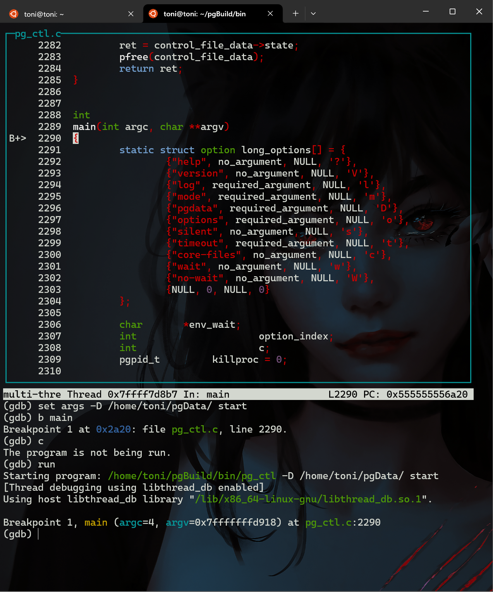
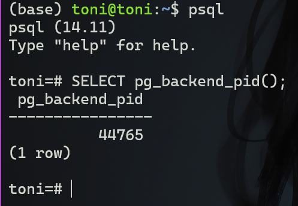
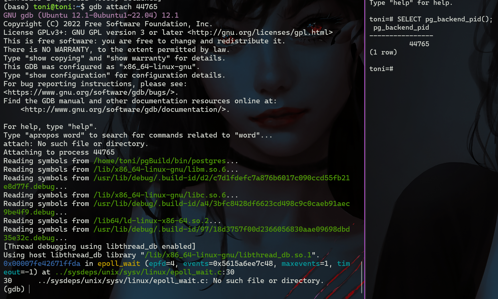
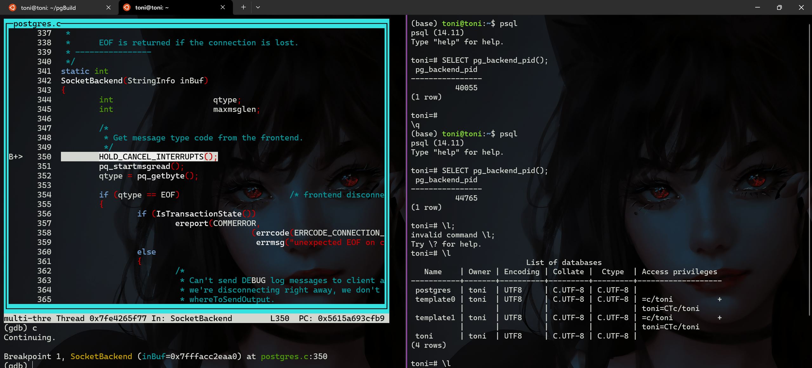

本文内容包括:
1. 如何从源码安装`postgresql-14`, 更多信息请参考官方文档: https://www.postgresql.org/docs/current/
2. 如何使用`gdb`调试`postgresql`
3. 如何在`VSCode`中开启`postgresql`代码的智能提示

# 1 编译源码
## 1.1 安装依赖
```bash
sudo apt-get install libreadline-dev
```

## 1.2 克隆仓库并编译
```bash
git clone https://git.postgresql.org/git/postgresql.git # 克隆完整仓库
git checkout REL_14_STABLE # 切换到14分支
```

由于我们源码安装的目的是为了查看源码调试, 所以我们不需要安装到默认的`/usr/local/`路径, 需要在`configure`中指定编译安装目录, 同时需要开启一些额外的选项允许后续的`gdb`调试:
```bash
mkdir /home/toni/pgBuild
./configure --prefix=/home/toni/pgBuild/ --enable-debug --enable-depend --enable-cassert CFLAGS=-O0
```
1. `--enable-debug`: 编译程序时包含额外的调试信息
2. `--enable-depend`: 用于生成依赖关系。它使得编译过程中会自动生成 `.depend` 文件，这些文件包含了源文件之间的依赖信息。这对于开发者在修改代码后只重新编译改变了的部分非常有用。
3. `--enable-cassert`: 用于开启断言（assertions）。通常用于开发和调试。它会编译进一些额外的检查，这些检查在标准运行中通常是关闭的，因为它们可能会降低性能。但是在开发过程中，这些检查可以帮助捕捉到代码中的错误。
4. `CFLAGS=-O0`: 环境变量设置，用于控制 C 编译器的优化级别。`-O0` 表示不进行优化，确保了编译器不会改变代码结构，从而使得调试时的代码行为更接近源码。

然后正常编译即可
```bash
make
make install
```

## 1.3 额外编译选项
1. 编译后测试
```bash
make check
```
2. 安装额外模块
```bash
make world
```

# 2 基本配置
## 2.1 配置环境变量
将安装目录的四个文件夹添加到环境变量:
```bash
# ~/.bashrc
PATH=$PATH:/home/toni/pgBuild/bin
PATH=$PATH:/home/toni/pgBuild/include
PATH=$PATH:/home/toni/pgBuild/lib
PATH=$PATH:/home/toni/pgBuild/share
```

## 2.2 初始化数据库
新建一个数据库目录并初始化
```bash
mkdir -p pgData
initdb -D pgData
```

## 2.3 启动数据库并登录
```bash
pg_ctl -D pgData/ start
```
从`psql`连接数据库
```bash
psql postgres
```
查看当前登录信息
```sql
postgres=# \c
You are now connected to database "postgres" as user "toni".
```
可以看到, 初始化数据库目录后, 自动创建了名为`postgres`的数据库和安装时的用户`toni`


# 3 启用gdb调试
## 3.1 调试`pg_ctl`
进入`pg_ctl`所在的目录, 执行如下命令:
```gdb
gdb pg_ctl
(gdb) layout src
(gdb) set args -D /home/toni/pgData/ start
(gdb) b main
(gdb) run
```
如果成功, 则会看到下图的内容:



## 3.2 postgres主程序的启动
我们单步调试`pg_ctl`, 终于发现了程序在这个位置启动主程序:
```cpp
(void) execl("/bin/sh", "/bin/sh", "-c", cmd, (char *) NULL);
```

但是返现其是由`exec`执行`sh`后再启动的, 这就不方便我们进行调试了, 不过我们可以通过获取`pid`后`attach`的方式进行调试

## 3.3 `postgresql`的进程
使用`pg_ctl`启动后, 我们发现`potgresql`有如下几个进程:
```bash
ps -ef | grep postgres
toni       38492     355  0 11:18 ?        00:00:00 /home/toni/pgBuild/bin/postgres -D ../pgData
toni       38494   38492  0 11:18 ?        00:00:00 postgres: checkpointer
toni       38495   38492  0 11:18 ?        00:00:00 postgres: background writer
toni       38496   38492  0 11:18 ?        00:00:00 postgres: walwriter
toni       38497   38492  0 11:18 ?        00:00:00 postgres: autovacuum launcher
toni       38498   38492  0 11:18 ?        00:00:00 postgres: stats collector
toni       38499   38492  0 11:18 ?        00:00:00 postgres: logical replication launcher
```

1. `/home/toni/pgBuild/bin/postgres -D ../pgData` (`PID 38492`):
   这是 PostgreSQL 的主进程（称为 `postmaster`）。它负责管理数据库系统的整体运行，包括处理客户端连接请求、启动新的子进程来处理这些连接，以及监控所有的子进程。参数 `-D ../pgData` 指定了数据库的数据目录。

2. `postgres: checkpointer` (`PID 38494`):
   检查点进程（checkpointer）负责创建检查点，这是数据库的一个稳定状态，用于数据恢复。检查点包括将缓冲区中的所有脏页（已修改但尚未写入磁盘的数据页）刷新到磁盘中。检查点有助于减少崩溃恢复的时间。

3. `postgres: background writer` (`PID 38495`):
   后台写入程序（background writer）进程负责将脏页从缓冲区定期写入磁盘。它可以减轻前端数据库进程的 `I/O `负载，并且可以平滑 `I/O` 峰值。

4. `postgres: walwriter` (`PID 38496`):
   写前日志（`Write-Ahead Logging, WAL`）写入器进程负责将 `WAL` 缓冲区中的记录刷新到磁盘上的 `WAL` 文件中。`WAL` 是 `PostgreSQL` 实现事务持久性和崩溃恢复的关键组成部分。

5. `postgres: autovacuum launcher` (`PID 38497`):
   自动清理启动器（autovacuum launcher）进程负责启动自动清理工作进程，这些工作进程负责清理数据库中的“死”元组（即不再可达的数据），并且帮助回收空间、更新统计信息以及防止事务 ID 耗尽。

6. `postgres: stats collector` (`PID 38498`):
   统计信息收集器（stats collector）进程负责收集数据库活动的统计信息，比如对于每个表和索引的访问频率等。这些信息对于查询优化器的决策非常重要。

7. `postgres: logical replication launcher` (`PID 38499`):
   逻辑复制启动器（logical replication launcher）进程负责管理逻辑复制和订阅功能。它监控逻辑复制工作进程，并在需要时启动新的工作进程以处理逻辑复制任务。

## 3.4 `psql`后调试后端进程
1. **获取后端进程`pid`**
要使用 `gdb` 调试已经连接到 `postmaster` 的 `psql` 会话，需要找到该 `psql` 会话对应的后端进程 ID, 这可以通过`sql`语句实现:

    

   我得到的进程`pid`是`44765`, 此时在另一个终端再次运行`ps -ef | grep postgres`, 发现多了一个`44765`的进程, 这个后端进程是响应客户端请求的进程，每个客户端连接都会有一个对应的后端进程。
    ```bash
    toni       38492     355  0 11:18 ?        00:00:00 /home/toni/pgBuild/bin/postgres -D ../pgData
    toni       38494   38492  0 11:18 ?        00:00:00 postgres: checkpointer
    toni       38495   38492  0 11:18 ?        00:00:00 postgres: background writer
    toni       38496   38492  0 11:18 ?        00:00:00 postgres: walwriter
    toni       38497   38492  0 11:18 ?        00:00:00 postgres: autovacuum launcher
    toni       38498   38492  0 11:18 ?        00:00:00 postgres: stats collector
    toni       38499   38492  0 11:18 ?        00:00:00 postgres: logical replication launcher
    toni       44765   38492  0 11:42 ?        00:00:00 postgres: toni toni [local] idle
    ```
    
2. **附加 `gdb` 到进程**
   ```bash
   sudo gdb -p 44765
   ```
   结果如下:
   

   这将启动 `gdb` 并附加到具有指定进程 ID 的进程。

   此时进程在系统调用`epoll_wait`中, 因此没有源码调试文件

3. `backtrace`追踪调用栈信息
   ```bash
   (gdb) backtrace
    #0  0x00007fe42671ffda in epoll_wait (epfd=4, events=0x5615a6ee7c48,
        maxevents=1, timeout=-1) at ../sysdeps/unix/sysv/linux/epoll_wait.c:30
    #1  0x00005615a6904d70 in WaitEventSetWaitBlock (set=0x5615a6ee7bd0,
        cur_timeout=-1, occurred_events=0x7fffacc2e940, nevents=1) at latch.c:1471
    #2  0x00005615a6904bd7 in WaitEventSetWait (set=0x5615a6ee7bd0, timeout=-1,
        occurred_events=0x7fffacc2e940, nevents=1, wait_event_info=100663296)
        at latch.c:1417
    #3  0x00005615a673fde1 in secure_read (port=0x5615a6f0e3f0,
        ptr=0x5615a6e5b260 <PqRecvBuffer>, len=8192) at be-secure.c:186
    #4  0x00005615a674b86c in pq_recvbuf () at pqcomm.c:959
    #5  0x00005615a674b951 in pq_getbyte () at pqcomm.c:1005
    #6  0x00005615a693cfd2 in SocketBackend (inBuf=0x7fffacc2eaa0) at postgres.c:352
    #7  0x00005615a693d24f in ReadCommand (inBuf=0x7fffacc2eaa0) at postgres.c:475
    #8  0x00005615a6942bd4 in PostgresMain (argc=1, argv=0x7fffacc2ebd0,
        dbname=0x5615a6f18758 "toni", username=0x5615a6f18738 "toni")
        at postgres.c:4445
    #9  0x00005615a6865e1e in BackendRun (port=0x5615a6f0e3f0) at postmaster.c:4540
    #10 0x00005615a6865679 in BackendStartup (port=0x5615a6f0e3f0)
        at postmaster.c:4262
    #11 0x00005615a6861402 in ServerLoop () at postmaster.c:1748
    #12 0x00005615a6860b5f in PostmasterMain (argc=3, argv=0x5615a6ee5d20)
        at postmaster.c:1420
    #13 0x00005615a674f089 in main (argc=3, argv=0x5615a6ee5d20) at main.c:209
    ```


   - `#0` - 这是当前停止点，即 `epoll_wait` 系统调用。这个函数是 `Linux` 内核提供的，用于等待多个文件描述符上的事件。这里的参数表示正在等待文件描述符 `4` 上的事件，最多等待 `1` 个事件，且超时时间设置为 `-1`，表示无限等待直到有事件发生。

   - `#1` - `WaitEventSetWaitBlock` 函数是 `PostgreSQL` 内部的函数。它是封装 `epoll_wait` 的部分，用于等待一组事件中的任何一个发生。

   - `#2` - `WaitEventSetWait` 函数是 `PostgreSQL` 的另一个内部函数，它负责等待事件集合中指定的事件。

   - `#3` - `secure_read` 函数尝试从安全连接中读取数据。

   - `#4` - `pq_recvbuf` 函数是 `PostgreSQL` 的内部通信函数，从客户端接收数据缓冲区。

   - `#5` - `pq_getbyte` 函数是用于从 `PostgreSQL` 后端接收单个字节的函数。

   - `#6` - `SocketBackend` 函数处理 `PostgreSQL` 后端进程中的套接字通信。

   - `#7` - `ReadCommand` 函数读取从客户端发来的命令。

   - `#8` - `PostgresMain` 是 `PostgreSQL` 后端主函数，处理每个数据库会话的生命周期。

   - `#9` - `BackendRun` 是在 `PostgreSQL` 后端进程启动后执行的函数。

   - `#10` - `BackendStartup` 函数负责在系统启动后初始化后端进程。

   - `#11` - `ServerLoop` 函数是 `PostgreSQL` 主进程的主循环，负责接受新的连接并启动新的后端进程。

   - `#12` - `PostmasterMain` 是 `PostgreSQL` 的主守护进程主函数，管理数据库服务器的整体运行。

   - `#13` - `main` 是 `PostgreSQL` 的入口点。

   从 `backtrace` 可以看出，`PostgreSQL` 后端进程正在等待来自客户端的新的网络活动。这是数据库服务器正常运行时的典型状态。

4. 调试`SocketBackend`
   `SocketBackend`接受客户端链接,因此可以在次数打断点, 先使用`ctrl c`暂停进程, 然后:
   ```gdb
   b SocketBackend
   c
   ```
   此时在`psql`连接客户端一侧, 使用`\l`命令使后端进行继续执行, 结果如下:
   

    此时我们就已经正常进入了`postgresql`的业务代码, 并附带了源码调试信息, 大功告成

# 4 VSCode智能提示设置
当我们完成上述操作后发现，如果我们在`VSCode`中直接打开项目文件夹, 是没有代码只能提示和补全的, 经过查阅得知, 智能跳转通常需要一个编译数据库（`compile_commands.json`）。这个文件包含了编译器在编译项目时使用的命令，它允许代码分析工具理解代码是如何被编译的，从而提供准确的智能感知。

`compile_commands.json`可以如下得到:

## 4.1 安装`bear`
`bear` 用于在运行构建过程的同时拦截编译命令，生成 `compile_commands.json` 文件，这个文件可以被很多编辑器和工具用来提供代码索引和自动完成等功能。

我使用`Ubuntu`的`apt`安装`bear`:
```bash
sudo apt install bear
```

## 4.2 `bear`拦截编译命令
```bash
make clean
bear -- make
```
在这个命令中，`--` 表示后面的参数都将传递给实际的构建系统（在这个例子中是 `make`），而不是被 `bear` 解析。这样，`bear` 就会监听 `make` 命令的执行，捕获它的编译命令，并生成 `compile_commands.json` 文件。

需要注意的是, 首先要`make clean`清理之前的编译结果, 否则如果`make`什么也没做, 那么`bear`就什么也没拦截到, 构建的`compile_commands.json` 文件就是空的。


## 4.3 VSCode设置`compile_commands.json`
1. `VSCode`安装`clangd`插件
2. 添加`compile_commands.json`
在工作区的 `.vscode` 文件夹中创建或编辑 `settings.json` 文件，并添加以下内容：
```json
{
    "C_Cpp.default.compileCommands": "${workspaceFolder}/compile_commands.json"
}
```

之后重启`VSCode`, 发现C文件已经有了智能提示和跳转了

### 参考
https://www.postgresql.org/docs/
https://www.zhihu.com/column/c_1624079542120914944
https://blog.csdn.net/weixin_43997331/article/details/120662533