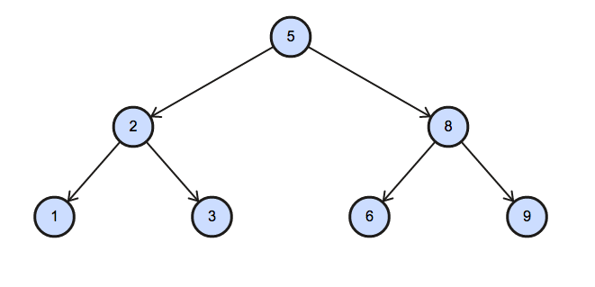

# 1 字符串操作
## 1.1 通配符
以下是SQL中使用`LIKE`操作符时支持的2种通配符：

| 通配符 | 描述                                                         |
|--------|--------------------------------------------------------------|
| `%`    | 匹配任意数量的字符，甚至可以是零个字符。                           |
| `_`    | 匹配任意单一字符。                                             |

## 1.2 `escape`关键字

当需要在 `LIKE` 子句中搜索 `%` 或 `_` 本身时，`ESCAPE` 关键字让数据库知道紧随其后的 `%` 或 `_` 是要被直接匹配的字符，而不是作为通配符。

下面是使用 `ESCAPE` 关键字的一个例子：

```sql
-- 查找包含下划线字符 '_' 的所有名称
SELECT * FROM Employees WHERE name LIKE '%\_%' ESCAPE '\';
```

在这个例子中，反斜杠 `\` 被用作转义字符。这意味着 `\_` 在 `LIKE` 子句中被解释为普通的下划线字符 `_`，而不是通配符。因此，这个查询将会返回 `name` 字段中包含实际下划线字符 `_` 的所有记录。

要正确地使用 `ESCAPE` 关键字，你需要：

1. 选择一个不会在搜索模式中作为普通字符出现的字符作为转义字符。
2. 在 `ESCAPE` 子句中指定这个转义字符。
3. 在你的 `LIKE` 模式中，将该转义字符放在你要作为普通字符搜索的 `%` 或 `_` 之前。

不同的数据库系统可能对转义字符的默认值有不同的规定，有些系统甚至可能不需要显式声明 `ESCAPE` 子句，除非你想要改变默认的转义字符。始终建议查看特定数据库的文档以确定其行为。

# 2 集合操作
## 2.1 集合交集、并集和差集
集合运算允许对两个查询结果集进行数学上的集合操作。以下是SQL支持的主要集合运算符：

| 集合运算符 | 描述 |
|------------|------|
| `UNION` | 将两个或多个查询结果合并为一个结果集，同时移除重复的行。 |
| `UNION ALL` | 将两个或多个查询结果合并为一个结果集，包含所有行，不移除重复的行。 |
| `INTERSECT` | 返回两个查询结果的交集，即两个结果集中都存在的行。 |
| `INTERSECT ALL` | 返回两个查询结果的交集，即两个结果集中都存在的行, 不移除重复的行。 |
| `EXCEPT`| 返回第一个查询结果中存在而在第二个查询结果中不存在的行。 |
| `EXCEPT ALL`| 返回第一个查询结果中存在而在第二个查询结果中不存在的行， 不移除重复的行。 |

> 集合运算要求各查询结果的列数和数据类型必须匹配。

下面是一个使用集合运算符的例子，假定有两个表格 `Table1` 和 `Table2`, 其列数和数据类型相同：

```sql
-- case1 返回两个表中都有的唯一记录
SELECT column_name(s) FROM Table1
UNION
SELECT column_name(s) FROM Table2;

-- case2 返回两个表中所有记录，包括重复项
SELECT column_name(s) FROM Table1
UNION ALL
SELECT column_name(s) FROM Table2;


-- case3 返回两个表中共同的记录
SELECT column_name(s) FROM Table1
INTERSECT
SELECT column_name(s) FROM Table2;

-- case4 返回两个表中共同的记录, 不去重
SELECT column_name(s) FROM Table1
INTERSECT
SELECT column_name(s) FROM Table2;

-- case5 返回只存在于第一个表中的记录
SELECT column_name(s) FROM Table1
EXCEPT
SELECT column_name(s) FROM Table2;

-- case6 返回只存在于第一个表中的记录, 不去重
SELECT column_name(s) FROM Table1
EXCEPT ALL
SELECT column_name(s) FROM Table2;
```

**注意**
集合运算中的`all`的情况如下:
1. 在`case2`中, 假设`Table1`中某个相同记录有4个, `Table2`中相同记录有3个, 结果的相同记录就会有7个(取二者之和)
2. 在`case4`中, 假设`Table1`中某个相同记录有4个, `Table2`中相同记录有3个, 结果的相同记录就会有3个(取最小值)
3. 在`case6`中, 假设`Table1`中某个相同记录有4个, `Table2`中相同记录有3个, 结果的相同记录就会有1个(第一个减去第二个, 前提不为负)

## 2.2 比较运算
`SQL` 中，有些关键字用来表示特定的集合关系操作。这些关键字通常用在子查询中，用来比较一个值与一组值的关系。以下是一些常用的集合关系操作符，以及它们的用途和语法的简要总结：

| 操作符 | 描述 | 用法示例 |
|--------|------|----------|
| `SOME` 或 `ANY` | 检查是否至少有一个子查询的返回值满足给定条件 | `value operator SOME (subquery)` |
| `ALL` | 检查是否所有子查询的返回值都满足给定条件 | `value operator ALL (subquery)` |
| `EXISTS` | 检查子查询是否返回了任何行 | `EXISTS (subquery)` |
| `IN` | 检查表达式的值是否在子查询或列表中的一个值 | `value IN (subquery or value list)` |
| `NOT IN` | 检查表达式的值是否不在子查询或列表中的任何一个值 | `value NOT IN (subquery or value list)` |

请注意，`EXCEPT` 不是一个集合关系操作，而是一个集合运算符，用于返回两个集合的差集；在此表中未包含。

以下是一些详细的用法示例：

**SOME 或 ANY**

```sql
-- 检查表中是否有至少一个元素的列值大于10
SELECT column_name FROM table_name WHERE column_name > SOME (SELECT column_name FROM another_table);
```

**ALL**

```sql
-- 检查表中的元素是否其列值都大于另一个表中所有元素的列值
SELECT column_name FROM table_name WHERE column_name > ALL (SELECT column_name FROM another_table);
```

**EXISTS**

```sql
-- 仅当子查询返回至少一行时，查询结果才会包含行
SELECT column_name FROM table_name WHERE EXISTS (SELECT * FROM another_table WHERE condition);
```

**IN**

```sql
-- 检查某个列的值是否在子查询或列表中指定的值集中
SELECT column_name FROM table_name WHERE column_name IN (SELECT column_name FROM another_table);
```

**NOT IN**

```sql
-- 检查某个列的值是否不在子查询或列表中指定的值集中
SELECT column_name FROM table_name WHERE column_name NOT IN (SELECT column_name FROM another_table);
```

**补充:<>**
在 SQL 中，`<>` 是不等于的比较运算符。当它与 `SOME` 或 `ALL` 关键字结合使用时，它们的含义如下：

**`<> SOME`**

`<> SOME (subquery)`是在检查主查询中的值是否不等于子查询返回的值集中的至少一个值。这意味着只要主查询中的值与子查询中返回的任一值不相等，条件就满足。实际上，**`<> SOME` 是 `EXISTS` 的同义词**，因为通常只要子查询中存在至少一个不同的值，这个条件就为真。

```sql
-- 检查主表中至少有一行的 column_name 不等于子查询返回的任一行的 column_name
SELECT * FROM main_table
WHERE column_name <> SOME (SELECT column_name FROM sub_table);
```

**`<> ALL`**

`<> ALL (subquery)`是在检查主查询中的值是否不等于子查询返回的所有值。这意味着只有当主查询中的值与子查询中返回的每个值都不相等时，条件才满足。它是一种更严格的比较，因为它要求与子查询返回的每个值都不匹配。


```sql
-- 检查主表中所有行的 column_name 是否都不等于子查询返回的任何一行的 column_name
SELECT * FROM main_table
WHERE column_name <> ALL (SELECT column_name FROM sub_table);
```

在使用这些运算符时，重要的是要注意子查询可能返回的 `NULL` 值。`NULL` 在 SQL 中表示未知的值，因此任何与 `NULL` 的比较操作都会返回 `UNKNOWN`。这可能会影响 `SOME` 和 `ALL` 运算符的行为，因为 `UNKNOWN` 不等同于 `TRUE` 或 `FALSE`。

使用集合关系操作符的时候，子查询通常返回一个列的值集合，主查询中的表达式或列与这个值集进行比较。你可以使用比较操作符如 `=`、`<`、`>` 等来定义这些比较的具体条件。

> 经典误区
> `<> SOME` 是 `EXISTS` 的同义词, 而并不等价于`NOT IN`, 但`=SOME`等价于`IN`
> `<> ALL`等价于`NOT IN`, 但`=ALL`不等价于`IN`

# 3 `unknown`、空值和重复性测试
## 3.1 `unknown`是什么
在处理 `WHERE` 子句中的条件时，每个条件的结果通常可以是 `TRUE`、`FALSE` 或 `UNKNOWN`。

`UNKNOWN` 是 SQL 中的一个特殊的逻辑结果，它出现在比较涉及到 `NULL` 值时。在 SQL 中，`NULL` 表示一个未知的或缺失的值。因为 `NULL` 本质上表示“无数据”，所以当你尝试使用比较操作符（如 `=`、`<`、`>` 等）进行条件比较时，如果任一操作数是 `NULL`，结果就不是 `TRUE` 或 `FALSE`，而是 `UNKNOWN`。

这里有一些例子来说明 `UNKNOWN`：

```sql
-- 假设 column_name 是 NULL
SELECT * FROM table_name WHERE column_name = 'value';
-- 结果未知（UNKNOWN），因为 column_name 是 NULL

SELECT * FROM table_name WHERE column_name != 'value';
-- 结果同样未知（UNKNOWN），因为 column_name 是 NULL

-- 使用 IS NULL 来检查 NULL 值
SELECT * FROM table_name WHERE column_name IS NULL;
-- 结果为 TRUE，如果 column_name 是 NULL
```

当有 `UNKNOWN` 结果时，这行数据不会被包含在 `WHERE` 子句过滤后的结果集中。只有条件为 `TRUE` 的行才会返回。

在 SQL 中处理 `NULL` 和 `UNKNOWN` 的正确方法通常涉及到使用 `IS NULL` 或 `IS NOT NULL` 操作符，或者在比较之前使用函数例如 `COALESCE` 或 `NVL`（取决于数据库系统）来处理潜在的 `NULL` 值。SQL `中，NULL` 表示一个未知的或缺失的值。因为 NULL 本质上表示“无数据”，所以当你尝试使用比较操作符（如 =、<、> 等）进行条件比较时，如果任一操作数是 `NULL`，结果就不是 `TRUE` 或 `FALSE，而是` `UNKNOWN。`

这是因为 `SQL` 的三值逻辑（true, false, unknown）是为了处理可能的未知或缺失的信息，它与传统的布尔逻辑不同，后者只有两个值：true 和 false。在 `SQL` 的三值逻辑中，只有当比较的结果确定为真时，行才会满足 `WHERE` 子句的条件。

## 3.2 `unknown`与逻辑运算
在 SQL 中，逻辑运算符 `AND`、`OR`、`NOT` 与 `TRUE`、`FALSE` 和 `UNKNOWN` 之间的运算遵循三值逻辑规则。在这种逻辑下，如果任何操作数是 `UNKNOWN`，那么结果可能也是 `UNKNOWN`，除了某些特定情况。以下是逻辑运算符与这些逻辑值的结合结果：

### AND 运算

| Expression | TRUE          | FALSE        | UNKNOWN      |
|------------|---------------|--------------|--------------|
| **TRUE**       | TRUE          | FALSE        | UNKNOWN      |
| **FALSE**      | FALSE         | FALSE        | FALSE        |
| **UNKNOWN**    | UNKNOWN       | FALSE        | UNKNOWN      |

### OR 运算

| Expression | TRUE          | FALSE        | UNKNOWN      |
|------------|---------------|--------------|--------------|
| **TRUE**       | TRUE          | TRUE         | TRUE         |
| **FALSE**      | TRUE          | FALSE        | UNKNOWN      |
| **UNKNOWN**    | TRUE          | UNKNOWN      | UNKNOWN      |

### NOT 运算

| Expression | Result        |
|------------|---------------|
| **TRUE**       | FALSE         |
| **FALSE**      | TRUE          |
| **UNKNOWN**    | UNKNOWN       |

在 `AND` 运算中，如果任一操作数为 `FALSE`，则结果总是 `FALSE`，无论另一个操作数是什么。如果两个操作数都是 `TRUE`，结果才是 `TRUE`。如果操作数之一是 `UNKNOWN`，而另一个是 `TRUE`，结果是 `UNKNOWN`。

在 `OR` 运算中，如果任一操作数为 `TRUE`，则结果总是 `TRUE`，无论另一个操作数是什么。只有当两个操作数都是 `FALSE` 时，结果才是 `FALSE`。如果一个操作数是 `UNKNOWN` 而另一个是 `FALSE`，结果是 `UNKNOWN`。

`NOT` 运算是一个一元运算符，它简单地反转其单一操作数的值：`NOT TRUE` 是 `FALSE`，`NOT FALSE` 是 `TRUE`，而 `NOT UNKNOWN` 仍然是 `UNKNOWN`。

**记忆小妙招**
可以如下定义三者的优先级: `TRUE` > `UNKNOWN` > `FALSE`
- `AND`: 取优先级更低的那一个
- `OR`: 取优先级更高的那一个
- `NOT`: 取对称的优先级

可以看出, 以上的结果满足表格定义

## 3.3 聚集函数对空值的处理
1. `count(*)` 不忽略空值
2. 其余所有聚集函数都忽略空值

## 3.4 重复性测试
`UNIQUE` 在子查询的结果中判断是否存在重复元组, 无重复返回`true`, 否则返回`false。以下是一个简单的例子：

```sql
SELECT name
    FROM students
    WHERE unique (SELECT id FROM course);
```
如果`cource`表中`id`没有重复项, 则执行对`students`中`name`的选择。
同时, 还有`NOT UNIQUE`的用法, 与之=相反就是了。

> 在DDL中, `UNIQUE` 是一种约束，用于确保列或一组列中的所有值都是唯一的，即不重复的 ,与此处的用法不同

# 5 子查询与`CTE`
## 5.1 `lateral`关键字
`lateral` 作用是允许子查询引用在它之前声明的表，从而在子查询中使用来自外部查询的列或表达式。

> `lateral`在`SQL:2003`之后才可以使用

下面是一个例子：

```sql
SELECT name
FROM instructor I1, lateral (SELECT avg(salary) as avg_salary
    FROM instructor I2
    WHERE I2.dept_name=I1.dept_name)
```

## 5.2 `CTE`
`CTE`又称为`with子查询`中, 用于创建临时结果集。`CTE` 类似于临时表，仅在查询执行期间存在，并且对于查询的其余部分可见。

CTE 通常用于提高查询的可读性和可维护性，尤其是对于复杂的查询。CTE 的语法如下：

```sql
WITH cte_name (column1, column2, ...) AS (
    -- CTE 查询体
    SELECT column1, column2, ...
    FROM some_table
    WHERE condition
)
-- 主查询
SELECT *
FROM cte_name;
```

其中：
- `cte_name` 是 CTE 的名称，可以在主查询中引用。
- `(column1, column2, ...)` 是可选的列名列表，用于为 CTE 结果集的列命名。
- CTE 查询体是实际的查询，它定义了临时结果集。

下面是一个例子：

```sql
WITH MyCTE (EmployeeIDAlias, FirstNameAlias, LastNameAlias) AS (
    SELECT
        EmployeeID,
        FirstName,
        LastName
    FROM
        Employees
    WHERE
        DepartmentID = 1
)

SELECT
    EmployeeIDAlias AS ID,
    FirstNameAlias AS First,
    LastNameAlias AS Last
FROM
    MyCTE;

```

# 5 case字句
引入一道题目:[Binary Tree Nodes](https://www.hackerrank.com/challenges/binary-search-tree-1/problem)

给定一个表BST，包含两列:N和P，其中N表示二叉树中一个节点的值，P是N的父节点。

编写一个查询，查找按节点值排序的二叉树的节点类型。为每个节点输出以下命令之一:
Root: 如果节点为根节点。
Leaf: 如果节点为叶子节点。
Inner: 如果节点为中间节点。
- Sample Input

- Sample Output
```bash
1 Leaf
2 Inner
3 Leaf
5 Root
6 Leaf
8 Inner
9 Leaf
```
- Explanation


解法: 使用`Case`字句
```sql
SELECT N, CASE
    WHEN P IS null THEN 'Root'
    WHEN N IN (SELECT P FROM BST WHERE P is not null) THEN 'Inner'
    ELSE 'Leaf'
    END AS node_type
FROM BST
ORDER BY N;
```

