本文将从原理介绍红黑树的实现思路，尽量做到图文并茂

具体的`cpp`代码实现在[这里](https://github.com/ToniXWD/cppDataStructure/blob/main/include/rbTree.hpp), 就不在文章里代码了, 自己写的实在太丑

# 0 引入: 为什么需要红黑树?
通常, 基本的数据结构课程和`Leetcode`中主要关注的是普通二叉树或者完全二叉树。我们知道其各自存在一些优缺点:
- 普通二叉树`BST`
  - 优点: 实现简单
  - 缺点: 如果插入的节点恰好是有序的，那么`BST`将会退化成一个链表，导致搜索、插入和删除的操作的时间复杂度都下降到`O(n)`
- 均衡二叉树`AVL`
  - 优点: 查询时时间复杂度一定是`O(log n)`, 不能存在退化成一个链表的情况
  - 缺点: 维护均衡二叉树消耗很大

为了解决普通`BST`在最坏情况下性能下降的问题，需要一种能够保持树平衡的数据结构，红黑树就是这样一种结构。红黑树通过节点着色和在插入或删除后进行特定的旋转操作，来保证树基本平衡。这种自平衡机制保证了在最坏情况下，树的高度保持在`O(log n)`，使得搜索、插入和删除操作的时间复杂度也都是`O(log n)`。

红黑树的自平衡特性使得它在实现许多数据结构（如关联数组、映射和集合）时非常有用，这些数据结构在`STL`（标准模板库）中被广泛使用。它为那些需要高效搜索、插入和删除操作的场景提供了一种可靠的解决方案，无论数据是如何插入的。


# 1 红黑树的性质
红黑树是一种自平衡的二叉搜索树，它保持树的平衡通过确保任何从根到叶子的最长路径不会超过最短路径的两倍。为了实现这一点，红黑树维护以下性质：

1. **节点颜色**：每个节点要么是红色，要么是黑色。

2. **根节点性质**：根节点总是黑色。

3. **叶子节点性质**：所有叶子节点（NIL节点，通常表示为哨兵节点）都是黑色。

4. **红色节点性质**：如果一个节点是红色的，那么它的两个子节点都是黑色的（也就是说，红色节点不能有红色的父节点或子节点，即不会有两个连续的红色节点）。

5. **黑色高度性质**：从任何给定节点到其任何叶子节点的路径中，经过的黑色节点的数量是相同的（这个数量称为该节点的黑色高度）。

这些性质确保了红黑树的关键优势：在最坏的情况下，树的高度保持在`O(log N)`，其中N是树中节点的数量。这意味着查找、插入和删除操作都可以在对数时间内完成，保持了高效性。红黑树通过旋转和重新着色来维持这些性质。当执行插入和删除等修改操作时，通过一系列的树旋转和重新着色来修复可能被破坏的红黑树性质，从而保持树结构的平衡。

# 2 红黑树的查找
红黑树的查找和`BST`没有区别, 直接略过吧...

# 3 红黑树的插入
## 3.1 插入原理
> 草图说明:
> 1. 圆圈表示节点, 矩形表示子树
> 2. 黑色和红色代表红黑树的颜色, 蓝色表示颜色未知
> 3. 阴影表示操作节点
> 4. 子树的颜色表示了子树的根节点的颜色
> 5. 删除的时候, 初始操作节点的颜色是不确定的

插入过程:

1. **插入新节点**：
   - 将新节点插入到红黑树中，就像在普通的二叉搜索树中那样。新节点的颜色初始化为**红色**。

2. **检查红黑树性质**：
   1. 如果新插入的节点是根节点，仅将其颜色改为黑色即可满足所有性质。
   2. 如果新节点的父节点是黑色，不违反红黑树的性质，不需要做任何额外的操作。
   3. 如果新节点的父节点是红色，就需要进行一些调整来修复树的性质，因为这违反了性质: 红色节点的子节点必须是黑色。

3. **调整红黑树**：
    如果新节点的父节点是红色的，有以下几种情况需要处理：
   1. 叔叔节点为红色
      1. 更改叔叔节点和父节点为黑色
      2. 将爷爷节点设为红色
      3. 以爷爷节点为目标继续判断是否需要调整
      上述操作可参考下图, 将叔叔和父亲设为黑色是避免连续的红色节点, 将爷爷节点设为红色目的是确保**黑色高度**不变, 因为爷爷的父亲可能还是红色, 所以需要继续判断:
      

   2. 叔叔节点为黑色或者不存在
      1. 如果新节点相对父节点的方向和父节点相对爷爷节点的**方向不一致**, 将操作的目标节点变为其父亲, 并进行左旋或右旋, 使者三代节点**方向一致**,
      2. 将操作节点(可能因为上一步的左旋或右旋, 操作节点发生了变化)的父节点设为黑色, 爷爷节点设为红色
      3. 右旋或左旋爷爷节点(父节点是爷爷节点的右孩子就左旋, 反之右旋), 修复完成, 不需要进一步判断
      上述操作可参考下图, 目的其实就是化3层为2层, 从而避免原来2-3层连续的红节点, 需要注意的是, 如果是第一次检查修复, 叔叔节点一定是不存在的, 叔叔节点存在且为黑色只会出现在`叔叔节点为红色`这个条件下的递归修复过程中
      


    递归向上进行修复，直到根节点，或满足红黑树性质, 注意,**最后需要将根节点重置为黑色, 因为之前的调整可能改变了根节点的颜色**

**名词解释：**
- **左旋**：将父节点的右孩子设为新的父节点, 原来的父节点变为新的父节点的左孩子
- **右旋**：与左旋相反，将父节点的左孩子设为新的父节点, 原来的父节点变为新的父节点的右孩子
- **方向不一致**: 新节点是父节点的右孩子而父节点是祖父节点的左孩子，或者新节点是父节点的左孩子而父节点是祖父节点的右孩子

## 3.2 插入案例
上面的流程看起来很抽象, 因此我们结合实际的案例来说明, 我使用了[这个网站](../../images/data_structures/https://algo.hufeifei.cn/RedBlack.html)演示红黑树插入的逻辑:
**1. 首先创建一个空的红黑树:**
```cpp
RedBlackTree<int> tree; // 伪代码
```
**2. 再插入10**
```cpp
tree.insert(10); // 伪代码
```
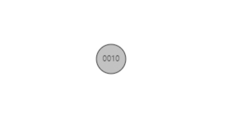
新的节点是根节点, 置为黑色

**3. 再插入5**
```cpp
tree.insert(10); // 伪代码
```
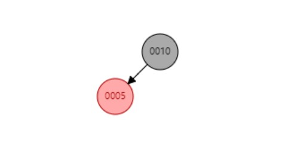
插入后没有改变红黑树性质, 无需调整

**4. 再插入50**
```cpp
tree.insert(50); // 伪代码
```
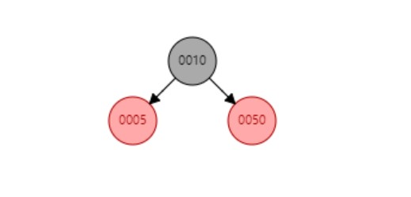
插入后没有改变红黑树性质, 无需调整

**5. 再插入30**
```cpp
tree.insert(30); // 伪代码
```
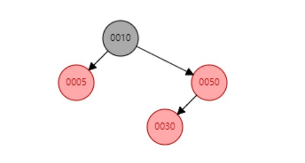
插入后30的父节点50是连续的红节点, 需要调整

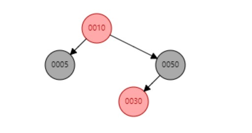
叔叔节是红色, 将叔叔和父亲置为黑色, 爷爷节点设为红色

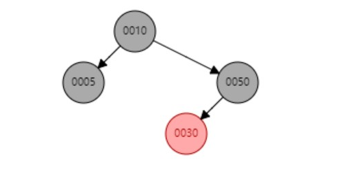
从爷爷节点继续判断, 爷爷节点是根节点, 重新置为黑色

> 小结: 为什么`父亲和叔叔节点都是红色`下的这种策略能有效地修复红黑树?
> 因为将父亲和叔叔变黑就已经修复了**红色节点性质**, 但增加了黑色节点高度怎么办呢? 再把爷爷节点变红就修复了**黑色高度性质**, 但需要从爷爷节点还是继续判断是否需要修复

**6. 再插入36**
```cpp
tree.insert(36); // 伪代码
```
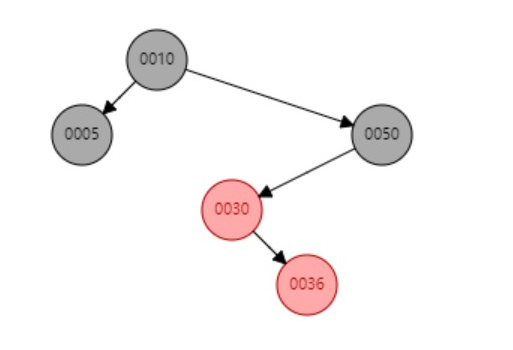
插入后36的父节点30是连续的红节点, 需要调整

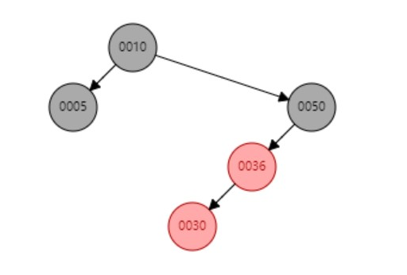
50, 30和36方向不一致, 左旋父节点30使其方向和50与36的方向一致: 向左, 左旋后, 将30置为操作节点

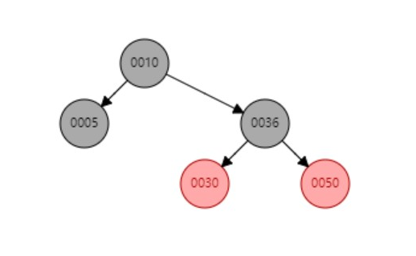
将操作节点30的父节点36设为黑色, 爷爷几点50设为红色, 右旋爷爷节点50

> 小结: 
> 1. 为什么`叔叔节点为黑色或者不存在`这个情况下旋转爷爷节点有效?
> 实际上就是将原来以爷爷节点为起点的3个分布在3层的节点压缩层了2层, 原来第二层和第三层连续的2个红色节点调整后就不连续了, 因为其中一个更大的一个节点变到了原来的爷爷节点的位置并变黑了, 原来的爷爷节点变成了儿子并且变成了红色, 所以满足了**黑色高度性质**的性质和**红色节点性质**
> 2. 为什么需要判断**方向一致**? 
> 方便后续统一操作而已

**7. 再插入4**
```cpp
tree.insert(4); // 伪代码
```
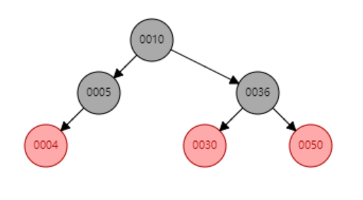
插入后4后不需要调整(主要是为了后续删除的演示)

# 4 红黑树的删除
红黑树的删除比插入复杂很多, 整体分3步:
1. 找到删除节点
2. 找到一个替换节点接替删除节点的位置
3. 修复红黑树高度

这里分删除和修复2部分说明
## 4.1 修复前的替换
**1. 查找要删除的节点**
就像在普通的二叉搜索树中那样, 查找要删除的节点。

**2. 替换节点**
红黑树需要用于一个节点来替换要删除的节点, 具体分情况如下:
   1. **删除节点有两个非空子节点** 
   在这种情况下，通常会找到该节点的后继或前驱（中序遍历下的下一个节点或上一个节点），这将是该节点右子树中的最小值(或左子树的最大值)。然后，将后继或前驱的值复制到要删除的节点中，并删除后继或前驱节点。因为后继节点(或前驱节点)至多只有一个非空子节点，所以这步骤将问题简化为删除有一个或没有子节点的节点。**本文采取使用前驱替代的策略**

   2. **删除节点最多有一个非空子节点：** 
   任意找到一个空子节点, 然后将另一个子节点(可能也是空的, 也可能是非空), 替代当前节点,

删除红色节点不需要判断修复, 但删除黑色节点后, 需要从一个节点开始判断红黑树是否需要修复, 具体有以下情况:
1. **删除节点有两个非空子节点**
   由于前驱节点是实际被删除的黑色节点, 因此从它开始就违反了**黑色高度性质**, 具体分类如下:
   1. 如果前驱节点有孩子, 孩子将替代前驱节点原来的位置, 这个位置就是修复判断的起始位置
   2. 如果前驱节点没有孩子, 那么也就是替代者是空指针, 虽然这个节点也是判断的其实位置, 但从这个节点开始不能进行修复判断, 因为空指针无法索引到它的父节点, 因此, 额外用一个**哨兵节点Nil**来代替这个空指针, 哨兵节点除了包含原来前驱的父节点指针外, 本身不算是红黑树的有效成员, 只是在删除修复时临时使用, **哨兵节点Nil**就是修复判断的起始位置
2. **删除节点最多有一个非空子节点：**
   任意找到一个空子节点, 然后将另一个子节点(可能也是空的, 也可能是非空), 替代当前节点, 当前节点被替代的位置就是判断的其实位置, 当然这个位置现在也可能是空的, 所以这种情况也需要使用**哨兵节点Nil**来处理

**替换完成后, 还需要将替换的节点的颜色置为原来删除位置节点的颜色**

## 4.2 修复红黑树
删除节点后，可能会违反红黑树的性质。如果删除的是红色节点，通常不需要进一步的修复，因为红色节点的删除不会影响黑色节点的平衡。但如果删除的是黑色节点，就可能需要通过一系列复杂的树的旋转和重新着色来进行修复。

修复过程是从某个节点开始进行判断的, 这个判断的节点的含义是: 这个节点开始的子树的**黑色高度**比删除前减小了1

修复的目标是重新分配树中的黑色高度, 修复过程遵循以下原则：

1. **兄弟节点是红色：** 
   1. 兄弟节点是红色意味着父节点一定是黑色, 先交换父节点和兄弟节点的颜色。
   2. 将父节点进行旋转, 方向朝着修复判断的操作节点
   3. 旋转后操作节点的新兄弟节点就是黑色了, 可以继续下面的判断修复
   这一过程可参考下图, 需要注意的是, 这个过程仅仅是将兄弟节点变黑, 并没有完成修复, 需要后续进一步操作
   
2. **兄弟节点是黑色，其子节点也都是黑色：** 
   1. 将兄弟节点设为红色, 此时兄弟节点开始的子树和操作节点开始的子树的**黑色高度**已经一样了
   2. 由于上述原因, 可以将操作节点向上移动到父节点, 继续判断修复:
      1. 如果父节点是红色, 将其置为黑色, 修复完成
      2. 否则, 从父节点开始继续判断
   
      这一过程可参考下图, 此时操作节点变成了原来的父节点, 继续判断:
   
3. **兄弟节点是黑色，且至少有一个红色子节点：** 
   1. 无论兄弟节点的红色节点是哪一侧, 都可以通过旋转操作统一到某一侧一定有红色节点, 这里将红色节点位置统一为操作节点的相反侧(如果操作节点是左节点, 就把兄弟节点的红色节点放在右孩子), 如果需要调整兄弟节点的子节点的位置的话
      1. 将兄弟节点和兄弟节点的红色孩子交换颜色
      2. 将兄弟节点向与操作节点向反的方向旋转
         这一过程可参考下图
         
      
   2. 将兄弟节点(可能因旋转发生了变化)设置为操作节点的父节点的颜色，将操作节点的父节点设置为黑色，将兄弟节点的与操作节点相反方向的孩子(之前的操作确保其为红)设置为黑色
      这一过程可参考下图
      
   3. 将操作节点的父节点向操作节点方向旋转
      这一过程可参考下图, 此时操作节点的路径上多了一个黑色节点, 其**黑色高度**被修复, 而操作节点的兄弟节点由于红色节点被置为黑色, 补充了被转移到原来操作节点一侧的黑节点, 因此高度也不变化, 此时, 完成了修复, 可以退出循环
      

删除修复可能会在树上向上递归，直到到达根节点，或者遇到可以修复树平衡的情况。

同时, 修复完成后还需要重新将**哨兵节点**卸载掉

> 有一个很重要的特性值得观察: 就是初始状态的修复判断的操作节点的颜色是未知的, 但通过以上的修复逻辑, 最终效果一定会将初始的操作节点安排一个黑色父节点从而避免连续的红色节点

## 4.3 删除案例
使用我们之前插入案例最后状态的红黑树:

**1. 删除36**
```cpp
tree.remove(36); // 伪代码
```
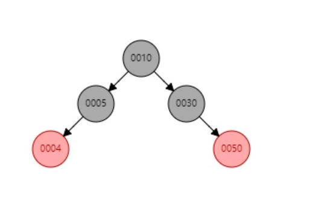
删除的36左右孩子都不为空, 所以找到其前驱30, 用30替代36, 并且替代的节点需要设置成和原来位置节点相同的颜色

替换的30节点是红色, 无需修复 

**2. 删除30**
```cpp
tree.remove(30); // 伪代码
```
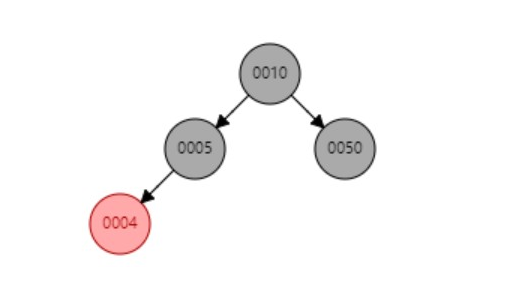

删除的30节点用50节点来代替, 并将50节点设置为黑色
替换的50节点是红色, 不需要修复

**3. 删除10**
```cpp
tree.remove(10); // 伪代码
```
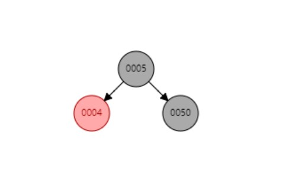
删除的10的左右孩子不为空, 用前驱5替代10, 并将10节点设置为黑色
替换的5节点是黑色, 需要修复

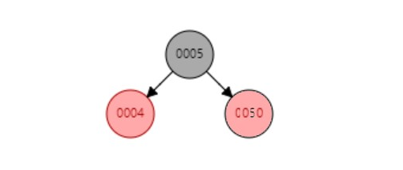
兄弟节点是黑色, 且孩子都是黑色(空节点也是黑色), 所以将兄弟节点染红, 操作节点置为其父节点
> 在线可视化的网页是将其4染成黑色, 都可以, 我按照我总结的思路将50染红, 所以P了下图

操作节点此时是根节点, 再次置为黑色, 结束修复

