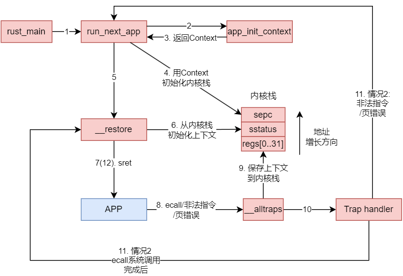

本文不会将原本`rCore文档`的内容重复太多, 主要是补充学习过程中遇到的知识点, 因此还需结合原文使用, 原文在后面的链接中

之前的章节仅仅是一个裸机运行的应用程序, 这一章节通过特权级的引入实现了S态下的`OS`和U态下的`app`, `app`通过系统调用访问`OS`, `OS`通过`SBI`提供的服务完成系统调用, 不过这一章节没有实现进程或线程切换, 而是将程序一个接一个地运行直到结束。

完整版官方文档： https://rcore-os.cn/rCore-Tutorial-Book-v3/chapter2/index.html

精简版文档： https://learningos.cn/rCore-Tutorial-Guide-2023A/chapter2/index.html


# 1 整体流程
本章的目的是实现批处理系统，文档中称为`邓氏鱼OS`, 其内容包括:
1. 编写`Rust应用程序`, 并使用链接脚本调整内存布局
2. 为`OS`实现系统调用
3. 将应用程序从`efl`转化为`binary`, 和`OS`的代码链接到一起
4. 实现批处理的任务调度
5. 引入用户栈和内核栈

# 2 特权级
## 2.1 特权级的概念
下面这摘自官方文档张图展示了`riscv`中不同的特权级:


RISC-V 定义了以下四个特权级别：

1. **用户级别（User-Level or U-Mode）**:
   就是图中的`App`所在的级别, 用户级别是最低的特权级别，普通的应用程序在这个级别上运行。在这个级别上，程序不能直接访问硬件资源，如控制I/O和管理内存等。用户级别的代码需要通过**系统调用**（`syscalls`）与更高特权级别的软件交互来请求服务。而`syscalls`就是应用程序二进制接口, 图中的`ABI`。程序在用户级别也称为用户态

2. **监督者级别（Supervisor-Level or S-Mode）**:
   监督者级别是操作系统内核通常运行的特权级别。它允许直接控制和管理硬件资源，包括内存管理单元（MMU）、中断处理等。大多数操作系统的内核，如`Linux`，会在`S-Mode`下运行。程序在用户级别也称为内核态。操作系统在态下其实也需要想=向更低一级的机器模式提出函数请求，这就是**SBI**所做的事情

3. **机器级别（Machine-Level or M-Mode）**:
   机器级别是最高的特权级别，提供对RISC-V硬件的完全控制。它用于引导系统、处理最底层的中断和异常，以及配置系统的安全和保护设置。固件和监控程序，如我们使用的`RustSBI`（通常在M-Mode下运行。

4. **超级用户级别（Hypervisor-Level or H-Mode）**:
   超级用户级别是为虚拟化环境设计的特权级别，在`RISC-V`体系结构中是一个可选的特权级别。它允许运行一个超级监控器（`hypervisor`），在单个物理硬件平台上虚拟化和管理多个独立的操作系统实例。`rCore`中不涉及这个级别

## 2.2 特权级的切换
官网中的这张图清晰地说明了应用程序如何进行特权级切换:


这张图其实还揭示了另一个细节: 不同特权级的内存空间通常是不一样的, 这就和我们常说的用户栈和内核栈联系起来了

## 2.3 特权级切换指令和寄存器
### 2.3.1 什么时候会发生特权级切换?
在RISC-V中，特权级切换通常在以下场景中发生：

1. **系统调用（System Calls）**：当用户程序需要操作系统提供的服务时，如文件操作、内存分配等，它会执行一个`ecall`指令来触发一个异常，导致处理器从用户模式（U-Mode）切换到监督者模式（S-Mode）或机器模式（`M-Mode`），这样操作系统可以安全地提供这些服务。

2. **中断（Interrupts）**：当外部设备需要处理器的注意时，它会发送一个中断信号。处理器响应中断信号也会导致特权级切换，通常是从较低的特权级别切换到机器模式（`M-Mode`），以便中断服务程序可以运行并处理中断。

3. **异常（Exceptions）**：当程序执行非法操作（如除以零、访问无权限的内存区域）时，或者出现硬件错误，就会发生异常。这将导致从当前特权级别切换到更高的特权级别，以便异常处理程序可以被执行来处理这些问题。

4. **特权级返回（Return from Trap）**：当中断或异常处理完成后，通过执行`mret`、`sret`或`uret`指令返回到发生中断或异常之前的特权级别。如果异常无法被正常处理, 则可能退出不会返回用户态, 而是在更高的特权级中尽显处理(*关机蓝屏等就是这些更改特权级处理异常的方式*)

通过上述情形可以我们可以看出, 异常控制流(区别与一般的函数控制)和特权级切换有下面的好处:
1. 保护系统和硬件不收错误的程序的损坏
2. 提供一层抽象, 便于开发

### 2.3.2 特权级切换指令和寄存器
1. 特权级切换指令

    | 指令        | 描述                                                         |
    | ----------- | ------------------------------------------------------------ |
    | **`ecall`** | **从用户态或监督者态触发一个环境调用异常，请求操作系统服务** |
    | `ebreak`    | 触发一个断点异常，用于调试                                   |
    | `mret`      | 从机器模式退出中断或异常处理程序并返回到之前的特权级别       |
    | **`sret`**  | **从监督者模式退出中断或异常处理程序并返回到之前的特权级别** |
    | `uret`      | 从用户模式退出中断或异常处理程序并返回到之前的特权级别       |

2. 特权级切换相关寄存器

    | 寄存器        | 描述                                                         |
    | ------------- | ------------------------------------------------------------ |
    | `mstatus`     | 保存机器模式的全局状态，包括全局中断使能位和特权级切换的状态 |
    | `ustatus`     | `mstatus` 的子集，用于保存用户模式的状态信息                 |
    | `mtvec`       | 保存中断和异常处理例程的基地址（机器模式）                   |
    | `utvec`       | 保存用户模式下中断和异常处理例程的基地址                     |
    | `mepc`        | 保存发生异常时的程序计数器值（机器模式）                     |
    | `uepc`        | 保存用户模式下发生异常时的程序计数器值                       |
    | `mcause`      | 保存最后一次异常或中断的原因（机器模式）                     |
    | `ucause`      | 保存用户模式下最后一次异常或中断的原因                       |
    | **`sstatus`** | **`mstatus` 的子集，用于保存监督者模式的状态信息**           |
    | **`scause`**  | **保存监督者模式下最后一次异常或中断的原因**                 |
    | **`sepc`**    | **保存监督者模式下发生异常时的程序计数器值**                 |
    | **`stval`**   | **给出 `Trap` 附加信息**                                     |
    | **`stvec`**   | **保存监督者模式下中断和异常处理例程的基地址**               |

# 3 特权级切换
## 3.1 系统调用
`riscv`中的系统调用很简单, 相关的代码我们之前也已经见到过:
1. 把系统调用的参数按照顺序放在`a0~a6`寄存器后
2. 把系统调用号放在`a7`寄存器
3. 调用`ecall`触发系统调用
4. 在`a0`处获得系统调用的返回值

系统调用可以使用`Rust`内联汇编实现:
```rust
use core::arch::asm;
fn syscall(id: usize, args: [usize; 3]) -> isize {
    let mut ret: isize;
    unsafe {
        asm!(
            "ecall",
            inlateout("x10") args[0] => ret,
            in("x11") args[1],
            in("x12") args[2],
            in("x17") id
        );
    }
    ret
}
```
如果上述汇编代码看不懂, 可以看我的上一篇`rCode`的笔记中关于内联汇编的介绍

## 3.2 特权级切换
系统调用会发生特权级切换, 特权级切换由于执行环境发生了变化, 要求我们在恢复原来的特权级时(例如从内核态返回用户态), 恢复执行环境的上下文。

发生特权级切换(执行`ecall`), 此处以陷入`S`态为例, 时硬件会帮我们做如下工作:
1. `sstatus` 的 `SPP` 字段会被修改为 `CPU` 当前的特权级
2. `sepc` 会被修改为 `Trap` 处理完成后默认会执行的下一条指令的地址。
3. `scause`/`stval` 分别会被修改成这次 `Trap` 的原因以及相关的附加信息。
4. `CPU` 会跳转到 `stvec` 所设置的 `Trap` 处理入口地址，并将当前特权级设置为 `S` ，然后从`Trap` 处理入口地址处开始执行。

上述是硬件自动完成的, 如果有其他的寄存器由于陷入内核态后会被使用, 需要提前被保存, 通常会手动保存在栈里, 这些工作可能是`stvec`一开始就执行的工作

当使用`sret`返回用户态时, 系统会帮我们做下面的工作:
1. `CPU` 会将当前的特权级按照 `sstatus` 的 `SPP` 字段设置为 `U` 或者 `S` ；
2. `CPU` 会跳转到 `sepc` 寄存器指向的那条指令，然后继续执行。

这里特别说明一下`sstatus` 的 `SPP`字段如何设置:
1. 调用 `ecall` 时：
   - 当从用户模式（U模式）执行 `ecall` 并陷入到监督者模式（S模式）时，`sstatus` 寄存器的 `SPP` 字段会被设置为 0，表示异常发生前处于用户模式。
   - 如果是从其他特权级别执行 `ecall`（例如，在 RISC-V 中还有机器模式 M），`SPP` 字段会被设置为对应于那个特权级别的值。

2. 调用 `sret` 时：
   - `sret` 指令用于从监督者模式（S模式）返回到之前的特权级别。在执行 `sret` 指令时，`SPP` 字段的值会被用来决定返回到哪个特权级别（U模式或S模式），并且执行 `sret` 之后，`SPP` 字段会被清零。
   - 如果 `SPP` 是 0，则在执行 `sret` 后 CPU 返回到用户模式（U模式）。
   - 如果 `SPP` 是 1，则在执行 `sret` 后 CPU 返回到监督者模式（S模式）。


# 4 用户代码
## 4.1 用户代码概览
用户代码很简单, 项目源码中有4个用户程序:
1. `ch2b_bad_address.rs`
    ```rust
    #![no_std]
    #![no_main]

    extern crate user_lib;

    /// 由于 rustsbi 的问题，该程序无法正确退出
    /// > rustsbi 0.2.0-alpha.1 已经修复，可以正常退出

    #[no_mangle]
    pub fn main() -> isize {
        unsafe {
            #[allow(clippy::zero_ptr)]
            (0x0 as *mut u8).write_volatile(0);
        }
        panic!("FAIL: T.T\n");
    }
    ```
    该程序向0地址处写入, 预期会触发`page fault`并退出

2. `ch2b_bad_instructions.rs`
    ```rust
    #![no_std]
    #![no_main]

    extern crate user_lib;

    /// 由于 rustsbi 的问题，该程序无法正确退出
    /// > rustsbi 0.2.0-alpha.1 已经修复，可以正常退出

    #[no_mangle]
    pub fn main() -> ! {
        unsafe {
            core::arch::asm!("sret");
        }
        panic!("FAIL: T.T\n");
    }
    ```
    该程序在`U模式`下使用`sret`, 应当是非法指令
3. `ch2b_bad_register.rs`
   ```rust
    #![no_std]
    #![no_main]

    extern crate user_lib;

    /// 由于 rustsbi 的问题，该程序无法正确退出
    /// > rustsbi 0.2.0-alpha.1 已经修复，可以正常退出

    #[no_mangle]
    pub fn main() -> ! {
        let mut sstatus: usize;
        unsafe {
            core::arch::asm!("csrr {}, sstatus", out(reg) sstatus);
        }
        panic!("(-_-) I get sstatus:{:x}\nFAIL: T.T\n", sstatus);
    }
    ```
    该程序在`U模式`下访问`csr`寄存器`sstatus`, 应当也是非法指令
4. `ch2b_hello_world.rs`
    ```rust
    #![no_std]
    #![no_main]

    #[macro_use]
    extern crate user_lib;

    /// 正确输出：
    /// Hello world from user mode program!

    #[no_mangle]
    fn main() -> i32 {
    println!("Hello, world from user mode program!");
    0
    }
    ```
    该程序是唯一正常输出的程序

## 4.2 用户库`user_lib`
上述的代码都使用了`user_lib`库, 也就是`user/src`下的`rust`项目, 其作用就是封装了了多个系统调用函数, 每个系统调用都使用对应的系统调用号、参数或地址调用[**3 系统调用**](#3-系统调用)中的`syscall`函数, 例如:
```rust
...
pub fn sys_exit(exit_code: i32) -> ! {
    syscall(SYSCALL_EXIT, [exit_code as usize, 0, 0]);
    panic!("sys_exit never returns!");
}

pub fn sys_sleep(sleep_ms: usize) -> isize {
    syscall(SYSCALL_SLEEP, [sleep_ms, 0, 0])
}

pub fn sys_yield() -> isize {
    syscall(SYSCALL_YIELD, [0, 0, 0])
}
...
```

# 5 内核代码
## 5.1 内核代码和用户代码的链接
这章的内核系统是和用户代码链接到一起的, 也就是说不存在从文件系统加载`elf`文件这样的步骤, 毕竟在学习`OS`的起步阶段, 文件系统离我们还挺遥远的, 具体而言, `os/src/main.rs`中的这句代码实现了用户代码的链接:
```rust
global_asm!(include_str!("link_app.S"));
```

>> `link_app.S`是构建脚本`build.rs`生成的, 其将用户仓库的编译文件夹`bin`目录下的二进制文件整整合到一起, 名创建各个`app`的符号

## 5.2 内核的调度
### 5.2.1 调度器的数据结构
内核调度是按照顺序一个接一个地调用用户应用, 其主要数据结构为:
```rust
struct AppManager {
    num_app: usize,
    current_app: usize,
    app_start: [usize; MAX_APP_NUM + 1],
}
```
文档中还介绍了`Rust`相关的语法知识, 后面的章节会整理出来


### 5.2.2 加载程序
最重要的调度函数是`load_app`, 其功能就是加载程序, 实际上并不是从文件系统加载, 而是从内核的某一个区段进行复制:
```rust
unsafe fn load_app(&self, app_id: usize) {
    if app_id >= self.num_app {
        println!("All applications completed!");
        use crate::board::QEMUExit;
        crate::board::QEMU_EXIT_HANDLE.exit_success();
    }
    println!("[kernel] Loading app_{}", app_id);
    // clear app area
    core::slice::from_raw_parts_mut(APP_BASE_ADDRESS as *mut u8, APP_SIZE_LIMIT).fill(0);
    let app_src = core::slice::from_raw_parts(
        self.app_start[app_id] as *const u8,
        self.app_start[app_id + 1] - self.app_start[app_id],
    );
    let app_dst = core::slice::from_raw_parts_mut(APP_BASE_ADDRESS as *mut u8, app_src.len());
    app_dst.copy_from_slice(app_src);
    // Memory fence about fetching the instruction memory
    // It is guaranteed that a subsequent instruction fetch must
    // observes all previous writes to the instruction memory.
    // Therefore, fence.i must be executed after we have loaded
    // the code of the next app into the instruction memory.
    // See also: riscv non-priv spec chapter 3, 'Zifencei' extension.
    asm!("fence.i");
}
```

可以从代码看出, 所有的`app`都是在`APP_BASE_ADDRESS`地址处运行的, **每个`app`运行前都需要将其从其二进制代码的地址处复制到`APP_BASE_ADDRESS`地址处**, 这也是`load_app`的核心工作

## 5.3 `Trap`上下文切换
### 5.3.1 用户栈和内核栈
正如之前的[3 特权级切换](#32-特权级切换)中说明, 特权级切换时需要用栈来保存上下文信息, 因此需要定义内核栈和用户栈:
```rust
// os/src/batch.rs

const USER_STACK_SIZE: usize = 4096 * 2;
const KERNEL_STACK_SIZE: usize = 4096 * 2;

#[repr(align(4096))]
struct KernelStack {
    data: [u8; KERNEL_STACK_SIZE],
}

#[repr(align(4096))]
struct UserStack {
    data: [u8; USER_STACK_SIZE],
}

static KERNEL_STACK: KernelStack = KernelStack { data: [0; KERNEL_STACK_SIZE] };
static USER_STACK: UserStack = UserStack { data: [0; USER_STACK_SIZE] };
```

### 5.3.2 上下文信息
本来不打算分析代码, 但这里的代码贯穿了整个`OS`, 所以特别介绍一下:
```rust
use riscv::register::sstatus::{self, Sstatus, SPP};
/// Trap Context
#[repr(C)]
pub struct TrapContext {
    /// general regs[0..31]
    pub x: [usize; 32],
    /// CSR sstatus      
    pub sstatus: Sstatus,
    /// CSR sepc
    pub sepc: usize,
}

impl TrapContext {
    /// set stack pointer to x_2 reg (sp)
    pub fn set_sp(&mut self, sp: usize) {
        self.x[2] = sp;
    }
    /// init app context
    pub fn app_init_context(entry: usize, sp: usize) -> Self {
        let mut sstatus = sstatus::read(); // CSR sstatus
        sstatus.set_spp(SPP::User); //previous privilege mode: user mode
        let mut cx = Self {
            x: [0; 32],
            sstatus,
            sepc: entry, // entry point of app
        };
        cx.set_sp(sp); // app's user stack pointer
        cx // return initial Trap Context of app
    }
}
```
这段 `Rust` 代码定义了`TrapContext` 的结构体，它用于保存程序的上下文，即在发生异常或中断时需要保存的状态信息，以便之后能够恢复执行, 包括通用寄存器、特殊控制状态寄存器（如 `sstatus` 和 `sepc`）等。同时实现了每个`app`的上下文初始化方法

### 5.3.3 `app`调度
上面的上下文在什么时候回被访问呢? 首先看看调度`app`的函数:
```rust
pub fn run_next_app() -> ! {
    let mut app_manager = APP_MANAGER.exclusive_access();
    let current_app = app_manager.get_current_app();
    unsafe {
        app_manager.load_app(current_app);
    }
    app_manager.move_to_next_app();
    drop(app_manager);
    // before this we have to drop local variables related to resources manually
    // and release the resources
    extern "C" {
        fn __restore(cx_addr: usize);
    }
    unsafe {
        __restore(KERNEL_STACK.push_context(TrapContext::app_init_context(
            APP_BASE_ADDRESS,
            USER_STACK.get_sp(),
        )) as *const _ as usize);
    }
    panic!("Unreachable in batch::run_current_app!");
}
```

可以看到, `load_app`已经通过`load_app`将指定的内容加载到了内存的固定位置, 然后运行这个程序调用的是`__restore`, 这是什么? 这是`trap.S`中用汇编代码写的上下文切换时的保存和回复寄存器的函数, 接下来将仔细解读

### 5.3.4 `Trap`恢复上下文
首先, 还是贴出`trap.S`:
```bash
.altmacro
.macro SAVE_GP n
    sd x\n, \n*8(sp)
.endm
.macro LOAD_GP n
    ld x\n, \n*8(sp)
.endm
    .section .text
    .globl __alltraps
    .globl __restore
    .align 2
__alltraps:
    csrrw sp, sscratch, sp
    # now sp->kernel stack, sscratch->user stack
    # allocate a TrapContext on kernel stack
    addi sp, sp, -34*8
    # save general-purpose registers
    sd x1, 1*8(sp)
    # skip sp(x2), we will save it later
    sd x3, 3*8(sp)
    # skip tp(x4), application does not use it
    # save x5~x31
    .set n, 5
    .rept 27
        SAVE_GP %n
        .set n, n+1
    .endr
    # we can use t0/t1/t2 freely, because they were saved on kernel stack
    csrr t0, sstatus
    csrr t1, sepc
    sd t0, 32*8(sp)
    sd t1, 33*8(sp)
    # read user stack from sscratch and save it on the kernel stack
    csrr t2, sscratch
    sd t2, 2*8(sp)
    # set input argument of trap_handler(cx: &mut TrapContext)
    mv a0, sp
    call trap_handler

__restore:
    # case1: start running app by __restore
    # case2: back to U after handling trap
    mv sp, a0
    # now sp->kernel stack(after allocated), sscratch->user stack
    # restore sstatus/sepc
    ld t0, 32*8(sp)
    ld t1, 33*8(sp)
    ld t2, 2*8(sp)
    csrw sstatus, t0
    csrw sepc, t1
    csrw sscratch, t2
    # restore general-purpuse registers except sp/tp
    ld x1, 1*8(sp)
    ld x3, 3*8(sp)
    .set n, 5
    .rept 27
        LOAD_GP %n
        .set n, n+1
    .endr
    # release TrapContext on kernel stack
    addi sp, sp, 34*8
    # now sp->kernel stack, sscratch->user stack
    csrrw sp, sscratch, sp
    sret
```
该 `trap.S`用于处理中断和异常。代码中定义了两个全局入口点：`__alltraps` 用于在中断或异常发生时保存上下文，`__restore` 用于恢复上下文并返回到用户态或继续执行应用程序。

1. `__alltraps` 入口点
   1. `csrrw sp, sscratch, sp`：交换 `sscratch` 和 `sp` 的值。`sscratch` 通常用来暂存用户栈指针，在发生异常时切换到内核栈。
   2. `addi sp, sp, -34*8`：在内核栈上分配 `TrapContext` 结构体所需的空间。
   3. 保存通用寄存器到内核栈上。跳过 `sp`（x2）和 `tp`（x4），因为 `sp` 会在后面单独保存，而 `tp`（线程指针）可能不被应用使用。
   4. 使用 `csrr` 指令读取 `sstatus` 和 `sepc` 寄存器的值，并保存到栈上。
   5. 从 `sscratch` 寄存器读取用户栈指针，保存到内核栈上。
   6. 将栈指针 `sp` 的值移到 `a0` 寄存器，作为 `trap_handler` 函数的参数（`cx: &mut TrapContext`）。
   7. 调用 `trap_handler` 函数处理异常。

2. `__restore` 入口点
    1. `mv sp, a0`：恢复 `sp` 寄存器的值，`a0` 中包含了指向 `TrapContext` 的指针。
    2. 从内核栈上加载 `sstatus`、`sepc` 和用户栈指针到临时寄存器 `t0`、`t1` 和 `t2`。
    3. 使用 `csrw` 指令恢复 `sstatus`、`sepc` 和 `sscratch` 寄存器的值。
    4. 从内核栈上恢复其他通用寄存器的值（除了 `sp` 和 `tp`）。
    5. `addi sp, sp, 34*8`：释放在内核栈上分配的 `TrapContext` 空间。
    6. 再次交换 `sscratch` 和 `sp` 的值，恢复用户栈指针到 `sp`。
    7. 执行 `sret` 指令返回到用户态或应用程序。

另一个值得注意的点是, `__restore` 在两种情况下被使用，它既是异常处理完毕后恢复应用程序状态的入口点，也是应用程序第一次开始执行时的入口点。在应用程序第一次开始执行时，`__restore` 这一步并不是在 "恢复" 任何先前的状态，因为此时还没有任何状态可以恢复。相反，它是在初始化应用程序的执行环境, 具体而言需要再栈中压入构造的`Trap Context`。在这种情况下，栈上加载的内容（如 `sstatus`、`sepc` 和 `sscratch`）是由操作系统预先设定好的，而不是由之前的应用程序执行状态保存的。这些值会设置为允许应用程序在用户模式下执行的正确状态，并确保了程序计数器（`sepc`）指向应用程序的入口点。


## 5.4 `Trap Handler`
还是先贴出代码
```rust
// os/src/trap/mod.rs

#[no_mangle]
pub fn trap_handler(cx: &mut TrapContext) -> &mut TrapContext {
    let scause = scause::read();
    let stval = stval::read();
    match scause.cause() {
        Trap::Exception(Exception::UserEnvCall) => {
            cx.sepc += 4;
            cx.x[10] = syscall(cx.x[17], [cx.x[10], cx.x[11], cx.x[12]]) as usize;
        }
        Trap::Exception(Exception::StoreFault) |
        Trap::Exception(Exception::StorePageFault) => {
            println!("[kernel] PageFault in application, kernel killed it.");
            run_next_app();
        }
        Trap::Exception(Exception::IllegalInstruction) => {
            println!("[kernel] IllegalInstruction in application, kernel killed it.");
            run_next_app();
        }
        _ => {
            panic!("Unsupported trap {:?}, stval = {:#x}!", scause.cause(), stval);
        }
    }
    cx
}
```
这里的`trap handler`根据`scause`分类处理, 目前实现了:
1. 系统调用陷入`S`态时执行系统调用
2. 非法指令和页错误直接运行下一个程序
3. 其余情况直接`panic`

分发的系统调用目前实现还比较简单, 因为此时还没有页表, 我们的地址都是物理地址, 因此不需要地址转换, 所以没啥好说的, 看项目代码就是了

## 5.5 流程图
下面是我整理的一个示意图, 展示了特权级切换的流程:



红色表示`S`态的函数, 蓝色表示`U`态的函数

# 6 补充知识
## 6.1 `Rust`补充知识
### 6.1.1 `RefCell`
在项目代码中, 我们封装了`RefCell`形成了`UPSafeCell`, 那么`RefCell`是什么?

官方的描述是: `RefCell<T>` 提供了内部可变性。这意味着即使在 `RefCell<T>` 的引用是不可变的情况下，也可以改变它所包含的值。这违反了 Rust 的借用规则——即通常情况下，不能同时拥有可变和不可变引用，以及不可变引用不能用来改变值。

简单来说，就是`Rust`的编译器检查太严格了, 当我们编写底层代码时, 编译时想绕过不可变借用的检查就可以使用`RefCell`。尤其是这样一个场景： **当需要在一个不可变的引用上修改数据时**。

不过绕过编译器检查还有运行期检查， `RefCell<T>` 使用运行时检查来确保借用规则，这是与编译时检查相对的（如通过 `&` 和 `&mut` 引用实现的）。从 `RefCell<T>` 中借用值时，如果违反了借用规则（例如，尝试进行两个可变借用或同时进行一个可变借用和任意数量的不可变借用），它会导致程序在运行时 `panic`。

下面是 `RefCell<T>` 的一个简单例子：

```rust
use std::cell::RefCell;

fn main() {
    let value = RefCell::new(42);

    // 通过value.borrow_mut()来借用可变引用。
    let mut value_borrow_mut = value.borrow_mut();
    *value_borrow_mut += 1;

    // 这时，value已经被可变地借用，所以尝试再次借用会导致panic！
    // 下面的行如果取消注释，将会在运行时产生panic。
    // let value_borrow_mut2 = value.borrow_mut();

    println!("value: {}", value_borrow_mut);

    // 第一个可变引用离开作用域，所以可以再次借用。
    drop(value_borrow_mut);

    // 现在可以再次借用，因为之前的可变引用已经结束。
    let value_borrow = value.borrow();
    println!("value: {}", value_borrow);
}
```

### 6.1.2 `bitflags`
我们看到项目代码中使用`bitflags!`宏来创建各种掩码并进行掩码操作，官方地说就是创建一个或多个位标志的集合。这些位标志通常用于表示一组开关或状态，每个开关或状态可以独立开启或关闭，通常用于配置选项或权限设置等场景。`

`bitflags`是社区包，需要在`Cargo.toml`文件中添加`bitflags crate`作为依赖。

```toml
[dependencies]
bitflags = "1.0"
```
下面是一个标志位使用的案例:
```rust
// 导入`bitflags`宏
use bitflags::bitflags;

// 使用`bitflags!`宏定义一个名为`Flags`的位标志类型
bitflags! {
    struct Flags: u32 {
        const FLAG_A = 0b00000001;
        const FLAG_B = 0b00000010;
        const FLAG_C = 0b00000100;
        const FLAG_D = 0b00001000;
    }
}

fn main() {
    // 创建一个新的Flags实例，初始没有任何标志设置
    let mut flags = Flags::empty();

    // 设置FLAG_A和FLAG_C
    flags.insert(Flags::FLAG_A | Flags::FLAG_C);

    // 检查FLAG_B是否被设置
    if flags.contains(Flags::FLAG_B) {
        println!("Flag B is set.");
    } else {
        println!("Flag B is not set.");
    }

    // 移除FLAG_A
    flags.remove(Flags::FLAG_A);

    // 切换FLAG_D的状态
    flags.toggle(Flags::FLAG_D);

    // 获取所有设置的标志
    println!("Current flags: {:?}", flags);
}
```

在这个例子中：

- `Flags`是一个包含四个位标志的新类型：`FLAG_A`、`FLAG_B`、`FLAG_C`和`FLAG_D`。
- 每个标志都赋予了不同的位模式，使得它们可以独立设置和清除。
- `Flags::empty()`创建了一个没有任何标志设置的`Flags`实例。
- `insert`方法用来设置特定的标志。
- `contains`方法用来检查特定的标志是否已经设置。
- `remove`方法用来清除特定的标志。
- `toggle`方法用来切换特定标志的状态。

### 6.1.3 `lazy_static`
`lazy_static`主要用于这样的需求: 想要创建一个全局变量, 但其初始化的值在编写代码时还不知道, 需要稍后初始化。在`Rust`中, 如果创建全局变量后再初始化会很繁琐, `lazy_static`简化了以上需求的操作难度


使用 `lazy_static` 创建的静态变量是线程安全的，并且保证只初始化一次。初始化发生在变量首次被访问的时候，并且如果初始化过程中发生了 `panic`，后续尝试访问该变量将会导致 `panic`。

下面是一个 `lazy_static` 的简单例子：

```toml
[dependencies]
lazy_static = "*"
```

```rust
#[macro_use]
extern crate lazy_static;

use std::collections::HashMap;

lazy_static! {
    static ref MY_MAP: HashMap<u32, &'static str> = {
        let mut m = HashMap::new();
        m.insert(0, "foo");
        m.insert(1, "bar");
        m
    };
}

fn main() {
    println!("The entry for `0` is \"{}\".", MY_MAP.get(&0).unwrap());
}
```

在这个例子中，`MY_MAP` 是一个 `HashMap`，它在首次被 `main` 函数中的 `println!` 宏访问时被创建和初始化。由于 `lazy_static` 保证了线程安全和只初始化一次，`MY_MAP` 可以在程序的任何地方安全地使用，就像其他静态变量一样。

### 6.1.4 `drain`
`drain`是`String`类型的方法，用来移除并遍历字符串的一部分内容。`drain` 方法会在原地修改 `String`，并返回一个迭代器，该迭代器提供被移除部分的字符。

使用 `drain` 方法时，需要指定一个范围来表明想要从字符串中移除哪些字符。范围是采用字节索引而非字符索引，这意味着必须确保范围的边界落在有效的`UTF-8字`符边界上，否则程序会在运行时`panic`

以下是一个使用 `drain` 方法的例子：

```rust
fn main() {
    let mut s = String::from("Hello, world!");
    // 移除字符串中的 "world" 部分
    let drained: String = s.drain(7..12).collect(); // world
    // 输出被移除的部分
    println!("Drained part: {}", drained);
    // 输出修改后的字符串
    println!("Remaining string: {}", s); // "Hello, !
}
```

### 6.1.5 项目代码中使用过的宏
下面是我整理的项目代码中使用的`rust`宏的含义, 这些宏大概了解其作用就可以, 在需要用时知道查什么关键字即可:
以下是对所提供的 Rust 属性和宏的解释，整理成 Markdown 表格的形式：

| 宏/属性                                   | 解释                                                                                                                  |
| ----------------------------------------- | --------------------------------------------------------------------------------------------------------------------- |
| `#[repr(align(4096))]`                    | 设置结构体或枚举的内存对齐方式为 4096 字节。                                                                          |
| `#![feature(panic_info_message)]`         | 允许使用实验性的 `panic_info_message` 功能，此功能允许访问 panic 信息中的消息内容。                                   |
| `#[macro_use]`                            | 允许在当前作用域中使用外部 `crate` 中定义的宏。                                                                       |
| `use core::arch::global_asm;`             | 引入 `global_asm!` 宏，允许在 `Rust` 代码中嵌入全局汇编指令。                                                         |
| `#[path = "boards/qemu.rs"]` `mod board`; | 指定模块文件的路径，这里是将模块文件定位到 `boards/qemu.rs`。                                                         |
| `#[no_mangle]`                            | 禁用名称修饰，确保编译器生成的函数名称与在 `Rust` 中声明的名称相同。                                                  |
| `#[inline(always)]`                       | 告诉编译器总是内联一个函数，无论编译器优化策略如何。                                                                  |
| `#[linkage = "weak"]`                     | 指定符号的链接强度为弱链接，允许在多个对象文件中定义相同的全局符号而不会导致链接错误，链接器将选择其中一个定义。      |
| `#[link_section = ".text.entry"]`         | 指定函数或静态变量应该放置在特定的链接段中，在这个例子中是一个名为 `.text.entry` 的段。                               |
| `#[repr(C)]`                              | 设置结构体或枚举的内存布局为 C 语言风格，这在与 C 代码交互时非常有用，因为它能保证字段在内存中的布局与 C 结构体相同。 |
| `#![feature(linkage)]`                    | 允许使用实验性的 `linkage` 属性，这个属性用于控制符号的链接方式。                                                     |
| `#![feature(alloc_error_handler)]`        | 允许自定义全局内存分配错误处理器。                                                                                    |
| `#![no_std]`                              | 表明当前的程序或库不会链接到 `Rust` 的标准库 `std`，通常用于裸机或嵌入式编程中，其中资源受限，只能依赖核心库 `core`。 |
| `#![no_main]`                             | 禁用 `Rust` 默认的入口点，这通常用在裸机或操作系统开发中，因为在这些情况下开发者需要自定义入口点。                    |

### 6.1.6 `build.rs`构建脚本
`Rust` 中，`build.rs` 是一个特殊的脚本，被称为"构建脚本"（build script）。它在项目构建过程的开始阶段被 `Cargo`执行。构建脚本通常用于编译时计算或生成代码、构建或链接非 `Rust` 代码（例如 C 库），或自动生成 `Rust` 代码之前的某些配置。

1. 构建脚本是可选的，只有当项目需要在编译前执行特定的任务时才会使用到。这个脚本必须是一个有效的 `Rust` 程序，`Cargo` 会将其编译并执行。
2. 当运行 `cargo build` 或相关的 `Cargo` 构建命令时，`Cargo` 会在编译项目的其余部分之前运行 `build.rs` 脚本。如果构建脚本执行成功，它可能会通过创建一个 `OUT_DIR` 环境变量来生成文件，Rust 代码可以在编译时通过 `include!` 或其他宏来访问这些文件。
3. 如果 `build.rs` 脚本生成了编译器指令，它们将作为标准输出打印，并被 Cargo 捕获。这些指令可以包括链接库、设置环境变量、传递编译器标志等。

在本项目中, `build.rs`用于生成`link_app.S`汇编文件, 将`user`项目编译的二进制文件引入进来：

## 6.2 riscv汇编代码补充知识
### 6.2.1 变量声明与二进制文件嵌入
这次新增的`riscv`汇编代码主要是`link_app.S`这个文件:
```bash
    .align 3
    .section .data
    .global _num_app
_num_app:
    .quad 7
    .quad app_0_start
    .quad app_1_start
    .quad app_2_start
    .quad app_3_start
    .quad app_4_start
    .quad app_5_start
    .quad app_6_start
    .quad app_6_end

    .section .data
    .global app_0_start
    .global app_0_end
app_0_start:
    .incbin "../user/build/bin/ch2b_bad_address.bin"
app_0_end:

    .section .data
    .global app_1_start
    .global app_1_end
app_1_start:
    .incbin "../user/build/bin/ch2b_bad_instructions.bin"
app_1_end:

    .section .data
    .global app_2_start
    .global app_2_end
app_2_start:
    .incbin "../user/build/bin/ch2b_bad_register.bin"
app_2_end:

    .section .data
    .global app_3_start
    .global app_3_end
app_3_start:
    .incbin "../user/build/bin/ch2b_hello_world.bin"
app_3_end:

    .section .data
    .global app_4_start
    .global app_4_end
app_4_start:
    .incbin "../user/build/bin/ch2b_power_3.bin"
app_4_end:

    .section .data
    .global app_5_start
    .global app_5_end
app_5_start:
    .incbin "../user/build/bin/ch2b_power_5.bin"
app_5_end:

    .section .data
    .global app_6_start
    .global app_6_end
app_6_start:
    .incbin "../user/build/bin/ch2b_power_7.bin"
app_6_end:
```

上述汇编代码定义类每一个`app`的起始位置的符号, 设计的新的语法如下:
1. `.quad`
   用于定义一个或多个8字节大小的数据元素。每个`.quad` 表示一个64位（即8字节）的值。这个指令常被用于分配内存空间，并初始化数据段中的常量值。这段代码中,`_num_app`位置后的`quad`记录了这7个`app`的开始位置
2. `.incbin`
   直接在当前位置包含（嵌入）一个二进制文件的内容。还可以指定文件中的位置和长度, 例如:
    ```bash
    .incbin "data.bin", 100, 50
    ```
    这句的含义是: 包含 `data.bin` 文件从第 100 个字节开始的接下来的 50 个字节

## 6.2.2 宏定义
我们在`trap.S`中看到了下面的宏定义代码
```bash
.altmacro
.macro SAVE_GP n
    sd x\n, \n*8(sp)
.endm
.macro LOAD_GP n
    ld x\n, \n*8(sp)
.endm
```
`.altmacro` 指令用于开启或关闭“替代宏语法模式”（alternate macro syntax mode）当`altmacro` 指令出现在文件中时，它会切换当前的宏处理模式。如果在 `.altmacro` 出现之前是标准宏模式，那么之后就会切换到替代宏模式；反之亦然。

在替代宏模式下，可以使用 `\()` 来对参数进行求值，允许宏内部对参数进行算术运算。此外，还可以使用更复杂的字符串处理功能，比如连接字符串或使用条件表达式。


在这里，`.altmacro` 可能是用来确保宏定义中的 `\n` 参数可以正常地被替换和计算。在 `.altmacro` 模式下，宏 `SAVE_GP` 和 `LOAD_GP` 中的 `\n` 会在宏展开时被实际传递的参数值所替换，并计算出正确的偏移量。

例如，如果使用 `SAVE_GP 2`，替代宏模式会确保宏展开为 `sd x2, 16(sp)`，这会将 `x2` 寄存器的内容保存到栈指针（`sp`）地址加上 16 字节处的内存位置（因为 `2 * 8 = 16`）。同理，`LOAD_GP` 宏则用于从相同的内存位置将数据加载回 `x2` 寄存器。

## 6.3 `stvec`的模式
`stvec` 存储处理器在发生异常或中断时跳转到的异常处理基地址（`trap handler`的入口地址）。`stvec` 寄存器有两种模式：

1. `Direct Mode` (直接模式)
   在直接模式下，当异常发生时，处理器会跳转到 `stvec` 寄存器中设置的地址开始执行异常处理程序。所有的异常和中断都会导致处理器跳转到这个单一的入口点，然后由异常处理程序根据异常原因码来处理不同的情况。
2. `Vectored Mode` (向量模式)
   在向量模式下，`stvec` 寄存器中的地址是中断向量表的基地址。当异常发生时，处理器会根据异常类型的不同来计算跳转地址。每种异常类型有一个固定的偏移量，处理器会将这个偏移量加到基地址上，计算得到对应的异常处理程序的地址，并跳转到该地址执行。

