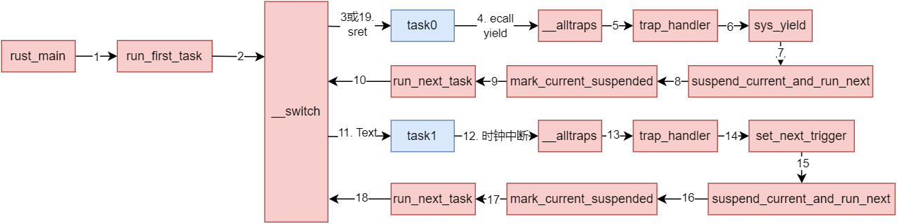

本文不会将原本`rCore文档`的内容重复太多, 主要是补充学习过程中遇到的知识点, 因此还需结合原文使用, 原文在后面的链接中

这一章在之前的章节中更进一步, 实现了任务调度的功能, 也就是任务不再是之前的批处理系统那样一个接一个地运行, 而是受到`OS`的调度。为了实现这一目标， 本章实现了下面的功能或机制：
1. 将应用程序加载到不同的内存位置， 并且同时存在于内存中
2. 内核添加上下文相关的数据结构，存储应用调度时的上下文信息，基于这些数据结构实现上下文切换函数
3. 通过时钟中断实现抢占式调度

完整版官方文档： https://rcore-os.cn/rCore-Tutorial-Book-v3/chapter3/index.html

精简版文档： https://learningos.cn/rCore-Tutorial-Guide-2023A/chapter3/index.html

# 1 应用程序数据结构
## 1.1 应用程序加载位置
这一过程相比之前的章节变化很小，就是将不同的应用程序链接到了操作系统的不同的位置，应用程序加载的位置是一个基址加上指定的偏移量。

## 1.2 应用程序的栈
这一由于我们需要实现任务的切换，应用程序运行的**上下文**包括了各种寄存器、函数调用栈等， 这些应用程序在应用程序被切换时需要被保存好，保存的位置通常是应用程序的内核栈，因此应用程序需要在上一章的基础上添加内核栈。

项目代码中，内核栈的初始化是咋`init_app_cx`中完成的:
```rust
// os/src/loader.rs
static KERNEL_STACK: [KernelStack; MAX_APP_NUM] = [KernelStack {
    data: [0; KERNEL_STACK_SIZE],
}; MAX_APP_NUM];
static USER_STACK: [UserStack; MAX_APP_NUM] = [UserStack {
    data: [0; USER_STACK_SIZE],
}; MAX_APP_NUM];
...
pub fn init_app_cx(app_id: usize) -> usize {
    KERNEL_STACK[app_id].push_context(TrapContext::app_init_context(
        get_base_i(app_id),
        USER_STACK[app_id].get_sp(),
    ))
}
```
可以看到, 每个程序有一个自己的**内核栈和用户栈**, 其内存空间就是一个全局变量数组的与`app`序号相同的索引处, 在初始化栈时, 每个应用程序的栈顶存放了其上下文信息(后面的章节会介绍)和用户栈指针。

# 2 上下文切换
这一部分是非常重要的概念，其思想几乎适用于所有的操作系统而不仅仅是`rCore`

## 2.1 什么是上下文切换?
**上下文**指的是一个进程或线程(这里我们还没有实现进程或者线程, 但是我们的应用程序可以类比进程)可以执行所需的所有信息的集合, 包括CPU寄存器的值、程序计数器（PC），堆栈指针以及操作系统为该进程或线程维护的内存分配信息等。

当操作系统执行任务切换（`context switch`）时，它会保存当前任务的上下文，并加载另一个任务的上下文，以便恢复该任务的执行, 这一过程称为**上下文切换**, 步骤包括:
1. **保存CPU状态**：保存当前执行任务的所有CPU寄存器，包括程序计数器和堆栈指针。
2. **保存进程状态**：将当前进程的其他状态信息（如打开的文件描述符、进程的权限、记账信息等）保存到进程控制块（PCB）。
3. **加载新的进程状态**：从另一个进程的PCB中读取其CPU寄存器和其他状态信息，并将其恢复到CPU和内存中。
4. **恢复执行**：开始或恢复执行选定的新进程。

## 2.2 什么时候会上下文切换?
上面介绍了上下文切换, 但实际上我们的上下文切换是何时发生的呢? 其发生的原因在本章实现的`OS`中有2中:
1. 应用程序主动通过`yield`让出`CPU`
2. 应用程序运行了过长的时间, 被操作系统抢占(后面章节会介绍)

## 2.3 上下文切换的实现
### 2.3.1 数据结构
直接先贴代码:
```rust
// os/src/task/context.rs
pub struct TaskContext {
    /// Ret position after task switching
    ra: usize,
    /// Stack pointer
    sp: usize,
    /// s0-11 register, callee saved
    s: [usize; 12],
}

impl TaskContext {
    /// Create a new empty task context
    pub fn zero_init() -> Self {
        Self {
            ra: 0,
            sp: 0,
            s: [0; 12],
        }
    }
    /// Create a new task context with a trap return addr and a kernel stack pointer
    pub fn goto_restore(kstack_ptr: usize) -> Self {
        extern "C" {
            fn __restore();
        }
        Self {
            ra: __restore as usize,
            sp: kstack_ptr,
            s: [0; 12],
        }
    }
}
```
`TaskContext`这个结构体就是保存上下文的结构体, 保存的结构体包括`s0-s11`寄存器, 栈指针`sp`, 返回地址`ra`。
另外需要注意的是， 程序还没运行时，其上下文信息中的`ra`是上一章介绍的从`trap`恢复的`__restore`, 这和之前的逻辑是一样的

### 2.3.2 `__switch`函数
`__switch`函数完成了上下文切换, 其是由汇编代码编写的:
```bash
.altmacro
.macro SAVE_SN n
    sd s\n, (\n+2)*8(a0)
.endm
.macro LOAD_SN n
    ld s\n, (\n+2)*8(a1)
.endm
    .section .text
    .globl __switch
__switch:
    # __switch(
    #     current_task_cx_ptr: *mut TaskContext,
    #     next_task_cx_ptr: *const TaskContext
    # )
    # save kernel stack of current task
    sd sp, 8(a0)
    # save ra & s0~s11 of current execution
    sd ra, 0(a0)
    .set n, 0
    .rept 12
        SAVE_SN %n
        .set n, n + 1
    .endr
    # restore ra & s0~s11 of next execution
    ld ra, 0(a1)
    .set n, 0
    .rept 12
        LOAD_SN %n
        .set n, n + 1
    .endr
    # restore kernel stack of next task
    ld sp, 8(a1)
    ret
```
这段汇编代码的`a0` 和 `a1` 是函数参数寄存器，在`RISC-V`调用约定中用来传递第一个和第二个参数。在`__switch`函数中，它们分别代表`current_task_cx_ptr`（当前任务上下文指针）和`next_task_cx_ptr`（下一个任务上下文指针）。

- `sd sp, 8(a0)`：存储当前任务的堆栈指针（`sp`）到`current_task_cx_ptr`所指向的结构体的第二个位置（假设结构体的起始位置为0，每个存储单元为8字节，栈指针保存在偏移量为8字节的位置）。

- `sd ra, 0(a0)`：存储当前任务的返回地址（`ra`）到`current_task_cx_ptr`所指向的结构体的起始位置。

- `.set n, 0` 和 `.rept 12` 循环：这是一个宏循环，它重复执行12次，用于保存寄存器`s0`到`s11`的值。`SAVE_SN`是一个宏，用于保存寄存器`s0`到`s11`到`current_task_cx_ptr`所指向的结构体中，对应的偏移量从16字节开始，每次增加8字节。

- `ld ra, 0(a1)`：加载下一个任务的返回地址到`ra`寄存器，这个地址来自`next_task_cx_ptr`所指向的结构体的起始位置。

- `.set n, 0` 和 `.rept 12` 循环：这是另一个宏循环，用于从`next_task_cx_ptr`所指向的结构体中恢复寄存器`s0`到`s11`的值。`LOAD_SN`宏执行相应的加载操作。

- `ld sp, 8(a1)`：加载下一个任务的堆栈指针到`sp`寄存器，这个堆栈指针来自`next_task_cx_ptr`所指向的结构体的第二个位置。

- `ret`：返回指令，它会跳转到`ra`寄存器中的地址，这里是下一个任务的继续执行点。

这段汇编代码的主要任务是保存当前执行环境的关键状态（堆栈指针和寄存器），然后恢复下一个任务的状态，从而实现任务之间的切换。

# 3 任务调度
## 3.1 数据结构
本章引入了`TASK_MANAGER`这个全局变量来实现任务的调度, 其结构体为:
```rust
// os/src/task/mod.rs

pub struct TaskManager {
    num_app: usize,
    inner: UPSafeCell<TaskManagerInner>,
}

struct TaskManagerInner {
    tasks: [TaskControlBlock; MAX_APP_NUM],
    current_task: usize,
}
```
其使用`current_task`标记当前运行的结构体

每个任务用`TaskControlBlock`标记:
```rust
pub struct TaskControlBlock {
    /// The task status in it's lifecycle
    pub task_status: TaskStatus,
    /// The task context
    pub task_cx: TaskContext,
}

/// The status of a task
#[derive(Copy, Clone, PartialEq)]
pub enum TaskStatus {
    /// uninitialized
    UnInit,
    /// ready to run
    Ready,
    /// running
    Running,
    /// exited
    Exited,
}
```
这一部分很同意理解, 就是将任务的状态和上下文记录在一起, 以便于任务调度

## 3.2 任务调度
调度任务的过程就是找到当前任务的上下文(或者第一个任务运行时的初始化的上下文)和下一个任务的上下文, 将其作为参数传递给`__switch`函数, 其发生场景有3种:

1. 第一次运行程序:
    ```rust
    // os/src/task/mod.rs
    fn run_first_task(&self) -> ! {
        let mut inner = self.inner.exclusive_access();
        let task0 = &mut inner.tasks[0];
        task0.task_status = TaskStatus::Running;
        let next_task_cx_ptr = &task0.task_cx as *const TaskContext;
        drop(inner);
        let mut _unused = TaskContext::zero_init();
        // before this, we should drop local variables that must be dropped manually
        unsafe {
            __switch(&mut _unused as *mut TaskContext, next_task_cx_ptr);
        }
        panic!("unreachable in run_first_task!");
    }
    ```
    这里是选择序号为0的程序运行

2. 程序主动让出`CPU`或被抢占
   ```rust
    // os/src/task/mod.rs
    pub fn suspend_current_and_run_next() {
        mark_current_suspended();
        run_next_task();
    }
    /// Change the status of current `Running` task into `Ready`.
    fn mark_current_suspended(&self) {
        let mut inner = self.inner.exclusive_access();
        let current = inner.current_task;
        inner.tasks[current].task_status = TaskStatus::Ready;
    }
    ```
3. 程序运行结束
   ```rust
        // os/src/task/mod.rs
    pub fn exit_current_and_run_next() {
        mark_current_exited();
        run_next_task();
    }
    /// Change the status of current `Running` task into `Exited`.
    fn mark_current_exited(&self) {
        let mut inner = self.inner.exclusive_access();
        let current = inner.current_task;
        inner.tasks[current].task_status = TaskStatus::Exited;
    }
    ```

其中`run_next_task`最终会调用下面的函数`run_next_task`方法:
```rust
fn run_next_task(&self) {
    if let Some(next) = self.find_next_task() {
        let mut inner = self.inner.exclusive_access();
        let current = inner.current_task;
        inner.tasks[next].task_status = TaskStatus::Running;
        inner.current_task = next;
        let current_task_cx_ptr = &mut inner.tasks[current].task_cx as *mut TaskContext;
        let next_task_cx_ptr = &inner.tasks[next].task_cx as *const TaskContext;
        drop(inner);
        // before this, we should drop local variables that must be dropped manually
        unsafe {
            __switch(current_task_cx_ptr, next_task_cx_ptr);
        }
        // go back to user mode
    } else {
        panic!("All applications completed!");
    }
}
```
其过程包括:
1. `find_next_task`选择一个就绪的任务
2. 标记这个就绪的任务为`TaskStatus::Running`
3. 传递2个任务的上下文结构体给`__switch`完成上下文切换

# 4 抢占
截止到目前, 大部分多任务调度的机制已经实现, 但还缺少抢占的机制实现
## 4.1 时钟中断
时钟中断是操作系统实现抢占式多任务处理的关键机制。它允许操作系统定期从当前执行的任务（或线程）中断开，以便操作系统的调度器可以决定是否继续执行当前任务或切换到另一个任务。这种机制确保了所有任务都有机会在处理器上运行，进而使得操作系统能够提供一个看似同时运行多个任务的环境, 并且避免了一个应用程序运行时间过长的场景。中断的主要作用有：

1. **公平的CPU时间分配**：确保所有任务都有公平的机会使用CPU，根据它们的优先级和CPU时间需求进行调度。
2. **响应性**：即使一个任务在执行一个长时间的操作，时钟中断也确保系统保持响应，因为操作系统可以在两个连续的时钟中断之间切换到其他任务。
3. **多任务处理**：允许多个任务看似同时进行，提高了系统的利用率和吞吐量。

## 4.2 时钟中断的工作原理

1. **硬件时钟**：硬件时钟（通常是一个定时器设备）被配置为在固定的时间间隔发出信号。这个时间间隔可以是毫秒级别，具体取决于操作系统的设计和配置。

2. **中断信号**：当硬件时钟达到预设的时间间隔时，它会向处理器发送一个中断信号。这个信号提示处理器当前正在执行的指令流应该被暂时中断。在我们的代码中， 我们进行了如下设置：
   ```rust
   /// Set the next timer interrupt
    pub fn set_next_trigger() {
        set_timer(get_time() + CLOCK_FREQ / TICKS_PER_SEC);
    }
    ```
    `set_timer`是`rustsbi`提供的中断设置接口, 其可以实则指定时间的中断


3. **中断服务例程（ISR）**：处理器接收到中断信号后，会跳转执行一个特定的中断服务例程。这个ISR是由操作系统提供的，并且在中断向量表中有一个特定的入口。在许多处理器架构和操作系统中，**中断服务例程（ISR）和异常处理程序通常通过一个统一的入口点处理，这个入口点被称为陷阱（trap）处理程序，也就是在我们的项目中存储在`stvec`中的`__alltraps`**, 我们可以在`os/src/trap/mod.rs`中看到下面的初始化:
   ```rust
   pub fn init() {
        extern "C" {
            fn __alltraps();
        }
        unsafe {
            stvec::write(__alltraps as usize, TrapMode::Direct);
        }
    }
    ```
    换句话说
4. **中断异常处理**：在`ISR`中，操作系统的调度器可以检测当前运行的任务是否应该继续运行，或者是另一个任务的运行优先级更高。如果决定进行任务切换，操作系统会保存当前任务的状态（上下文切换），然后加载下一个任务的状态并开始执行它。目前我们的中断是时钟中断, 实际上还有更多类型的中断, 不是每一个中断都和上下文切换相关, 比如有的中断只是外设鼠标或键盘的硬件中断

5. **返回正常执行**：完成调度决策和任何必要的任务切换后，`ISR`结束，并指示处理器恢复到中断前的状态，继续执行被中断的任务或开始执行新的任务。

## 4.3 引入中断后的任务调度
### 4.3.1 中断机制的初始化
中断相关的初始化很简单, 就是在`rust_main`中调用`set_next_trigger`设置一次中断时间。
### 4.3.2 任务调度
由于中断使用的入口就是`__alltraps`，因此我们只需要关注`__alltraps`调用的`trap_handler`即可:
```rust
#[no_mangle]
pub fn trap_handler(cx: &mut TrapContext) -> &mut TrapContext {
    let scause = scause::read(); // get trap cause
    let stval = stval::read(); // get extra value
                               // trace!("into {:?}", scause.cause());
    match scause.cause() {
        Trap::Exception(Exception::UserEnvCall) => {
            // jump to next instruction anyway
            cx.sepc += 4;
            // get system call return value
            cx.x[10] = syscall(cx.x[17], [cx.x[10], cx.x[11], cx.x[12]]) as usize;
        }
        Trap::Exception(Exception::StoreFault) | Trap::Exception(Exception::StorePageFault) => {
            println!("[kernel] PageFault in application, bad addr = {:#x}, bad instruction = {:#x}, kernel killed it.", stval, cx.sepc);
            exit_current_and_run_next();
        }
        Trap::Exception(Exception::IllegalInstruction) => {
            println!("[kernel] IllegalInstruction in application, kernel killed it.");
            exit_current_and_run_next();
        }
        Trap::Interrupt(Interrupt::SupervisorTimer) => {
            set_next_trigger();
            suspend_current_and_run_next();
        }
        _ => {
            panic!(
                "Unsupported trap {:?}, stval = {:#x}!",
                scause.cause(),
                stval
            );
        }
    }
    cx
}
```
可以看到, `match`多了一个`SupervisorTimer`分支, 处理方式就是简单地再次设置下一次中断时间, 并且挂起当前任务, 找下一个任务运行

# 5 总结
之前说了这么多, 可能思路还是比较乱, 比如`trap`和中断之前的处理调用逻可能不清楚, 这里我梳理了下面的流程图:



可以看到, `task0`第一次主动让出CPU, 通过`ecall`简介调用了`_switch`, 调用的序号为10, 后来在序号19时, `task0`又从`_switch`中返回, **这也是`_switch`的一个核心性质: 调用时和返回时可能经历了多个控制流(不同的线程或进程)**