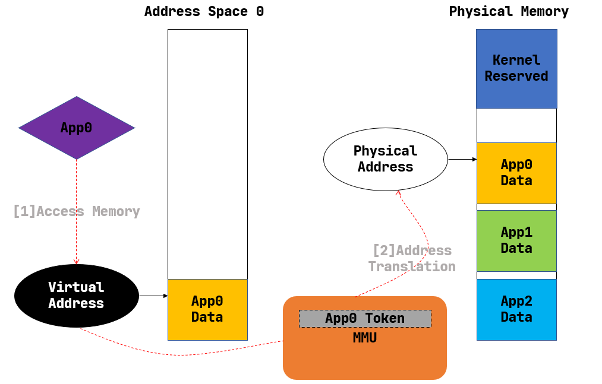
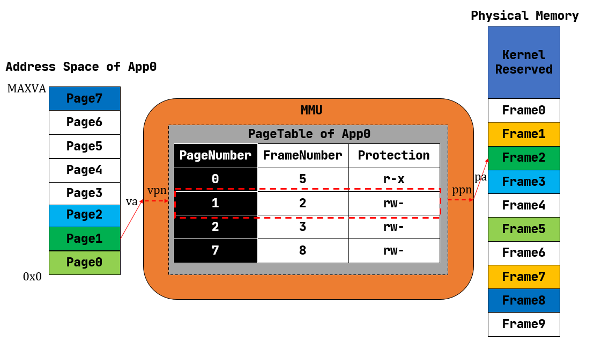

本文不会将原本`rCore文档`的内容重复太多, 主要是补充学习过程中遇到的知识点, 因此还需结合原文使用, 原文在后面的链接中

这一章引入了页表和虚拟内存。回顾之前构建的`OS`, 其内核和应用是共用一份地址空间的。这也就意味着， 某个应用程序可以任意访问其他应用程序甚至内核的代码和数据， 这是不安全的， 并且， 编写应用程序的程序员还需要显式地指定链接的地址。因此， 虚拟内存应运而生。同时， 引入虚拟内存后， 还需要重新设计上下文切换和进程控制快, 因此这一章的代码相对复杂。

本章的内容包括:
1. 基于`SV39`引入虚拟内存和页表
2. 重新设计进程控制块结构体
3. 重新设计上下文切换

完整版官方文档： https://rcore-os.cn/rCore-Tutorial-Book-v3/chapter3/index.html

精简版文档： https://learningos.cn/rCore-Tutorial-Guide-2023A/chapter3/index.html

# 1 引入虚拟内存
## 1.1 虚拟地址空间的概念
文档中对地址空间的介绍已经很完善了, 这里只做简要总结:

上图摘自官方文档, 根据这个图简单介绍什么是地址空间

1. 为什么叫**虚拟地址空间**?
   因为地址不是真正的物理内存地址, 而是需要经过一系列操作映射到物理地址。想象一下， 编写不同C语言程序时，我们的数据可以防止同样的地址中， 但这些不同的应用都可以同时运行，显然他们不是同一个物理地址
2. 如何转化为**物理地址**？
   通过硬件单元`MMU`进行转化, `MMU`会根据一个映射表查询虚拟地址对应的物理地址, 这个映射表就叫**页表**, 根页表的地址存放在指定的寄存器中, `riscv`中是`satp`寄存器
3. 如何实现隔离
   1. `U`表示用户态是否可以访问, `U`标记实现了内核和应用程序之间的隔离
   2. 每个应用程序有自己的页表, 并且页表项中的`V`标记位表示页表项是否有效, 不属于应用程序的地址没有设置`V`标记, 这实现了应用程序间的隔离

## 1.2 分页管理
由于地址的数量是近乎无限的, 不可能以每一个地址为粒度进行映射, 因此将`4096`个字节作为一个映射单位, 这就是**分页**的概念, 除了这个原因外, 分页还有一个好处就是**方便在硬盘和内存之间加载和替换数据**, 因为一次硬盘的`IO`是昂贵的, 因此一次硬盘的`IO`应当包含足够大的空间, 通常也就是一个扇区, 大小通常也是`4096`个字节。

>> 目前的`rCore`没有文件系统, 因此虚拟内存的分页也没有在硬盘和内存中进行加载和替换的功能, 只是实现虚拟内存的抽象罢了

虚拟内存中的分页机制可以用一个贴近生活的比喻来理解：假设你有一本非常厚的书（这里的书就像是一个程序需要的内存空间），书架（物理内存）的空间有限，你不能同时把所有的书放在书架上。所以，你决定只把当前正在阅读的几页（活跃的内存页）放在书架上，而把其他的页暂时存放在一个大箱子里（硬盘上的交换空间）。当你想读书中的其他部分时，你会从箱子里取出你需要的页，并把不再需要的页放回箱子里。

**虚拟内存分页机制：**

1. **分页的基本概念**：
   就像上面的比喻中，分页机制将虚拟内存分割成许多固定大小的块，每一块称为一个“页”或“页面”。同样地，物理内存也被分割成同样大小的块，称为“页帧”或“物理页”。

2. **页表映射**：
   为了追踪哪些虚拟页对应于物理内存中的哪些页帧，操作系统维护着一张映射表，这就是所谓的页表。当程序尝试访问其虚拟内存中的数据时，操作系统查看页表来找出那个虚拟页在物理内存中的位置。

3. **内存访问**：
   当程序访问一个虚拟地址时，这个地址被分成两部分：页号和页内偏移。页号用于在页表中查找对应的物理页帧，而页内偏移决定了在这个页帧内的具体位置。

4. **缺页中断**：
   如果程序需要访问的页当前不在物理内存中（也就是说，它在硬盘的交换空间里），这会触发一个叫做缺页中断（page fault）的事件。操作系统随后会选择一个物理页（如果需要，可能会将当前的内容保存到硬盘上），并从硬盘上加载所需的虚拟页到这个物理页中，然后更新页表，并重新开始执行刚才中断的指令。

5. **页替换算法**：
   当物理内存满了，而需要加载新的页时，操作系统必须决定哪些页将被移出物理内存以为新页腾出空间。这涉及到页替换算法，如最近最少使用（LRU）、先进先出（FIFO）等，用于选择被替换的页。

通过这种分页机制，操作系统可以非常高效地管理内存，即使物理内存有限，程序也可以使用比物理内存大得多的地址空间。这样不仅提高了内存的使用效率，也简化了程序员的工作，因为他们不需要关心内存的物理限制，只需要关注于程序的逻辑结构。

最后贴上官方文档的图:

页表中包含3个部分:
1. 映射的物理页号
2. 页的操作权限

>> 图中的`FrameNumber`实际上在页表中是没有的

## 1.3 `SV39`分页介绍
这里介绍如何实现映射, 这里采用的是`riscv`的`SV39`分页机制:

首先看看虚拟地址和物理地址的格式:

1. 虚拟地址被分为39位，意味着虚拟地址空间的大小可以达到239字节，即512GB。其中低12位是页内的偏移量, 高27位可以分为3份, 每份9位, 表示的是在各级页表中的索引(如果看不懂就去看后面给出的地址翻译流程图)
2. 物理地址的低12位表示一个页内的偏移, `12-55`位表示了页号

下面是详细的`SV39分`页机制：

1. **三级页表结构**：在SV39分页模式下，地址翻译使用三级页表。这意味着虚拟地址被分为四部分：`VPN[2]、VPN[1]、VPN[0]`和页内偏移。这里的VPN代表虚拟页号（Virtual Page Number），不同级别的页表项（PTE）由不同的VPN部分索引。

2. **页大小**：SV39通常使用4KB的页大小，这是最常见的页大小，但也支持大页，如2MB和1GB的大页。因为地址是8字节, 因此一个存放页表项的页就包含了`4096/1024`=`512`个页表项

3. **地址转换**：虚拟地址转换为物理地址的过程涉及查找三级页表。首先使用VPN[2]在一级页表中查找，得到二级页表的地址；然后使用VPN[1]在二级页表中查找，得到三级页表的地址；最后使用VPN[0]在三级页表中查找，得到物理页号（PPN）。页内偏移保持不变，直接用于定位物理页内的具体地址。

4. **地址翻译缓存（TLB）**：由于地址翻译过程可能相当耗时，因为它涉及到多次内存访问，RISC-V处理器通常会使用`TLB`来缓存最近的地址翻译结果，来加快地址翻译速度。

接下来是地址翻译的流程, 摘自`MIT6.S081`:

1. `L2`是根页表的索引, 29 = 512正好能表示所有的索引, 根页表的页表项记录了`L1`对应页表的物理页号`PPN`
2. 用之前拿到的物理页号`PPN`找到`L1`对应页表的物理页, 用同样的思路找到索引`L1`的页表项, 其记录了`L0`对应页表的物理页号`PPN`
3. 用之前的`PPN`, 结合索引`L0`拿到实际的数据页的页号`PPN`
4. 用最终得到的页号`PPN`找到数据页, 使用页内便宜`OffSet`就找到了最终的物理地址

## 1.4 `SV39`分页的代码实现

